# Understanding and Using the Soundscape Perception Index (SPI)

``` python
import matplotlib.pyplot as plt
import numpy as np
import pandas as pd

import soundscapy as sspy
from soundscapy.databases import isd
from soundscapy.spi import DirectParams, MultiSkewNorm
```

## Introduction

The Soundscape Perception Index (SPI) is a powerful metric for comparing
soundscape distributions and evaluating the similarity between a
measured soundscape and a target or ideal soundscape. This tutorial will
guide you through understanding the SPI concept and using Soundscapy’s
SPI functionality to analyze and compare soundscapes.

### Learning Objectives

By the end of this tutorial, you will be able to: - Understand the
theoretical foundation of the SPI - Work with multi-dimensional skewed
normal distributions - Fit distributions to soundscape data - Calculate
SPI between distributions - Interpret SPI results - Apply SPI in
practical soundscape analysis

Let’s begin by loading some sample data from the International
Soundscape Database (ISD):

``` python
# Load the ISD dataset
data = isd.load()

# Validate the dataset
valid_data, _ = isd.validate(data)

# Calculate ISO coordinates if not already present
if "ISOPleasant" not in valid_data.columns or "ISOEventful" not in valid_data.columns:
    valid_data = sspy.surveys.add_iso_coords(valid_data)

# Display basic information about the dataset
print(f"Dataset shape: {valid_data.shape}")
print(f"Number of locations: {valid_data['LocationID'].nunique()}")
print(f"Number of records: {valid_data['RecordID'].nunique()}")
```

    Dataset shape: (3533, 144)
    Number of locations: 26
    Number of records: 2622

## 1. Understanding the Soundscape Perception Index (SPI)

The Soundscape Perception Index (SPI) is a metric that quantifies the
similarity between two soundscape distributions in the ISO coordinate
space. It is based on the statistical comparison of distributions and
ranges from 0 to 100, where:

- 100 indicates perfect similarity to the target distribution
- 0 indicates complete dissimilarity

The SPI is calculated using a two-sample Kolmogorov-Smirnov test, which
measures the maximum difference between two cumulative distribution
functions. This approach allows for a robust comparison of soundscape
distributions, taking into account both the central tendency and the
spread of the data.

### Why SPI is Useful

The SPI provides several advantages for soundscape analysis:

1. **Quantitative Comparison**: It allows for a numerical comparison
    between soundscapes, making it easier to evaluate changes or
    differences.
2. **Distribution-Based**: Unlike simple averages, it considers the
    full distribution of perceptions, capturing the variability in how
    people experience soundscapes.
3. **Target Setting**: It enables setting quantitative targets for
    soundscape design or improvement.
4. **Evaluation Tool**: It can be used to evaluate the success of
    soundscape interventions by comparing before and after
    distributions.

Let’s explore how to use the SPI in practice.

``` python
# Select data for a specific location to use as our reference
reference_location = "CamdenTown"
reference_data = isd.select_location_ids(valid_data, reference_location)

# Display basic information about the reference data
print(f"Reference location: {reference_location}")
print(f"Number of samples: {len(reference_data)}")
print(f"Mean ISOPleasant: {reference_data['ISOPleasant'].mean():.3f}")
print(f"Mean ISOEventful: {reference_data['ISOEventful'].mean():.3f}")

# Visualize the reference data
ax = sspy.iso_plot(
    reference_data,
    title=f"Reference Soundscape: {reference_location}",
    plot_layers=["scatter", "density"],
    diagonal_lines=True,
)
plt.show()
```

    Reference location: CamdenTown
    Number of samples: 105
    Mean ISOPleasant: -0.103
    Mean ISOEventful: 0.364

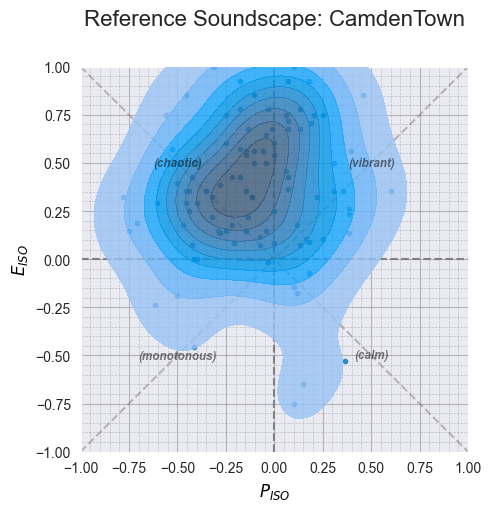

## 2. Working with Multi-dimensional Skewed Normal Distributions

The SPI is based on comparing distributions, and in Soundscapy, these
distributions are modeled using Multi-dimensional Skewed Normal (MSN)
distributions. The MSN distribution is a flexible distribution that can
capture the asymmetry often observed in soundscape data.

### Key Components of MSN Distributions

An MSN distribution is defined by three parameters:

1. **xi (ξ)**: The location parameter, which determines the center of
    the distribution.
2. **omega (Ω)**: The scale matrix, which determines the spread and
    correlation of the distribution.
3. **alpha (α)**: The shape parameter, which determines the skewness of
    the distribution.

These parameters can be specified directly (DirectParams) or derived
from more intuitive parameters like mean, standard deviation, and
skewness (CentredParams).

Let’s create an MSN distribution and visualize it:

``` python
# Create a MultiSkewNorm instance
msn = MultiSkewNorm()

# Fit the MSN distribution to our reference data
msn.fit(data=reference_data[["ISOPleasant", "ISOEventful"]])

# Display the fitted parameters
print("Fitted MSN Parameters:")
msn.summary()

# Generate a sample from the fitted distribution
sample_data = msn.sample(n=1000, return_sample=True)

# Visualize the fitted distribution
plt.figure(figsize=(10, 5))

# Plot the original data
plt.subplot(1, 2, 1)
sspy.scatter(
    reference_data,
    title="Original Data",
    diagonal_lines=True,
)

# Plot the sampled data from the fitted distribution
plt.subplot(1, 2, 2)
sspy.scatter(
    pd.DataFrame(sample_data, columns=["ISOPleasant", "ISOEventful"]),
    title="Sampled from Fitted MSN",
    diagonal_lines=True,
)

plt.tight_layout()
plt.show()
```

    Fitted MSN Parameters:
    Fitted from data. n = 105
    Direct Parameters:
    xi:    [-0.257  0.681]
    omega: [[ 0.107 -0.042]
     [-0.042  0.218]]
    alpha: [ 1.113 -2.133]


    Centred Parameters:
    mean:  [-0.101  0.361]
    sigma: [[0.082 0.008]
     [0.008 0.116]]
    skew:  [ 0.069 -0.354]

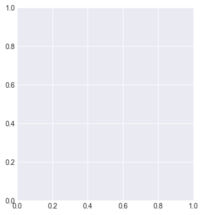

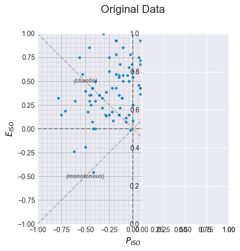

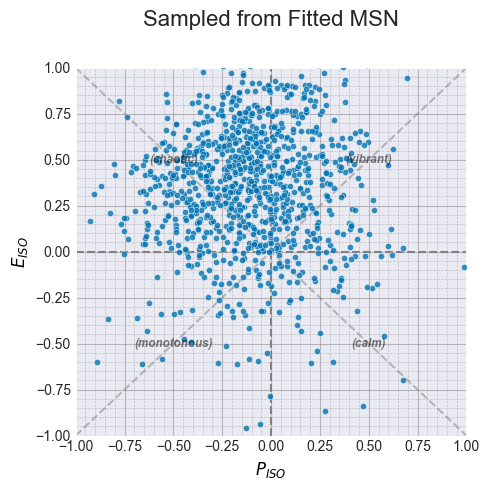

### Creating MSN Distributions Directly

You can also create MSN distributions directly by specifying the
parameters:

``` python
# Create a custom MSN distribution with specified parameters
custom_msn = MultiSkewNorm()
custom_msn.define_dp(
    xi=np.array([0.5, 0.7]),  # Location parameter (center)
    omega=np.array([[0.1, 0.05], [0.05, 0.1]]),  # Scale matrix (spread)
    alpha=np.array([0, -5]),  # Shape parameter (skewness)
)

# Generate a sample from the custom distribution
custom_sample = custom_msn.sample(n=1000, return_sample=True)

# Visualize the custom distribution
plt.figure(figsize=(8, 8))
sspy.scatter(
    pd.DataFrame(custom_sample, columns=["ISOPleasant", "ISOEventful"]),
    title="Custom MSN Distribution",
    diagonal_lines=True,
)
plt.show()
```

    <Figure size 800x800 with 0 Axes>

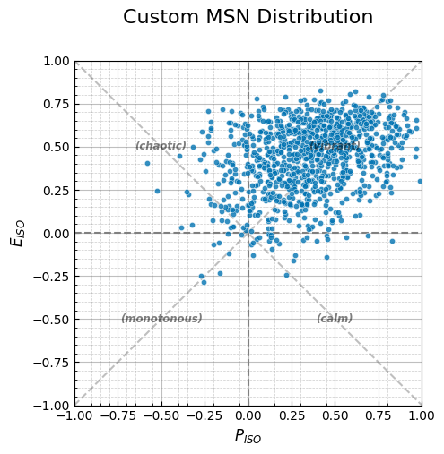

### Alternative Ways to Create MSN Distributions

Soundscapy provides several ways to create MSN distributions:

``` python
# Method 1: Using the from_params class method with DirectParams
dp = DirectParams(
    xi=np.array([0.3, 0.4]),
    omega=np.array([[0.15, 0.02], [0.02, 0.12]]),
    alpha=np.array([2, -3]),
)
msn1 = MultiSkewNorm.from_params(dp)

# Method 2: Using the from_params class method with individual parameters
msn2 = MultiSkewNorm.from_params(
    xi=np.array([0.3, 0.4]),
    omega=np.array([[0.15, 0.02], [0.02, 0.12]]),
    alpha=np.array([2, -3]),
)

# Generate samples from both distributions
sample1 = msn1.sample(n=1000, return_sample=True)
sample2 = msn2.sample(n=1000, return_sample=True)

# Visualize both distributions
plt.figure(figsize=(12, 5))

plt.subplot(1, 2, 1)
sspy.scatter(
    pd.DataFrame(sample1, columns=["ISOPleasant", "ISOEventful"]),
    title="MSN from DirectParams",
    diagonal_lines=True,
)

plt.subplot(1, 2, 2)
sspy.scatter(
    pd.DataFrame(sample2, columns=["ISOPleasant", "ISOEventful"]),
    title="MSN from Individual Parameters",
    diagonal_lines=True,
)

plt.tight_layout()
plt.show()
```

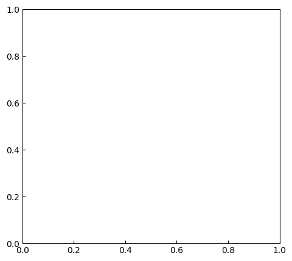

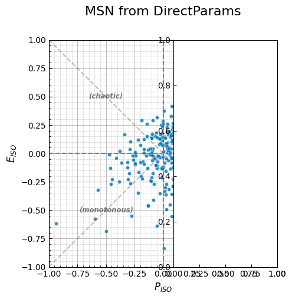

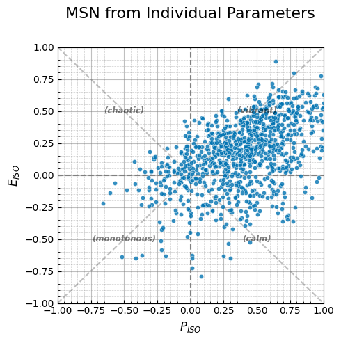

## 3. Calculating the SPI

Now that we understand MSN distributions, let’s calculate the SPI
between different soundscapes. The SPI is calculated by comparing the
distributions of two soundscapes using the Kolmogorov-Smirnov test.

### Comparing Two Locations

``` python
# Select data for two locations
location1 = "CamdenTown"
location2 = "RegentsParkJapan"

data1 = isd.select_location_ids(valid_data, location1)
data2 = isd.select_location_ids(valid_data, location2)

# Fit MSN distributions to both locations
msn1 = MultiSkewNorm()
msn1.fit(data=data1[["ISOPleasant", "ISOEventful"]])
msn1.sample(n=1000)  # Generate sample data

msn2 = MultiSkewNorm()
msn2.fit(data=data2[["ISOPleasant", "ISOEventful"]])
msn2.sample(n=1000)  # Generate sample data

# Calculate SPI between the two locations
# Ensure sample data exists
if msn1.sample_data is None:
    msn1.sample(n=1000)
if msn2.sample_data is None:
    msn2.sample(n=1000)

spi_score = msn1.spi_score(msn2.sample_data)

# Visualize both distributions
plt.figure(figsize=(15, 5))

plt.subplot(1, 3, 1)
sspy.scatter(
    data1,
    title=f"{location1}",
    diagonal_lines=True,
)

plt.subplot(1, 3, 2)
sspy.scatter(
    data2,
    title=f"{location2}",
    diagonal_lines=True,
)

plt.subplot(1, 3, 3)
plt.text(0.5, 0.5, f"SPI = {spi_score}", fontsize=24, ha="center")
plt.axis("off")

plt.tight_layout()
plt.show()
```


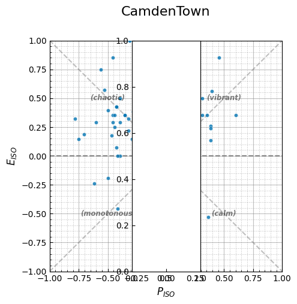

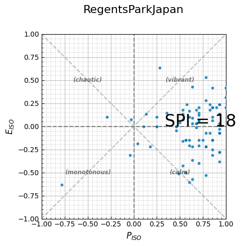

### Comparing Multiple Locations to a Target

We can also compare multiple locations to a target distribution to see
which one is most similar:

``` python
# Define a target distribution
target_msn = MultiSkewNorm()
target_msn.define_dp(
    xi=np.array([0.6, 0.2]),  # A pleasant but not too eventful soundscape
    omega=np.array([[0.1, 0.02], [0.02, 0.1]]),
    alpha=np.array([0, 0]),  # Symmetric distribution
)
target_msn.sample(n=1000)  # Generate sample data

# Select several locations to compare
locations = ["CamdenTown", "RegentsParkJapan", "PancrasLock", "RussellSq"]
location_data = {}
msn_models = {}
spi_scores = {}

# Process each location
for loc in locations:
    # Get data for this location
    location_data[loc] = isd.select_location_ids(valid_data, loc)

    # Fit MSN distribution
    msn_model = MultiSkewNorm()
    msn_model.fit(data=location_data[loc][["ISOPleasant", "ISOEventful"]])
    msn_model.sample(n=1000)
    msn_models[loc] = msn_model

    # Ensure sample data exists for both models
    if msn_model.sample_data is None:
        msn_model.sample(n=1000)
    if target_msn.sample_data is None:
        target_msn.sample(n=1000)

    # Calculate SPI score
    spi_scores[loc] = msn_model.spi_score(target_msn.sample_data)

# Create a bar chart of SPI scores
plt.figure(figsize=(10, 6))
plt.bar(list(spi_scores.keys()), list(spi_scores.values()))
plt.xlabel("Location")
plt.ylabel("SPI Score")
plt.title("SPI Scores Compared to Target Distribution")
plt.ylim(0, 100)
plt.xticks(rotation=45)
plt.tight_layout()
plt.show()
```

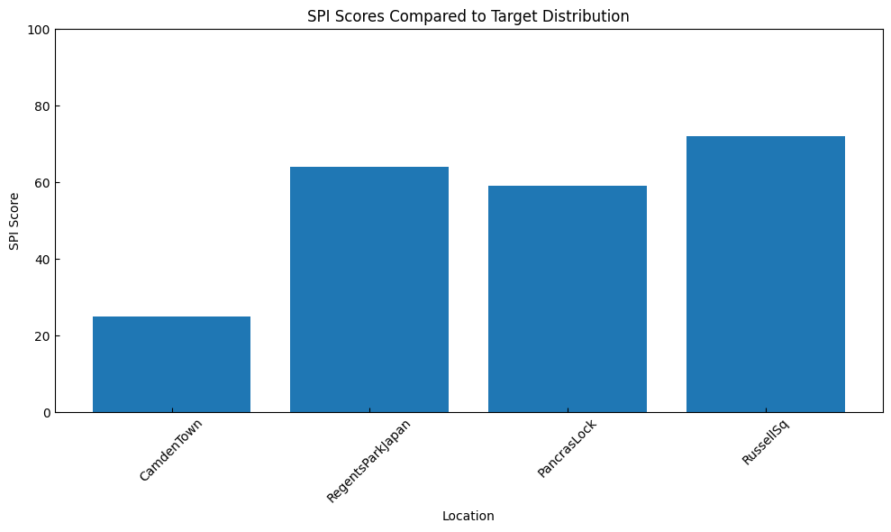

### Visualizing the Target and Actual Distributions

Let’s visualize the target distribution alongside the actual
distributions:

``` python
# Create a figure with subplots
fig = plt.figure(figsize=(15, 10))

# Plot the target distribution
ax1 = fig.add_subplot(2, 3, 1)
sspy.scatter(
    pd.DataFrame(target_msn.sample_data, columns=["ISOPleasant", "ISOEventful"]),
    title="Target Distribution",
    diagonal_lines=True,
    ax=ax1,
)

# Plot each location with its SPI score
for i, location in enumerate(locations):
    ax = fig.add_subplot(2, 3, i + 2)
    sspy.scatter(
        location_data[location],
        title=f"{location} (SPI: {spi_scores[location]})",
        diagonal_lines=True,
        ax=ax,
    )

plt.tight_layout()
plt.show()
```

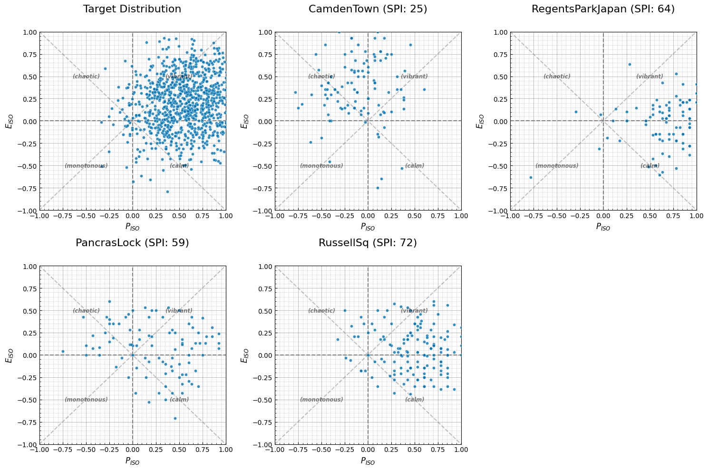

## 4. Using the ISOPlot Class with SPI

Soundscapy’s `ISOPlot` class provides a convenient way to visualize SPI
comparisons. Let’s use it to create more sophisticated visualizations:

``` python
# Create a plot comparing multiple locations with a target distribution
p = sspy.ISOPlot(title="Comparison with Target Distribution").create_subplots(
    nrows=2, ncols=2, figsize=(5, 5), subplot_titles=locations
)

# Ensure target sample data exists
if target_msn.sample_data is None:
    target_msn.sample(n=1000)

# Convert to DataFrame for compatibility
target_df = pd.DataFrame(target_msn.sample_data, columns=["ISOPleasant", "ISOEventful"])

# Add scatter and density layers for each location
for idx, loc in enumerate(locations):
    # Add scatter plot for location data
    p.add_scatter(
        data=location_data[loc],
        on_axis=idx,
    )

    # Add density plot for location data
    p.add_simple_density(
        data=location_data[loc],
        on_axis=idx,
        fill=False,
    )

    # Add scatter layer for target distribution
    p.add_scatter(
        data=target_df,
        on_axis=idx,
        color="red",
        alpha=0.3,
        s=10,
    )

    # Add text annotation with SPI score
    ax = p.get_single_axes(idx)
    ax.text(
        0.05,
        0.95,
        f"SPI: {spi_scores[loc]}",
        transform=ax.transAxes,
        fontsize=10,
        verticalalignment="top",
        bbox={"boxstyle": "round", "facecolor": "white", "alpha": 0.7},
    )

# Apply styling
p.style(diagonal_lines=True)
p.show()
```

    /var/folders/6t/7h8wn9n92w5f24ml_bkwck9m0000gn/T/ipykernel_66249/3988557273.py:2: ExperimentalWarning: `ISOPlot` is currently under development and should be considered experimental. `ISOPlot` implements an experimental API for creating layered soundscape circumplex plots. Use with caution.
      p = sspy.ISOPlot(title="Comparison with Target Distribution").create_subplots(

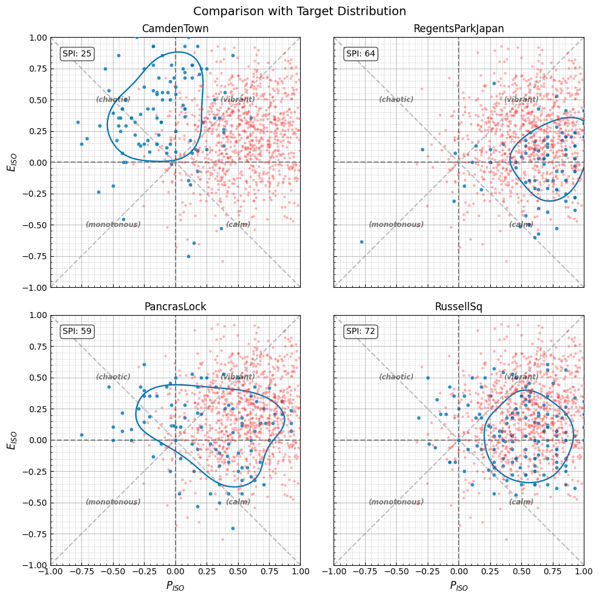

## 5. Practical Applications of SPI

The SPI has several practical applications in soundscape research and
design:

### 1. Evaluating Soundscape Interventions

SPI can be used to evaluate the effectiveness of soundscape
interventions by comparing the distribution before and after the
intervention. A higher SPI indicates that the intervention has moved the
soundscape closer to the target distribution.

### 2. Comparing Different Locations

SPI allows for a quantitative comparison of soundscapes across different
locations, helping to identify locations with similar or different
soundscape characteristics.

### 3. Setting Design Targets

In soundscape design, SPI can be used to set quantitative targets for
the desired soundscape. Designers can define a target distribution and
then evaluate design proposals based on their SPI relative to the
target.

### 4. Monitoring Soundscape Changes Over Time

SPI can be used to monitor how soundscapes change over time, providing a
quantitative measure of temporal variations in soundscape perception.

Let’s simulate a soundscape intervention to demonstrate how SPI can be
used to evaluate its effectiveness:

``` python
# Define a "before" distribution (based on a real location)
before_location = "CamdenTown"
before_data = isd.select_location_ids(valid_data, before_location)
before_msn = MultiSkewNorm()
before_msn.fit(data=before_data[["ISOPleasant", "ISOEventful"]])
before_msn.sample(n=1000)

# Make sure before_msn is properly fitted and has sample data
if before_msn.dp is None or before_msn.sample_data is None:
    before_msn.fit(data=before_data[["ISOPleasant", "ISOEventful"]])
    before_msn.sample(n=1000)

# Get the parameters from the fitted model
xi_param = before_msn.dp.xi.copy()  # Make a copy to avoid reference issues
omega_param = before_msn.dp.omega.copy()
alpha_param = before_msn.dp.alpha.copy()

# Define an "after" distribution (simulated improvement)
# We'll create a distribution that's more pleasant but with similar eventfulness
after_msn = MultiSkewNorm()

# Now define the after distribution with the copied parameters
after_msn.define_dp(
    xi=xi_param + np.array([0.3, 0]),  # Increase pleasantness
    omega=omega_param,  # Keep same spread
    alpha=alpha_param,  # Keep same skewness
)
after_msn.sample(n=1000)

# Define an "ideal" target distribution
target_msn = MultiSkewNorm()

# Now define the target distribution using the copied parameters
target_msn.define_dp(
    xi=np.array([0.7, xi_param[1]]),  # Very pleasant with same eventfulness
    omega=np.array([[0.1, 0], [0, 0.1]]),  # Tighter distribution
    alpha=np.array([0, 0]),  # Symmetric
)
target_msn.sample(n=1000)

# Generate samples for all distributions
before_msn.sample(n=1000)
after_msn.sample(n=1000)
target_msn.sample(n=1000)

# Now we can safely calculate SPI scores
before_spi = before_msn.spi_score(target_msn.sample_data)
after_spi = after_msn.spi_score(target_msn.sample_data)

# Visualize the before, after, and target distributions
plt.figure(figsize=(15, 5))

plt.subplot(1, 3, 1)
sspy.scatter(
    pd.DataFrame(before_msn.sample_data, columns=["ISOPleasant", "ISOEventful"]),
    title=f"Before Intervention (SPI: {before_spi})",
    diagonal_lines=True,
)

plt.subplot(1, 3, 2)
sspy.scatter(
    pd.DataFrame(after_msn.sample_data, columns=["ISOPleasant", "ISOEventful"]),
    title=f"After Intervention (SPI: {after_spi})",
    diagonal_lines=True,
)

plt.subplot(1, 3, 3)
sspy.scatter(
    pd.DataFrame(target_msn.sample_data, columns=["ISOPleasant", "ISOEventful"]),
    title="Target Distribution",
    diagonal_lines=True,
)

plt.tight_layout()
plt.show()
```

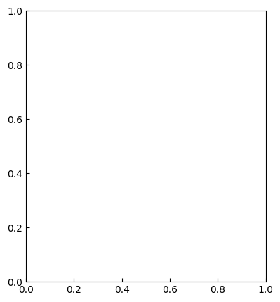

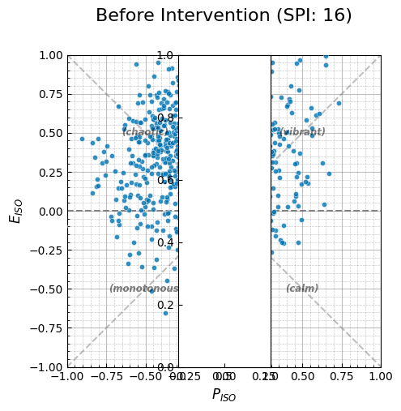

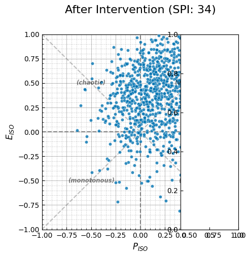

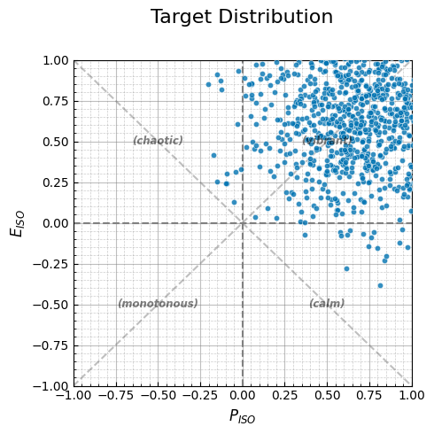

## 6. Best Practices for Using SPI

When using the SPI in your soundscape analysis, consider the following
best practices:

1. **Sample Size**: Ensure that you have a sufficient sample size for
    reliable distribution fitting. The more samples, the better the fit.

2. **Distribution Fitting**: Check the quality of the MSN fit to your
    data. A poor fit can lead to misleading SPI values.

3. **Target Selection**: Choose your target distribution carefully. It
    should represent a realistic and desirable soundscape for the
    specific context.

4. **Interpretation**: Remember that SPI is a relative measure. A high
    SPI doesn’t necessarily mean a good soundscape; it just means
    similarity to the target.

5. **Visualization**: Always visualize the distributions alongside the
    SPI values to get a complete picture of the comparison.

6. **Context**: Consider the context when interpreting SPI. Different
    contexts may require different target distributions.

Let’s demonstrate some of these best practices:

``` python
# Check the quality of MSN fit to data
location = "CamdenTown"
data = isd.select_location_ids(valid_data, location)

# Fit MSN distribution
msn = MultiSkewNorm()
msn.fit(data=data[["ISOPleasant", "ISOEventful"]])
msn.sample(n=1000)

# Visualize original data and fitted distribution
plt.figure(figsize=(15, 5))

plt.subplot(1, 3, 1)
sspy.scatter(
    data,
    title="Original Data",
    diagonal_lines=True,
)

plt.subplot(1, 3, 2)
sspy.scatter(
    pd.DataFrame(msn.sample_data, columns=["ISOPleasant", "ISOEventful"]),
    title="Fitted MSN Distribution",
    diagonal_lines=True,
)

# Create a combined plot to check overlap
plt.subplot(1, 3, 3)
sspy.scatter(
    data,
    title="Overlay",
    diagonal_lines=True,
    color="blue",
    alpha=0.7,
)
sspy.scatter(
    pd.DataFrame(msn.sample_data, columns=["ISOPleasant", "ISOEventful"]),
    ax=plt.gca(),
    color="red",
    alpha=0.3,
)

plt.tight_layout()
plt.show()
```


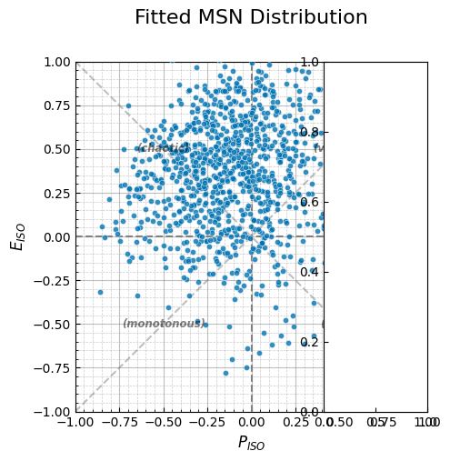

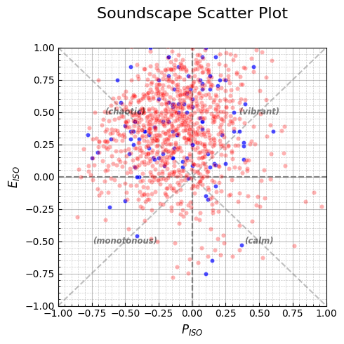

## Summary

In this tutorial, we’ve explored the Soundscape Perception Index (SPI)
and its applications in soundscape analysis. We’ve learned:

1. **What SPI is**: A metric for comparing soundscape distributions,
    ranging from 0 to 100.

2. **How to work with MSN distributions**: Creating, fitting, and
    sampling from multi-dimensional skewed normal distributions.

3. **How to calculate SPI**: Comparing distributions using the
    Kolmogorov-Smirnov test.

4. **Practical applications**: Evaluating interventions, comparing
    locations, setting design targets, and monitoring changes.

5. **Best practices**: Ensuring reliable results through proper sample
    size, distribution fitting, and interpretation.

The SPI provides a powerful tool for quantitative soundscape analysis,
enabling researchers and practitioners to make data-driven decisions in
soundscape design and management.

## References

1. Mitchell, A., Aletta, F., & Kang, J. (2022). How to analyse and
    represent quantitative soundscape data. JASA Express Letters,
    2, 37201. <https://doi.org/10.1121/10.0009794>
2. ISO 12913-3:2019. Acoustics — Soundscape — Part 3: Data analysis.
