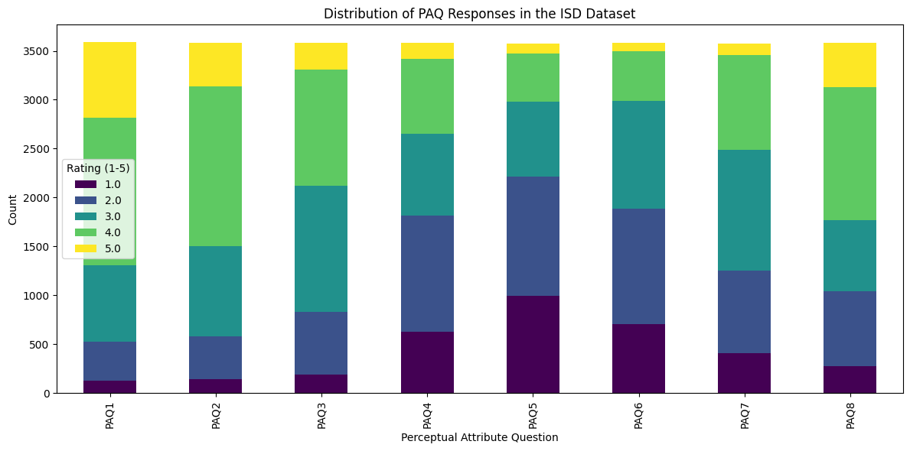
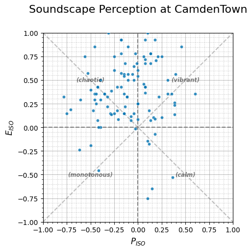
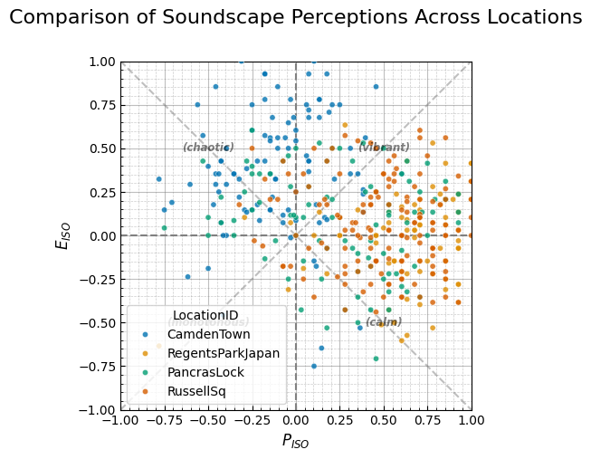

# Working with Soundscape Databases in Soundscapy


``` python
import matplotlib.pyplot as plt
import pandas as pd

import soundscapy as sspy
from soundscapy.databases import isd  # araus
```

## Introduction

Soundscapy provides access to several standardized soundscape databases,
making it easy to work with soundscape survey data from different
sources. This tutorial will guide you through the process of loading,
exploring, and analyzing data from these databases.

### Learning Objectives

By the end of this tutorial, you will be able to: - Load data from
different soundscape databases - Understand the structure and content of
each database - Perform data validation and quality checks - Filter and
select data based on various criteria - Work with multi-language data -
Apply common analysis techniques to soundscape data

Let’s begin by exploring the available databases in Soundscapy.

## 1. Available Databases in Soundscapy

Soundscapy currently provides access to the following databases:

1.  **International Soundscape Database (ISD)**: A collection of
    soundscape survey data from various locations around the world,
    following the ISO 12913 standard.

2.  **Soundscape Attributes Translation Project (SATP)**: A database
    containing translations of soundscape attributes in multiple
    languages, allowing for cross-cultural soundscape research.

3.  **ARAUS Database**: A database of soundscape surveys conducted in
    the Augmented Reality Audio for Urban Soundscapes project.

Each database has its own module in Soundscapy, providing specialized
functions for loading, validating, and analyzing the data.

## 2. Working with the International Soundscape Database (ISD)

The International Soundscape Database (ISD) is a comprehensive
collection of soundscape survey data following the ISO 12913 standard.
It includes data from various locations, with perceptual attributes,
acoustic metrics, and contextual information.

### 2.1 Loading the ISD Data

``` python
# Load the ISD dataset
isd_data = isd.load()

# Display basic information about the dataset
print(f"ISD Dataset shape: {isd_data.shape}")
print(f"Number of locations: {isd_data['LocationID'].nunique()}")
print(f"Number of records: {isd_data['RecordID'].nunique()}")

# Display the first few rows
isd_data.head()
```

    ISD Dataset shape: (3589, 142)
    Number of locations: 26
    Number of records: 2664

<div>
<style scoped>
    .dataframe tbody tr th:only-of-type {
        vertical-align: middle;
    }

    .dataframe tbody tr th {
        vertical-align: top;
    }

    .dataframe thead th {
        text-align: right;
    }
</style>

<table class="dataframe" data-quarto-postprocess="true" data-border="1">
<thead>
<tr style="text-align: right;">
<th data-quarto-table-cell-role="th"></th>
<th data-quarto-table-cell-role="th">LocationID</th>
<th data-quarto-table-cell-role="th">SessionID</th>
<th data-quarto-table-cell-role="th">GroupID</th>
<th data-quarto-table-cell-role="th">RecordID</th>
<th data-quarto-table-cell-role="th">start_time</th>
<th data-quarto-table-cell-role="th">end_time</th>
<th data-quarto-table-cell-role="th">latitude</th>
<th data-quarto-table-cell-role="th">longitude</th>
<th data-quarto-table-cell-role="th">Language</th>
<th data-quarto-table-cell-role="th">Survey_Version</th>
<th data-quarto-table-cell-role="th">...</th>
<th data-quarto-table-cell-role="th">RA_cp90_Max</th>
<th data-quarto-table-cell-role="th">RA_cp95_Max</th>
<th data-quarto-table-cell-role="th">THD_THD_Max</th>
<th data-quarto-table-cell-role="th">THD_Min_Max</th>
<th data-quarto-table-cell-role="th">THD_Max_Max</th>
<th data-quarto-table-cell-role="th">THD_L5_Max</th>
<th data-quarto-table-cell-role="th">THD_L10_Max</th>
<th data-quarto-table-cell-role="th">THD_L50_Max</th>
<th data-quarto-table-cell-role="th">THD_L90_Max</th>
<th data-quarto-table-cell-role="th">THD_L95_Max</th>
</tr>
</thead>
<tbody>
<tr>
<td data-quarto-table-cell-role="th">0</td>
<td>CarloV</td>
<td>CarloV2</td>
<td>2CV12</td>
<td>1434</td>
<td>2019-05-16 18:46:00</td>
<td>2019-05-16 18:56:00</td>
<td>37.17685</td>
<td>-3.590392</td>
<td>eng</td>
<td>engISO2018</td>
<td>...</td>
<td>8.15</td>
<td>6.72</td>
<td>-0.09</td>
<td>-11.76</td>
<td>54.18</td>
<td>34.82</td>
<td>26.53</td>
<td>5.57</td>
<td>-9.0</td>
<td>-10.29</td>
</tr>
<tr>
<td data-quarto-table-cell-role="th">1</td>
<td>CarloV</td>
<td>CarloV2</td>
<td>2CV12</td>
<td>1435</td>
<td>2019-05-16 18:46:00</td>
<td>2019-05-16 18:56:00</td>
<td>37.17685</td>
<td>-3.590392</td>
<td>eng</td>
<td>engISO2018</td>
<td>...</td>
<td>8.15</td>
<td>6.72</td>
<td>-0.09</td>
<td>-11.76</td>
<td>54.18</td>
<td>34.82</td>
<td>26.53</td>
<td>5.57</td>
<td>-9.0</td>
<td>-10.29</td>
</tr>
<tr>
<td data-quarto-table-cell-role="th">2</td>
<td>CarloV</td>
<td>CarloV2</td>
<td>2CV13</td>
<td>1430</td>
<td>2019-05-16 19:02:00</td>
<td>2019-05-16 19:12:00</td>
<td>37.17685</td>
<td>-3.590392</td>
<td>eng</td>
<td>engISO2018</td>
<td>...</td>
<td>5.00</td>
<td>3.91</td>
<td>-2.10</td>
<td>-19.32</td>
<td>72.52</td>
<td>32.33</td>
<td>24.52</td>
<td>0.25</td>
<td>-16.3</td>
<td>-17.33</td>
</tr>
<tr>
<td data-quarto-table-cell-role="th">3</td>
<td>CarloV</td>
<td>CarloV2</td>
<td>2CV13</td>
<td>1431</td>
<td>2019-05-16 19:02:00</td>
<td>2019-05-16 19:12:00</td>
<td>37.17685</td>
<td>-3.590392</td>
<td>eng</td>
<td>engISO2018</td>
<td>...</td>
<td>5.00</td>
<td>3.91</td>
<td>-2.10</td>
<td>-19.32</td>
<td>72.52</td>
<td>32.33</td>
<td>24.52</td>
<td>0.25</td>
<td>-16.3</td>
<td>-17.33</td>
</tr>
<tr>
<td data-quarto-table-cell-role="th">4</td>
<td>CarloV</td>
<td>CarloV2</td>
<td>2CV13</td>
<td>1432</td>
<td>2019-05-16 19:02:00</td>
<td>2019-05-16 19:12:00</td>
<td>37.17685</td>
<td>-3.590392</td>
<td>eng</td>
<td>engISO2018</td>
<td>...</td>
<td>5.00</td>
<td>3.91</td>
<td>-2.10</td>
<td>-19.32</td>
<td>72.52</td>
<td>32.33</td>
<td>24.52</td>
<td>0.25</td>
<td>-16.3</td>
<td>-17.33</td>
</tr>
</tbody>
</table>

<p>5 rows × 142 columns</p>
</div>

### 2.2 Understanding the ISD Data Structure

The ISD dataset contains several types of columns:

1.  **Index Columns**: Identify the survey, location, and respondent
    - `LocationID`: Identifier for the location
    - `RecordID`: Identifier for the audio recording
    - `GroupID`: Identifier for the group of respondents
    - `SessionID`: Identifier for the survey session
2.  **Perceptual Attribute Questions (PAQs)**: Ratings on a 5-point
    Likert scale
    - `PAQ1` (pleasant): How pleasant is the soundscape?
    - `PAQ2` (vibrant): How vibrant is the soundscape?
    - `PAQ3` (eventful): How eventful is the soundscape?
    - `PAQ4` (chaotic): How chaotic is the soundscape?
    - `PAQ5` (annoying): How annoying is the soundscape?
    - `PAQ6` (monotonous): How monotonous is the soundscape?
    - `PAQ7` (uneventful): How uneventful is the soundscape?
    - `PAQ8` (calm): How calm is the soundscape?
3.  **Acoustic Metrics**: Objective measurements of the sound
    environment
    - `LAeq`: A-weighted equivalent continuous sound level
    - Various other metrics like `N5`, `Sharpness`, etc.
4.  **Contextual Information**: Additional data about the survey context
    - Weather conditions, time of day, etc.

Let’s explore the distribution of PAQ responses:

``` python
# Calculate the distribution of responses for each PAQ
paq_columns = [f"PAQ{i}" for i in range(1, 9)]
paq_distribution = isd_data[paq_columns].apply(pd.value_counts).T

# Create a stacked bar chart
ax = paq_distribution.plot(
    kind="bar",
    stacked=True,
    figsize=(12, 6),
    colormap="viridis",
    title="Distribution of PAQ Responses in the ISD Dataset",
)
ax.set_xlabel("Perceptual Attribute Question")
ax.set_ylabel("Count")
ax.legend(title="Rating (1-5)")
plt.tight_layout()
plt.show()
```

    /var/folders/6t/7h8wn9n92w5f24ml_bkwck9m0000gn/T/ipykernel_67016/3928312901.py:3: FutureWarning: pandas.value_counts is deprecated and will be removed in a future version. Use pd.Series(obj).value_counts() instead.
      paq_distribution = isd_data[paq_columns].apply(pd.value_counts).T



### 2.3 Validating the ISD Data

Before analyzing the data, it’s important to validate it to ensure
quality and consistency. Soundscapy provides functions for validating
the ISD data:

``` python
# Validate the ISD dataset
valid_data, invalid_indices = isd.validate(isd_data)

# Display validation results
print(f"Original dataset size: {len(isd_data)}")
print(f"Valid dataset size: {len(valid_data)}")
print(
    f"Number of invalid records: {len(invalid_indices) if isinstance(invalid_indices, pd.DataFrame) else 0}"
)

# If there are invalid records, display the first few
if isinstance(invalid_indices, pd.DataFrame):
    print("\nSample of invalid records:")
    print(isd_data.iloc[invalid_indices[:5].index])
```

    Original dataset size: 3589
    Valid dataset size: 3533
    Number of invalid records: 56

    Sample of invalid records:
       LocationID SessionID GroupID RecordID           start_time  \
    6      CarloV   CarloV2   2CV21     1428  2019-05-16 18:39:00   
    9      CarloV   CarloV2   2CV32     1437  2019-05-16 18:56:00   
    13     CarloV   CarloV2   2CV32     1441  2019-05-16 18:56:00   
    30     CarloV   CarloV2   2CV62     1418  2019-05-16 19:20:00   
    32     CarloV   CarloV2   2CV62     1420  2019-05-16 19:20:00   

                   end_time  latitude  longitude Language Survey_Version  ...  \
    6   2019-05-16 18:49:00  37.17685  -3.590392      eng     engISO2018  ...   
    9   2019-05-16 19:00:00  37.17685  -3.590392      eng     engISO2018  ...   
    13  2019-05-16 19:00:00  37.17685  -3.590392      eng     engISO2018  ...   
    30  2019-05-16 19:30:00  37.17685  -3.590392      eng     engISO2018  ...   
    32  2019-05-16 19:30:00  37.17685  -3.590392      eng     engISO2018  ...   

        RA_cp90_Max  RA_cp95_Max  THD_THD_Max  THD_Min_Max  THD_Max_Max  \
    6          4.45         3.52        -1.91       -13.06        65.17   
    9          6.06         4.93        -0.57       -16.16        58.38   
    13         6.06         4.93        -0.57       -16.16        58.38   
    30         8.88         7.33        -1.22        -9.39        72.49   
    32         8.88         7.33        -1.22        -9.39        72.49   

        THD_L5_Max  THD_L10_Max  THD_L50_Max  THD_L90_Max  THD_L95_Max  
    6        29.99        22.06         2.14        -9.60       -11.12  
    9        32.16        24.88         3.93       -13.25       -14.21  
    13       32.16        24.88         3.93       -13.25       -14.21  
    30       38.63        30.30        10.19        -5.72        -6.94  
    32       38.63        30.30        10.19        -5.72        -6.94  

    [5 rows x 142 columns]

The validation process checks for several issues:

1.  **Missing Values**: Ensures that all required fields have values
2.  **Valid PAQ Responses**: Checks that PAQ responses are within the
    valid range (1-5)
3.  **Consistent Responses**: Identifies respondents who gave the same
    rating for all PAQs
4.  **Data Integrity**: Verifies that the data structure matches the
    expected format

### 2.4 Calculating ISO Coordinates

The ISO 12913 standard defines a circumplex model for soundscape
perception, with two main dimensions: pleasantness and eventfulness.
Soundscapy can calculate these coordinates from the PAQ responses:

``` python
# Calculate ISO coordinates if not already present
if "ISOPleasant" not in valid_data.columns or "ISOEventful" not in valid_data.columns:
    valid_data = sspy.surveys.add_iso_coords(valid_data)

# Display the first few rows with ISO coordinates
valid_data[
    [
        "LocationID",
        "PAQ1",
        "PAQ2",
        "PAQ3",
        "PAQ4",
        "PAQ5",
        "PAQ6",
        "PAQ7",
        "PAQ8",
        "ISOPleasant",
        "ISOEventful",
    ]
].head()
```

<div>
<style scoped>
    .dataframe tbody tr th:only-of-type {
        vertical-align: middle;
    }

    .dataframe tbody tr th {
        vertical-align: top;
    }

    .dataframe thead th {
        text-align: right;
    }
</style>

<table class="dataframe" data-quarto-postprocess="true" data-border="1">
<thead>
<tr style="text-align: right;">
<th data-quarto-table-cell-role="th"></th>
<th data-quarto-table-cell-role="th">LocationID</th>
<th data-quarto-table-cell-role="th">PAQ1</th>
<th data-quarto-table-cell-role="th">PAQ2</th>
<th data-quarto-table-cell-role="th">PAQ3</th>
<th data-quarto-table-cell-role="th">PAQ4</th>
<th data-quarto-table-cell-role="th">PAQ5</th>
<th data-quarto-table-cell-role="th">PAQ6</th>
<th data-quarto-table-cell-role="th">PAQ7</th>
<th data-quarto-table-cell-role="th">PAQ8</th>
<th data-quarto-table-cell-role="th">ISOPleasant</th>
<th data-quarto-table-cell-role="th">ISOEventful</th>
</tr>
</thead>
<tbody>
<tr>
<td data-quarto-table-cell-role="th">0</td>
<td>CarloV</td>
<td>2.0</td>
<td>4.0</td>
<td>2.0</td>
<td>1.0</td>
<td>2.0</td>
<td>2.0</td>
<td>4.0</td>
<td>2.0</td>
<td>0.219670</td>
<td>-0.133883</td>
</tr>
<tr>
<td data-quarto-table-cell-role="th">1</td>
<td>CarloV</td>
<td>2.0</td>
<td>4.0</td>
<td>4.0</td>
<td>4.0</td>
<td>4.0</td>
<td>4.0</td>
<td>1.0</td>
<td>1.0</td>
<td>-0.426777</td>
<td>0.530330</td>
</tr>
<tr>
<td data-quarto-table-cell-role="th">2</td>
<td>CarloV</td>
<td>5.0</td>
<td>3.0</td>
<td>3.0</td>
<td>1.0</td>
<td>2.0</td>
<td>1.0</td>
<td>3.0</td>
<td>4.0</td>
<td>0.676777</td>
<td>-0.073223</td>
</tr>
<tr>
<td data-quarto-table-cell-role="th">3</td>
<td>CarloV</td>
<td>5.0</td>
<td>3.0</td>
<td>3.0</td>
<td>1.0</td>
<td>2.0</td>
<td>2.0</td>
<td>3.0</td>
<td>4.0</td>
<td>0.603553</td>
<td>-0.146447</td>
</tr>
<tr>
<td data-quarto-table-cell-role="th">4</td>
<td>CarloV</td>
<td>5.0</td>
<td>3.0</td>
<td>3.0</td>
<td>2.0</td>
<td>2.0</td>
<td>3.0</td>
<td>3.0</td>
<td>4.0</td>
<td>0.457107</td>
<td>-0.146447</td>
</tr>
</tbody>
</table>

</div>

### 2.5 Filtering and Selecting Data

Soundscapy provides functions for filtering and selecting data from the
ISD dataset:

``` python
# Select data for a specific location
location_id = "CamdenTown"
location_data = isd.select_location_ids(valid_data, location_id)

print(f"Data for {location_id}:")
print(f"Number of records: {len(location_data)}")
print(f"Mean ISOPleasant: {location_data['ISOPleasant'].mean():.3f}")
print(f"Mean ISOEventful: {location_data['ISOEventful'].mean():.3f}")

# Visualize the location data
ax = sspy.scatter(
    location_data,
    title=f"Soundscape Perception at {location_id}",
    diagonal_lines=True,
)
plt.show()
```

    Data for CamdenTown:
    Number of records: 105
    Mean ISOPleasant: -0.103
    Mean ISOEventful: 0.364



You can also select data based on other criteria, such as `RecordID`,
`GroupID`, or `SessionID`:

``` python
# Select data for a specific record
record_id = "CT101"
record_data = valid_data[valid_data["RecordID"] == record_id]

print(f"Data for Record {record_id}:")
print(f"Number of responses: {len(record_data)}")
print(f"Mean ISOPleasant: {record_data['ISOPleasant'].mean():.3f}")
print(f"Mean ISOEventful: {record_data['ISOEventful'].mean():.3f}")
```

    Data for Record CT101:
    Number of responses: 0
    Mean ISOPleasant: nan
    Mean ISOEventful: nan

### 2.6 Comparing Multiple Locations

One common analysis is to compare soundscape perceptions across
different locations:

``` python
# Select data for multiple locations
locations = ["CamdenTown", "RegentsParkJapan", "PancrasLock", "RussellSq"]
multi_location_data = pd.concat(
    [isd.select_location_ids(valid_data, loc) for loc in locations]
)

# Create a scatter plot with locations as hue
ax = sspy.scatter(
    multi_location_data,
    title="Comparison of Soundscape Perceptions Across Locations",
    hue="LocationID",
    diagonal_lines=True,
)
plt.show()
```



## 3. Working with the Soundscape Attributes Translation Project (SATP)

The Soundscape Attributes Translation Project (SATP) provides
translations of soundscape attributes in multiple languages. This is
particularly useful for cross-cultural soundscape research.

### 3.1 Loading the SATP Data

``` python
# Load the SATP dataset
satp_data = sspy.db.satp.load()

# Display basic information about the dataset
print(f"SATP Dataset shape: {satp_data.shape}")
print(f"Number of languages: {satp_data['Language'].nunique()}")
print(f"Languages included: {', '.join(satp_data['Language'].unique())}")

# Display the first few rows
satp_data.head()
```

    AttributeError: module 'soundscapy.databases.satp' has no attribute 'load'
    ---------------------------------------------------------------------------
    AttributeError                            Traceback (most recent call last)
    Cell In[31], line 2
          1 # Load the SATP dataset
    ----> 2 satp_data = sspy.db.satp.load()
          4 # Display basic information about the dataset
          5 print(f"SATP Dataset shape: {satp_data.shape}")

    AttributeError: module 'soundscapy.databases.satp' has no attribute 'load'

### 3.2 Understanding the SATP Data Structure

The SATP dataset contains translations of soundscape attributes in
multiple languages. Each row represents a translation of a specific
attribute in a specific language.

The main columns are:

1.  **Language**: The language of the translation
2.  **Attribute**: The soundscape attribute being translated
3.  **Translation**: The translated term
4.  **Back Translation**: The back-translation to English
5.  **Notes**: Additional notes about the translation

### 3.3 Working with Language-Specific Angles

Different languages may have slightly different semantic relationships
between soundscape attributes. Soundscapy provides language-specific
angles for the circumplex model:

``` python
# Display the language-specific angles
from soundscapy.surveys import LANGUAGE_ANGLES

print("Language-specific angles for the circumplex model:")
for language, angles in LANGUAGE_ANGLES.items():
    print(f"{language}: {angles}")
```

These language-specific angles can be used when calculating ISO
coordinates for data collected in different languages:

``` python
# Example of calculating ISO coordinates with language-specific angles
# (This is a demonstration - we'll use simulated data)

# Create simulated data
simulated_data = sspy.surveys.simulation(n=100)

# Calculate ISO coordinates with default angles (English)
default_coords = sspy.surveys.add_iso_coords(
    simulated_data, names=("ISO_EN_Pleasant", "ISO_EN_Eventful")
)

# Calculate ISO coordinates with language-specific angles (e.g., German)
german_coords = sspy.surveys.add_iso_coords(
    simulated_data,
    names=("ISO_DE_Pleasant", "ISO_DE_Eventful"),
    angles=LANGUAGE_ANGLES["deu"],
)

# Compare the results
comparison_data = pd.DataFrame(
    {
        "EN_Pleasant": default_coords["ISO_EN_Pleasant"],
        "EN_Eventful": default_coords["ISO_EN_Eventful"],
        "DE_Pleasant": german_coords["ISO_DE_Pleasant"],
        "DE_Eventful": german_coords["ISO_DE_Eventful"],
    }
)

# Calculate the differences
comparison_data["Pleasant_Diff"] = (
    comparison_data["EN_Pleasant"] - comparison_data["DE_Pleasant"]
)
comparison_data["Eventful_Diff"] = (
    comparison_data["EN_Eventful"] - comparison_data["DE_Eventful"]
)

print("Summary of differences between English and German ISO coordinates:")
print(comparison_data[["Pleasant_Diff", "Eventful_Diff"]].describe())
```

## 4. Working with the ARAUS Database

The ARAUS (Augmented Reality Audio for Urban Soundscapes) database
contains soundscape survey data collected as part of the ARAUS project.

### 4.1 Loading the ARAUS Data

``` python
# Note: This is a placeholder for the ARAUS database functionality
# The actual implementation may differ
try:
    araus_data = araus.load()  # noqa: F821
    print(f"ARAUS Dataset shape: {araus_data.shape}")
except (ImportError, AttributeError):
    print("ARAUS database functionality is not yet fully implemented.")
    print("This section is included for completeness and future compatibility.")
```

## 5. Common Analysis Techniques

Regardless of which database you’re working with, there are several
common analysis techniques that can be applied to soundscape data.

### 5.1 Calculating Mean Responses

One simple analysis is to calculate the mean responses for each PAQ:

``` python
# Calculate mean responses by location
mean_by_location = sspy.surveys.mean_responses(valid_data, "LocationID")

# Display the results
print("Mean PAQ responses by location:")
print(mean_by_location)
```

### 5.2 Structural Summary Method (SSM)

The Structural Summary Method (SSM) provides a more sophisticated
analysis of circumplex data. It fits a cosine function to the PAQ
responses and extracts parameters such as amplitude, angle, elevation,
and displacement:

``` python
# Calculate SSM metrics for a location
location_data = isd.select_location_ids(valid_data, "CamdenTown")
ssm_results = sspy.surveys.ssm_metrics(location_data)

# Display the results
print("SSM metrics for CamdenTown:")
print(ssm_results.round(2))
```

### 5.3 Data Quality Checks

Soundscapy provides functions for checking the quality of Likert scale
data:

``` python
# Perform data quality checks
invalid_indices = sspy.surveys.likert_data_quality(valid_data)

if invalid_indices:
    print(f"Found {len(invalid_indices)} records with data quality issues.")
else:
    print("All records passed the data quality check.")
```

## 6. Best Practices for Working with Soundscape Databases

When working with soundscape databases, consider the following best
practices:

1.  **Data Validation**: Always validate your data before analysis to
    ensure quality and consistency.

2.  **Documentation**: Keep track of your data sources, processing
    steps, and analysis methods.

3.  **Cross-Cultural Considerations**: Be aware of cultural differences
    in soundscape perception and use language-specific angles when
    appropriate.

4.  **Context**: Consider the context of the soundscape surveys,
    including location, time, and environmental factors.

5.  **Visualization**: Use appropriate visualizations to communicate
    your findings effectively.

6.  **Reproducibility**: Make your analysis reproducible by documenting
    your code and data processing steps.

## Summary

In this tutorial, we’ve explored how to work with different soundscape
databases in Soundscapy. We’ve learned:

1.  **Available Databases**: The ISD, SATP, and ARAUS databases provide
    different types of soundscape data.

2.  **Data Loading and Validation**: Soundscapy provides functions for
    loading and validating data from these databases.

3.  **ISO Coordinates**: The ISO 12913 standard defines a circumplex
    model for soundscape perception, with pleasantness and eventfulness
    as the main dimensions.

4.  **Data Selection**: You can filter and select data based on various
    criteria, such as location, record, group, or session.

5.  **Cross-Cultural Analysis**: The SATP database and language-specific
    angles enable cross-cultural soundscape research.

6.  **Analysis Techniques**: Common analysis techniques include
    calculating mean responses, SSM metrics, and data quality checks.

By leveraging these databases and analysis techniques, you can gain
valuable insights into soundscape perception and contribute to the
growing field of soundscape research.

## References

1.  ISO 12913-1:2014. Acoustics — Soundscape — Part 1: Definition and
    conceptual framework.
2.  ISO 12913-2:2018. Acoustics — Soundscape — Part 2: Data collection
    and reporting requirements.
3.  ISO 12913-3:2019. Acoustics — Soundscape — Part 3: Data analysis.
4.  Mitchell, A., Aletta, F., & Kang, J. (2022). How to analyse and
    represent quantitative soundscape data. JASA Express Letters,
    2, 37201. https://doi.org/10.1121/10.0009794
