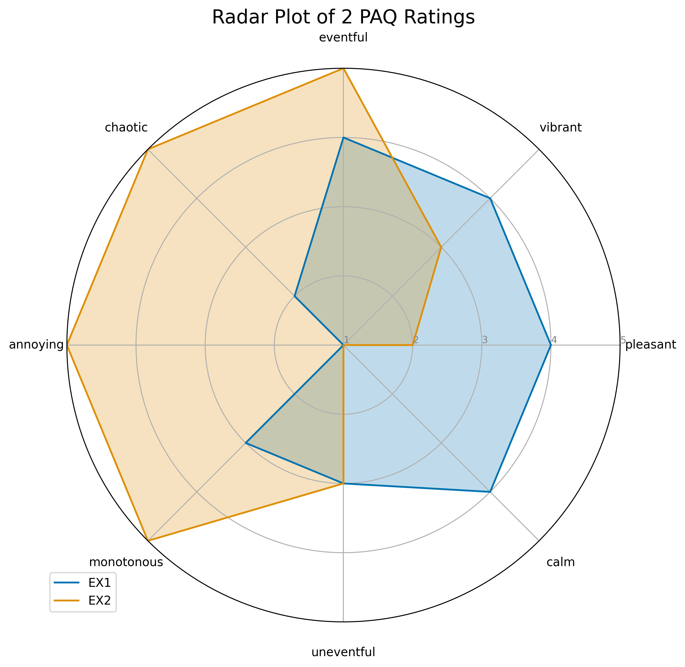
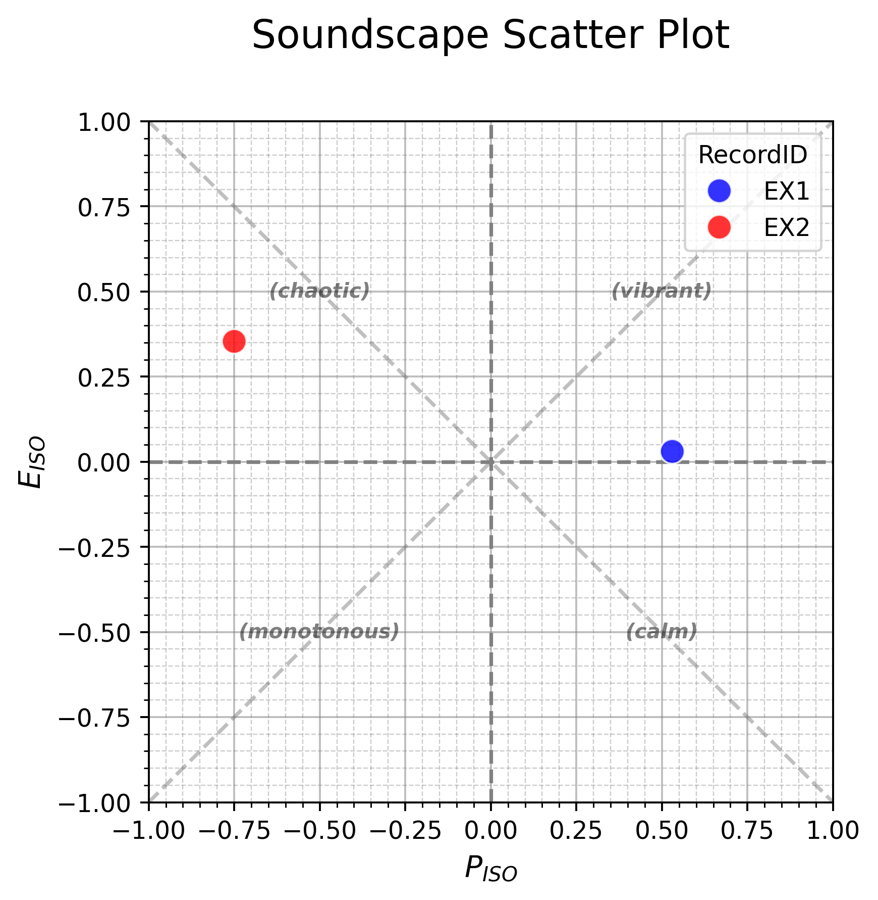
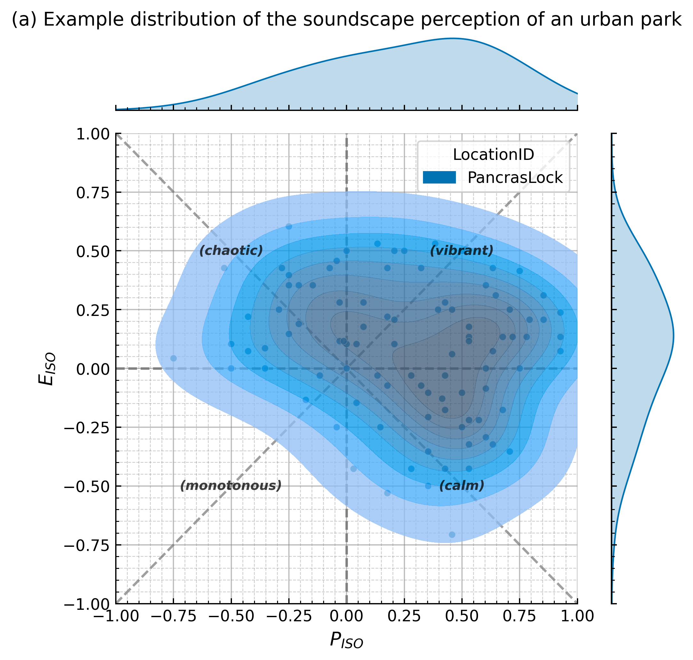
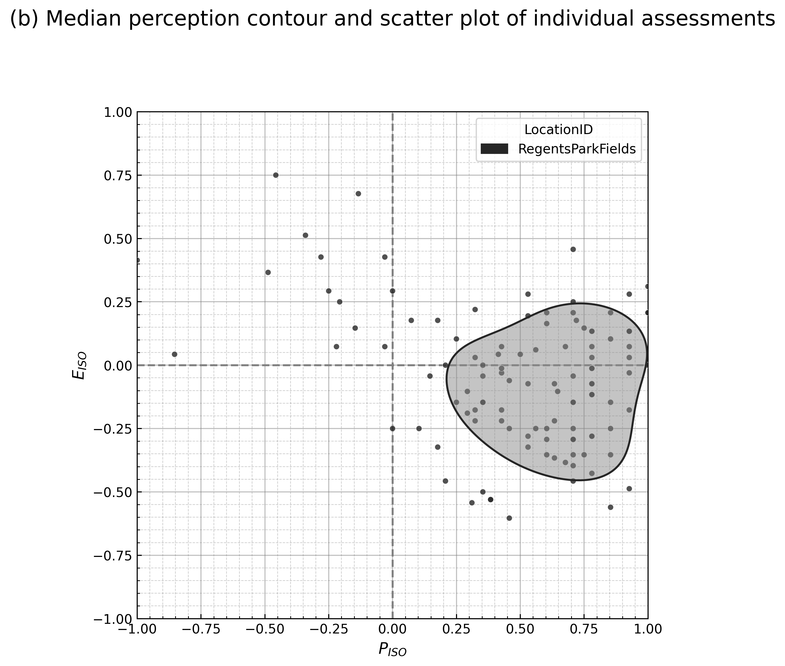
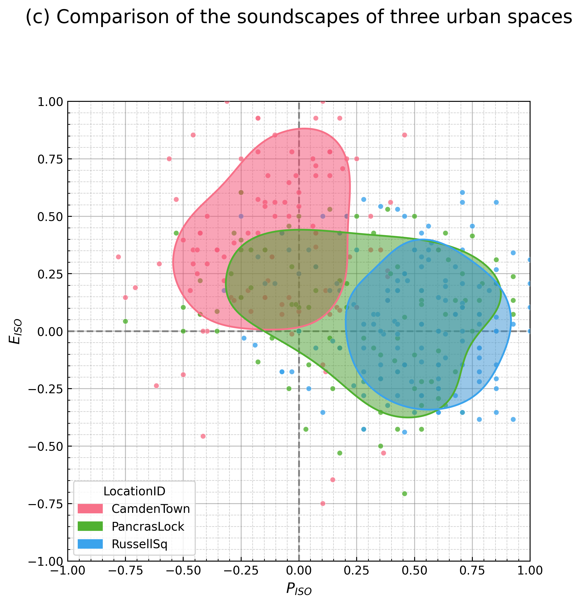
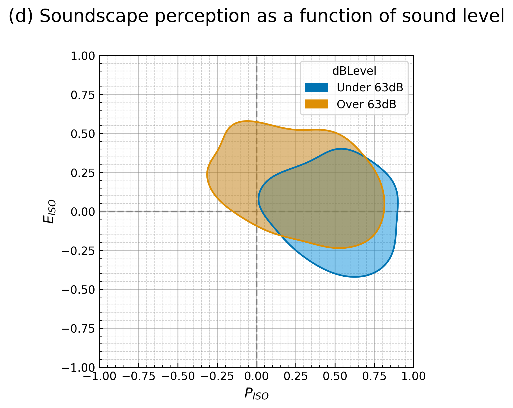
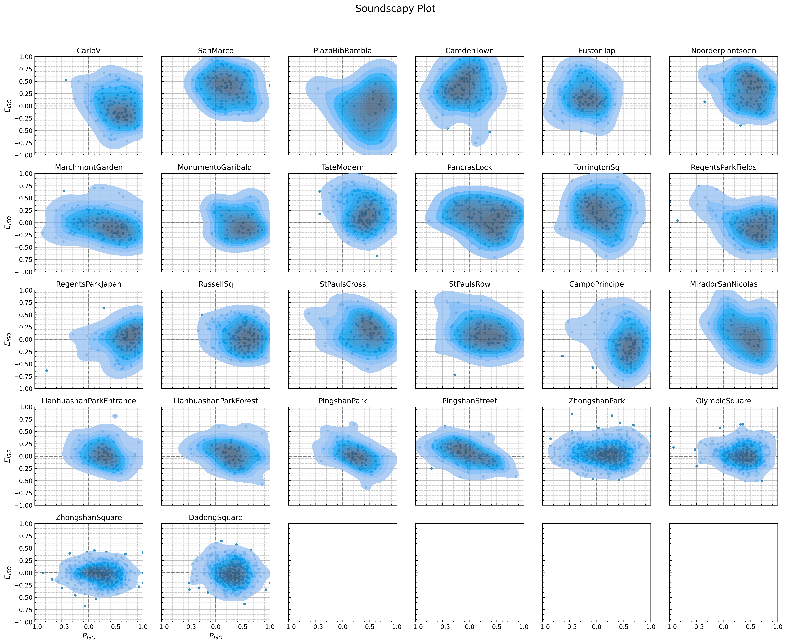
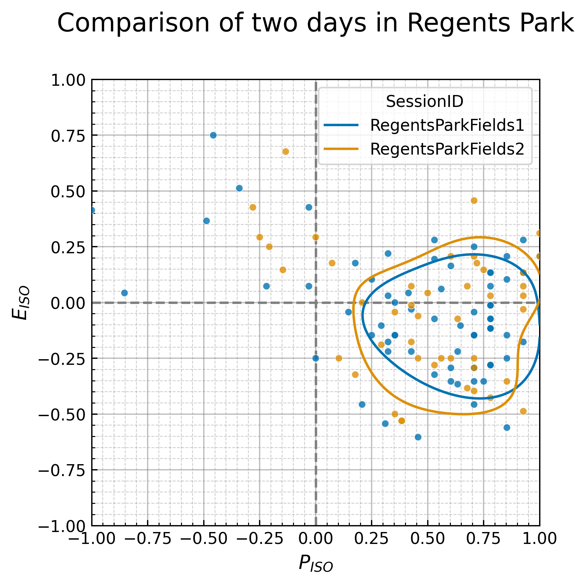
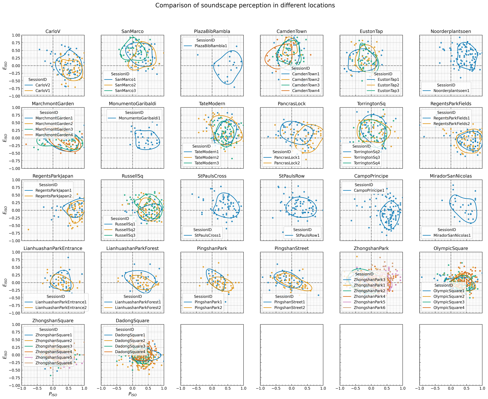
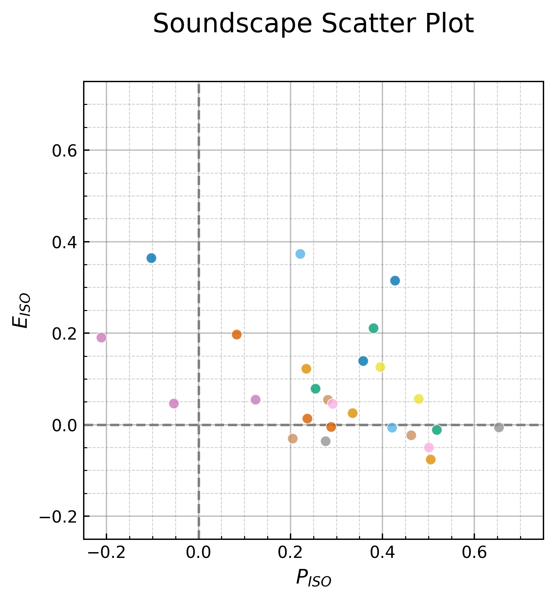

# How to analyse and represent soundscape perception

Andrew Mitchell, Francesco Aletta, Jian Kang

This notebook provides examples for analysing and visualising soundscape
assessment data from the International Soundscape Database (ISD). The
custom functions created for this purpose are stored in the `isd.py`
file.

The ISD contains survey and acoustic data collected in urban public
spaces with the goal of creating a unified dataset for the development
of a predictive soundscape model and a set of soundscape indices. We
have created a new visualisation method in order to properly analyse and
examine the assessment of the locations included in the dataset. This
method focuses on enabling sophisticated statistical analyses and
ensuring the variety of responses in a location are properly considered.

In this notebook we will walk you through both using the code itself and
interpreting the soundscape perception of urban spaces.

``` python
# imports
import matplotlib.pyplot as plt
import pandas as pd
import seaborn as sns

import soundscapy as sspy
```

## The current ISO 12913 framework

Although different methods are proposed for data collection in ISO12913
Part 2, in the context of this study we focus on the questionnaire-based
soundscape assessment (Method A), because it is underpinned by a
theoretical relationship among the items of the questionnaire that
compose it. The core of this questionnaire is the 8 perceptual
attributes (PA) originally derived in Axlesson et al. (2010): pleasant,
vibrant (or exciting), eventful, chaotic, annoying, monotonous,
uneventful, and calm. In the questionnaire procedure, these PAs are
assessed independently of each other, however, they are conceptually
considered to form a two-dimensional circumplex with *Pleasantness* and
*Eventfulness* on the x- and y-axis, respectively, where all regions of
the space are equally likely to accomodate a given soundscape
assessment. In Axelsson et al. (2010) a third primary dimension,
*Familiarity* was also found, however this only accounted for 8% of the
variance and is typically disregarded as part of the standard
circumplex. As will be made clear throughout, the circumplex model has
several aspects which make it useful for representing the soundscape
perception of a space as a whole.

### Coordinate transformation

To facilitate the analysis of the perceptual attribute (PA) responses,
the Likert scale responses are coded from 1 (Strongly disagree) to 5
(Strongly agree) as ordinal variables. In order to reduce the 8 PA
values into a pair of coordinates which can be plotted on the
Pleasant-Eventful axes, Part 3 of the ISO 12913 provides a trigonometric
transformation, based on the $45\degree$ relationship between the
diagonal axes and the pleasant and eventful axes. This tranformation
projects the coded values from the individual PAs down onto the primary
Pleasantness and Eventfulness dimensions, then adds them together to
form a single coordinate pair. In theory, this coordinate pair then
encapsulates information from all 8 PA dimensions onto a more easily
understandable and analyzable 2 dimensions.

The ISO coordinates are thus calculated by:

$$
ISOPleasant = \[(pleasant - annoying) + \cos{45\degree} \* (calm - chaotic) + \cos{45\degree} \* (vibrant - monotonous)\] \* \frac{1}{(4 + \sqrt{32})}
$$

$$
ISOEventful = \[(eventful - uneventful) + \cos{45\degree} \* (chaotic - calm) + \cos{45\degree} \* (vibrant - monotonous)\] \* \frac{1}{(4 + \sqrt{32})}
$$

where the PAs are arranged around the circumplex as shown in Figure 1.
The $\cos{45\degree}$ term operates to project the diagonal terms down
ono the x and y axes, and the $\frac{1}{4 + \sqrt{32}}$ scales the
resulting coordinates to the range (-1, 1). The result of this
transformation is demonstrated in Figure 1.

To give an example of this, we create two example survey responses, with
different PAQ answers:

``` python
sample_transform = {
    "RecordID": ["EX1", "EX2"],
    "pleasant": [4, 2],
    "vibrant": [4, 3],
    "eventful": [4, 5],
    "chaotic": [2, 5],
    "annoying": [1, 5],
    "monotonous": [3, 5],
    "uneventful": [3, 3],
    "calm": [4, 1],
}
sample_df = pd.DataFrame().from_dict(sample_transform)
sample_df = sample_df.set_index("RecordID")
sample_df
```

<div>
<style scoped>
    .dataframe tbody tr th:only-of-type {
        vertical-align: middle;
    }

    .dataframe tbody tr th {
        vertical-align: top;
    }

    .dataframe thead th {
        text-align: right;
    }
</style>

<table class="dataframe" data-quarto-postprocess="true" data-border="1">
<thead>
<tr style="text-align: right;">
<th data-quarto-table-cell-role="th"></th>
<th data-quarto-table-cell-role="th">pleasant</th>
<th data-quarto-table-cell-role="th">vibrant</th>
<th data-quarto-table-cell-role="th">eventful</th>
<th data-quarto-table-cell-role="th">chaotic</th>
<th data-quarto-table-cell-role="th">annoying</th>
<th data-quarto-table-cell-role="th">monotonous</th>
<th data-quarto-table-cell-role="th">uneventful</th>
<th data-quarto-table-cell-role="th">calm</th>
</tr>
<tr>
<th data-quarto-table-cell-role="th">RecordID</th>
<th data-quarto-table-cell-role="th"></th>
<th data-quarto-table-cell-role="th"></th>
<th data-quarto-table-cell-role="th"></th>
<th data-quarto-table-cell-role="th"></th>
<th data-quarto-table-cell-role="th"></th>
<th data-quarto-table-cell-role="th"></th>
<th data-quarto-table-cell-role="th"></th>
<th data-quarto-table-cell-role="th"></th>
</tr>
</thead>
<tbody>
<tr>
<td data-quarto-table-cell-role="th">EX1</td>
<td>4</td>
<td>4</td>
<td>4</td>
<td>2</td>
<td>1</td>
<td>3</td>
<td>3</td>
<td>4</td>
</tr>
<tr>
<td data-quarto-table-cell-role="th">EX2</td>
<td>2</td>
<td>3</td>
<td>5</td>
<td>5</td>
<td>5</td>
<td>5</td>
<td>3</td>
<td>1</td>
</tr>
</tbody>
</table>

</div>

We can visualise how these individual PAQ answers are arranged on the
circumplex with a radar plot.

``` python
fig = plt.figure(figsize=(4, 4))
plt.rcParams["figure.dpi"] = 350
sspy.plotting.likert.paq_radar_plot(sample_df, title="Radar Plot of 2 PAQ Ratings")
```

    <Figure size 400x400 with 0 Axes>



Now, we can apply the transform formula from above to calculate the
ISOPleasant and ISOEventful values and add them to the dataframe.

``` python
sample_df = sspy.surveys.rename_paqs(sample_df)
sample_df = sspy.surveys.add_iso_coords(sample_df)
sample_df
```

<div>
<style scoped>
    .dataframe tbody tr th:only-of-type {
        vertical-align: middle;
    }

    .dataframe tbody tr th {
        vertical-align: top;
    }

    .dataframe thead th {
        text-align: right;
    }
</style>

<table class="dataframe" data-quarto-postprocess="true" data-border="1">
<thead>
<tr style="text-align: right;">
<th data-quarto-table-cell-role="th"></th>
<th data-quarto-table-cell-role="th">PAQ1</th>
<th data-quarto-table-cell-role="th">PAQ2</th>
<th data-quarto-table-cell-role="th">PAQ3</th>
<th data-quarto-table-cell-role="th">PAQ4</th>
<th data-quarto-table-cell-role="th">PAQ5</th>
<th data-quarto-table-cell-role="th">PAQ6</th>
<th data-quarto-table-cell-role="th">PAQ7</th>
<th data-quarto-table-cell-role="th">PAQ8</th>
<th data-quarto-table-cell-role="th">ISOPleasant</th>
<th data-quarto-table-cell-role="th">ISOEventful</th>
</tr>
<tr>
<th data-quarto-table-cell-role="th">RecordID</th>
<th data-quarto-table-cell-role="th"></th>
<th data-quarto-table-cell-role="th"></th>
<th data-quarto-table-cell-role="th"></th>
<th data-quarto-table-cell-role="th"></th>
<th data-quarto-table-cell-role="th"></th>
<th data-quarto-table-cell-role="th"></th>
<th data-quarto-table-cell-role="th"></th>
<th data-quarto-table-cell-role="th"></th>
<th data-quarto-table-cell-role="th"></th>
<th data-quarto-table-cell-role="th"></th>
</tr>
</thead>
<tbody>
<tr>
<td data-quarto-table-cell-role="th">EX1</td>
<td>4</td>
<td>4</td>
<td>4</td>
<td>2</td>
<td>1</td>
<td>3</td>
<td>3</td>
<td>4</td>
<td>0.53033</td>
<td>0.030330</td>
</tr>
<tr>
<td data-quarto-table-cell-role="th">EX2</td>
<td>2</td>
<td>3</td>
<td>5</td>
<td>5</td>
<td>5</td>
<td>5</td>
<td>3</td>
<td>1</td>
<td>-0.75000</td>
<td>0.353553</td>
</tr>
</tbody>
</table>

</div>

Finally, we can plot these values on a two dimensional plane to
visualise how the transform went from the 8 dimensions shown in the
radar plot to the two ISO dimensions. This is done by calling the
`circumplex_scatter()` function included in `isd.py`. This will create a
plotting axis with the appropriate circumplex grid and labels, then plot
the ISOPleasant and ISOEventful values as the x and y coordinates.

This treatment of the 8 PAs makes several assumptions and inferences
about the relationships between the dimensions. As stated in the
standard:

> According to the two-dimensional model, vibrant soundscapes are both
> pleasant and eventful, chaotic soundscapes are both eventful and
> unpleasant, monotonous soundscapes are both unpleasant and uneventful,
> and finally calm soundscapes are both uneventful and pleasant.

``` python
colors = ["b", "r"]
palette = sns.color_palette(colors)
sspy.plotting.scatter(
    sample_df,
    hue="RecordID",
    palette=palette,
    diagonal_lines=True,
    legend="brief",
    s=100,
)
```



## The way forward: Probabilistic soundscape representation

Given the identified issues with the recommended methods for statistical
analysis and their shortcomings in representing the variety in
perception of the soundscape in a space, how then should we discuss or
present the results of these soundscape assessments? Ideally the method
will: 1) take advantage of the circumplex coordinates and their ability
to be displayed on a scatter plot and be treated as continuous
variables, 2) scale from a dataset of 10 responses to thousands of
responses, 3) facilitate the comparison of the soundscapes of different
locations and conditions, and 4) encapsulate the nuances and diversity
of soundscape perception by representing the distribution of responses.

We therefore present a series of visualisations of the soundscape
assessments of several urban spaces included in the International
Soundscape Database (ISD) which reflect these goals. The specific
locations selected from the ISD are chosen for demonstration only and
these methods can be applied to any location. Rather than attempting to
represent a single individual’s soundscape or of describing a location’s
soundscape as a single average assessment (as in Part 3 of the ISO
technical specification), this representation shows the whole range of
perception of the users of the space.

To begin, we can load the dataset directly from the ISD:

``` python
ssid = sspy.isd.load()
ssid, excl = sspy.isd.validate(ssid, allow_paq_na=False)
ssid = sspy.surveys.add_iso_coords(ssid)
ssid.head()
```

<div>
<style scoped>
    .dataframe tbody tr th:only-of-type {
        vertical-align: middle;
    }

    .dataframe tbody tr th {
        vertical-align: top;
    }

    .dataframe thead th {
        text-align: right;
    }
</style>

<table class="dataframe" data-quarto-postprocess="true" data-border="1">
<thead>
<tr style="text-align: right;">
<th data-quarto-table-cell-role="th"></th>
<th data-quarto-table-cell-role="th">LocationID</th>
<th data-quarto-table-cell-role="th">SessionID</th>
<th data-quarto-table-cell-role="th">GroupID</th>
<th data-quarto-table-cell-role="th">RecordID</th>
<th data-quarto-table-cell-role="th">start_time</th>
<th data-quarto-table-cell-role="th">end_time</th>
<th data-quarto-table-cell-role="th">latitude</th>
<th data-quarto-table-cell-role="th">longitude</th>
<th data-quarto-table-cell-role="th">Language</th>
<th data-quarto-table-cell-role="th">Survey_Version</th>
<th data-quarto-table-cell-role="th">...</th>
<th data-quarto-table-cell-role="th">THD_THD_Max</th>
<th data-quarto-table-cell-role="th">THD_Min_Max</th>
<th data-quarto-table-cell-role="th">THD_Max_Max</th>
<th data-quarto-table-cell-role="th">THD_L5_Max</th>
<th data-quarto-table-cell-role="th">THD_L10_Max</th>
<th data-quarto-table-cell-role="th">THD_L50_Max</th>
<th data-quarto-table-cell-role="th">THD_L90_Max</th>
<th data-quarto-table-cell-role="th">THD_L95_Max</th>
<th data-quarto-table-cell-role="th">ISOPleasant</th>
<th data-quarto-table-cell-role="th">ISOEventful</th>
</tr>
</thead>
<tbody>
<tr>
<td data-quarto-table-cell-role="th">0</td>
<td>CarloV</td>
<td>CarloV2</td>
<td>2CV12</td>
<td>1434</td>
<td>2019-05-16 18:46:00</td>
<td>2019-05-16 18:56:00</td>
<td>37.17685</td>
<td>-3.590392</td>
<td>eng</td>
<td>engISO2018</td>
<td>...</td>
<td>-0.09</td>
<td>-11.76</td>
<td>54.18</td>
<td>34.82</td>
<td>26.53</td>
<td>5.57</td>
<td>-9.0</td>
<td>-10.29</td>
<td>0.219670</td>
<td>-0.133883</td>
</tr>
<tr>
<td data-quarto-table-cell-role="th">1</td>
<td>CarloV</td>
<td>CarloV2</td>
<td>2CV12</td>
<td>1435</td>
<td>2019-05-16 18:46:00</td>
<td>2019-05-16 18:56:00</td>
<td>37.17685</td>
<td>-3.590392</td>
<td>eng</td>
<td>engISO2018</td>
<td>...</td>
<td>-0.09</td>
<td>-11.76</td>
<td>54.18</td>
<td>34.82</td>
<td>26.53</td>
<td>5.57</td>
<td>-9.0</td>
<td>-10.29</td>
<td>-0.426777</td>
<td>0.530330</td>
</tr>
<tr>
<td data-quarto-table-cell-role="th">2</td>
<td>CarloV</td>
<td>CarloV2</td>
<td>2CV13</td>
<td>1430</td>
<td>2019-05-16 19:02:00</td>
<td>2019-05-16 19:12:00</td>
<td>37.17685</td>
<td>-3.590392</td>
<td>eng</td>
<td>engISO2018</td>
<td>...</td>
<td>-2.10</td>
<td>-19.32</td>
<td>72.52</td>
<td>32.33</td>
<td>24.52</td>
<td>0.25</td>
<td>-16.3</td>
<td>-17.33</td>
<td>0.676777</td>
<td>-0.073223</td>
</tr>
<tr>
<td data-quarto-table-cell-role="th">3</td>
<td>CarloV</td>
<td>CarloV2</td>
<td>2CV13</td>
<td>1431</td>
<td>2019-05-16 19:02:00</td>
<td>2019-05-16 19:12:00</td>
<td>37.17685</td>
<td>-3.590392</td>
<td>eng</td>
<td>engISO2018</td>
<td>...</td>
<td>-2.10</td>
<td>-19.32</td>
<td>72.52</td>
<td>32.33</td>
<td>24.52</td>
<td>0.25</td>
<td>-16.3</td>
<td>-17.33</td>
<td>0.603553</td>
<td>-0.146447</td>
</tr>
<tr>
<td data-quarto-table-cell-role="th">4</td>
<td>CarloV</td>
<td>CarloV2</td>
<td>2CV13</td>
<td>1432</td>
<td>2019-05-16 19:02:00</td>
<td>2019-05-16 19:12:00</td>
<td>37.17685</td>
<td>-3.590392</td>
<td>eng</td>
<td>engISO2018</td>
<td>...</td>
<td>-2.10</td>
<td>-19.32</td>
<td>72.52</td>
<td>32.33</td>
<td>24.52</td>
<td>0.25</td>
<td>-16.3</td>
<td>-17.33</td>
<td>0.457107</td>
<td>-0.146447</td>
</tr>
</tbody>
</table>

<p>5 rows × 144 columns</p>
</div>

First, rather than calculating the median response to each PA in the
location, then calculating the circumplex coordinates, the coordinates
for each individual response are calculated. This results in a vector of
ISOPleasant, ISOEventful values which are continuous variables from -1
to +1 and can be analysed statistically by calculating summary
statistics (mean, standard deviation, quintiles, etc.) and through the
use of regression modelling, which can often be simpler and more
familiar than the recommended methods of analysing ordinal data. This
also enables each individual’s response to be placed within the
pleasant-eventful space. All of the responses for a location can then be
plotted, giving an overall scatter plot for a location, as demonstrated
in (i).

``` python
# Jointplot has not yet been reimplemented in the newest version of Soundscapy. This will be added back soon.

sspy.plotting.jointplot(
    sspy.isd.select_location_ids(ssid, "PancrasLock"),
    title="(a) Example distribution of the soundscape perception of an urban park",
    diagonal_lines=True,
    hue="LocationID",
    legend=True,
    alpha=0.75,
)
plt.tight_layout()
```



Once these individual responses are plotted, we then overlay a heatmap
of the bivariate distribution (with color maps for each decile) and
marginal distribution plots. In this way, three primary characteristics
of the soundscape perception can be seen:

1. The distribution across both pleasantness and eventfulness,
    including the central tendency, the dispersion, and any skewness in
    the response;
2. The general shape of the soundscape within the space - in this case
    Russell Sq is almost entirely in the pleasant half, but is split
    relatively evenly across the eventfulness space, meaning while it is
    perceived as generally pleasant, it is not strongly calm or vibrant;
3. The degree of agreement about the soundscape perception - there
    appears to be a relatively high agreement about the character of
    Russell Sq, as demonstrated by the compactness of the distribution,
    but this is not the case for every location, as will be shown later.

Fig (i) includes several in-depth visualisations of the distribution of
soundscape assessments, however the detail included can make further
analysis difficult. In particular, a decile heatmap is so visually busy
that, in our experience, it is not possible to plot more than one
soundscape distribution at a time without the figure becoming overly
busy. It also can make it difficult to truly grasp point 2, the general
shape of the soundscape. To facilitate this, the same soundscape can be
represented by its 50th percentile contour, as demonstrated in Fig (ii)
where the shaded portion contains 50% of the responses. This simplified
view of the distribution presents several advantages, as will be
demonstrated in Figs. (iii and iv) and takes inspiration from the
recommendation in the ISO standard to use the median as a summary
statistic.

When visualised this way, it is possible to identify outliers and
responses which are the result of anamolous sound events. For instance
if, during a survey session at a calm park, a fleet of helicopters flies
overhead, driving the participants to respond that the soundscape is
highly chaotic, we would see a group of scatter points in the chaotic
quadrant which appear obviously outside the general pattern of
responses. In a simpler analysis method, these responses would either be
entirely discarded as outliers or surveys and soundwalks would be halted
entirely – ignoring what is in fact a significant impact on that
location, its soundscape, and how useful it may be for the community –
or would be included within the statistical analysis, significantly
impacting the central tendency and dispersion metrics (i.e. median and
range) without consideration for the context. This is the situation
shown in Fig (ii) where it is obvious that there is strong agreement
that Regents Park Fields is highly pleasant and calm, however we can see
numerous responses which assessed it as highly chaotic when a series of
military helicopter fly overs drastically changed the sound environment
of the space for nearly 20 minutes.

``` python
location = "RegentsParkFields"
fig, ax = plt.subplots(1, 1, figsize=(7, 7))

sspy.density(
    sspy.isd.select_location_ids(ssid, location),
    hue="LocationID",
    title="(b) Median perception contour and scatter plot of individual assessments\n\n",
    palette="dark:gray",
    ax=ax,
    density_type="simple",
)
```



Fig (iii) demonstrates how this simplified representation makes it
possible to compare the soundscape of several locations in a
sophisticated way. The soundscape assessments of three urban spaces,
Camden Town, Pancras Lock, and Russell Square, are shown overlaid with
each other. We can see that Camden Town, a busy and crowded street
corner with high levels of traffic noise and amplified music, is
generally perceived as chaotic, but the median contour shape which
characterises it also crosses over into the vibrant quadrant. We can
also see that, for a part of the sample, Russell Square and Pancras Lock
are both perceived as similarly pleasant, however some portion of the
responses perceived Pancras Lock as being somewhat chaotic and annoying.
This kind of visualisation is able to highlight these similarities
between the soundscapes in the locations and identify how they differ.
From here, further investigation could lead us to answer what is it that
led to those people perceiving the location as unpleasant, and what
similarities does the soundscape of Pancras Lock have with Russell
Square that could perhaps be enhanced to increase the proportion of
people perceiving it as more pleasant.

``` python
fig, ax = plt.subplots(1, 1, figsize=(7, 7))

sspy.plotting.density(
    sspy.isd.select_location_ids(ssid, ["CamdenTown", "RussellSq", "PancrasLock"]),
    hue="LocationID",
    title="(c) Comparison of the soundscapes of three urban spaces\n\n",
    palette="husl",
    density_type="simple",
    ax=ax,
)
```



In addition to solely analysing the distributions of the perceptual
responses themselves, this method can also be combined with other
acoustic, environmental, and contextual data. The final example, in Fig
(iv) demonstrates how this method can better demonstrate the complex
relationships between acoustic features of the sound environment and the
soundscape perception. The data in the ISD includes approximately 30
second long binaural audio recordings taken while each participant was
responding to the soundscape survey, providing an indication of the
exact sound environment they were exposed to. For Fig (iv) the entire
dataset of 1,338 responses at all 13 locations has been split according
to the analysis of these recordings giving a set of less than 65 dB LAeq
and a set of more than 65 dB. The bivariate distribution of these two
conditions are then plotted.

``` python
ssid["dBLevel"] = pd.cut(
    ssid["LAeq_L(A)_Max"],
    bins=(0, 63, 150),
    labels=("Under 63dB", "Over 63dB"),
    precision=1,
)

ssid.head()
```

<div>
<style scoped>
    .dataframe tbody tr th:only-of-type {
        vertical-align: middle;
    }

    .dataframe tbody tr th {
        vertical-align: top;
    }

    .dataframe thead th {
        text-align: right;
    }
</style>

<table class="dataframe" data-quarto-postprocess="true" data-border="1">
<thead>
<tr style="text-align: right;">
<th data-quarto-table-cell-role="th"></th>
<th data-quarto-table-cell-role="th">LocationID</th>
<th data-quarto-table-cell-role="th">SessionID</th>
<th data-quarto-table-cell-role="th">GroupID</th>
<th data-quarto-table-cell-role="th">RecordID</th>
<th data-quarto-table-cell-role="th">start_time</th>
<th data-quarto-table-cell-role="th">end_time</th>
<th data-quarto-table-cell-role="th">latitude</th>
<th data-quarto-table-cell-role="th">longitude</th>
<th data-quarto-table-cell-role="th">Language</th>
<th data-quarto-table-cell-role="th">Survey_Version</th>
<th data-quarto-table-cell-role="th">...</th>
<th data-quarto-table-cell-role="th">THD_Min_Max</th>
<th data-quarto-table-cell-role="th">THD_Max_Max</th>
<th data-quarto-table-cell-role="th">THD_L5_Max</th>
<th data-quarto-table-cell-role="th">THD_L10_Max</th>
<th data-quarto-table-cell-role="th">THD_L50_Max</th>
<th data-quarto-table-cell-role="th">THD_L90_Max</th>
<th data-quarto-table-cell-role="th">THD_L95_Max</th>
<th data-quarto-table-cell-role="th">ISOPleasant</th>
<th data-quarto-table-cell-role="th">ISOEventful</th>
<th data-quarto-table-cell-role="th">dBLevel</th>
</tr>
</thead>
<tbody>
<tr>
<td data-quarto-table-cell-role="th">0</td>
<td>CarloV</td>
<td>CarloV2</td>
<td>2CV12</td>
<td>1434</td>
<td>2019-05-16 18:46:00</td>
<td>2019-05-16 18:56:00</td>
<td>37.17685</td>
<td>-3.590392</td>
<td>eng</td>
<td>engISO2018</td>
<td>...</td>
<td>-11.76</td>
<td>54.18</td>
<td>34.82</td>
<td>26.53</td>
<td>5.57</td>
<td>-9.0</td>
<td>-10.29</td>
<td>0.219670</td>
<td>-0.133883</td>
<td>Under 63dB</td>
</tr>
<tr>
<td data-quarto-table-cell-role="th">1</td>
<td>CarloV</td>
<td>CarloV2</td>
<td>2CV12</td>
<td>1435</td>
<td>2019-05-16 18:46:00</td>
<td>2019-05-16 18:56:00</td>
<td>37.17685</td>
<td>-3.590392</td>
<td>eng</td>
<td>engISO2018</td>
<td>...</td>
<td>-11.76</td>
<td>54.18</td>
<td>34.82</td>
<td>26.53</td>
<td>5.57</td>
<td>-9.0</td>
<td>-10.29</td>
<td>-0.426777</td>
<td>0.530330</td>
<td>Under 63dB</td>
</tr>
<tr>
<td data-quarto-table-cell-role="th">2</td>
<td>CarloV</td>
<td>CarloV2</td>
<td>2CV13</td>
<td>1430</td>
<td>2019-05-16 19:02:00</td>
<td>2019-05-16 19:12:00</td>
<td>37.17685</td>
<td>-3.590392</td>
<td>eng</td>
<td>engISO2018</td>
<td>...</td>
<td>-19.32</td>
<td>72.52</td>
<td>32.33</td>
<td>24.52</td>
<td>0.25</td>
<td>-16.3</td>
<td>-17.33</td>
<td>0.676777</td>
<td>-0.073223</td>
<td>Under 63dB</td>
</tr>
<tr>
<td data-quarto-table-cell-role="th">3</td>
<td>CarloV</td>
<td>CarloV2</td>
<td>2CV13</td>
<td>1431</td>
<td>2019-05-16 19:02:00</td>
<td>2019-05-16 19:12:00</td>
<td>37.17685</td>
<td>-3.590392</td>
<td>eng</td>
<td>engISO2018</td>
<td>...</td>
<td>-19.32</td>
<td>72.52</td>
<td>32.33</td>
<td>24.52</td>
<td>0.25</td>
<td>-16.3</td>
<td>-17.33</td>
<td>0.603553</td>
<td>-0.146447</td>
<td>Under 63dB</td>
</tr>
<tr>
<td data-quarto-table-cell-role="th">4</td>
<td>CarloV</td>
<td>CarloV2</td>
<td>2CV13</td>
<td>1432</td>
<td>2019-05-16 19:02:00</td>
<td>2019-05-16 19:12:00</td>
<td>37.17685</td>
<td>-3.590392</td>
<td>eng</td>
<td>engISO2018</td>
<td>...</td>
<td>-19.32</td>
<td>72.52</td>
<td>32.33</td>
<td>24.52</td>
<td>0.25</td>
<td>-16.3</td>
<td>-17.33</td>
<td>0.457107</td>
<td>-0.146447</td>
<td>Under 63dB</td>
</tr>
</tbody>
</table>

<p>5 rows × 145 columns</p>
</div>

``` python
ssid["dBLevel"].describe()
```

    count          1443
    unique            2
    top       Over 63dB
    freq            751
    Name: dBLevel, dtype: object

``` python
sspy.density(
    ssid,
    hue="dBLevel",
    title="(d) Soundscape perception as a function of sound level",
    palette="colorblind",
    incl_scatter=False,
    diagonal_lines=False,
    density_type="simple",
    marginal_kind="kde",
)
```

    /Users/mitch/Documents/GitHub/Soundscapy/.venv/lib/python3.12/site-packages/seaborn/distributions.py:1176: UserWarning: The following kwargs were not used by contour: 'marginal_kind'
      cset = contour_func(
    /Users/mitch/Documents/GitHub/Soundscapy/.venv/lib/python3.12/site-packages/seaborn/distributions.py:1176: UserWarning: The following kwargs were not used by contour: 'marginal_kind'
      cset = contour_func(



## Other examples

In addition to the visualisation demonstrations given above which were
included in the JASA Express Letters article, we present a few examples
of the uses of this distributional shape approach.

### The soundscape shape of all 13 locations

``` python
len(ssid.LocationID.unique())
```

    26

``` python
fig, ax = sspy.create_iso_subplots(
    data=ssid,
    plot_layers=["density", "scatter"],
    subplot_size=(3, 3),
    subplot_by="LocationID",
)

plt.show()
```

    /Users/mitch/Documents/GitHub/Soundscapy/src/soundscapy/plotting/plot_functions.py:953: UserWarning: Density plots are not recommended for small datasets (<30 samples).
      _valid_density(data)
    /Users/mitch/Documents/GitHub/Soundscapy/src/soundscapy/plotting/plot_functions.py:953: UserWarning: Density plots are not recommended for small datasets (<30 samples).
      _valid_density(data)



### A comparison of two days in the same location

``` python
sspy.density(
    sspy.isd.select_location_ids(ssid, location_ids="RegentsParkFields"),
    hue="SessionID",
    title="Comparison of two days in Regents Park",
    fill=False,
    incl_outline=True,
    incl_scatter=True,
    density_type="simple",
    legend="auto",
)
```



### All of the survey days in every location

``` python
fig, ax = sspy.create_iso_subplots(
    data=ssid,
    subplot_by="LocationID",
    title="Comparison of soundscape perception in different locations",
    plot_layers=["simple_density", "scatter"],
    subplot_size=(3, 3),
    hue="SessionID",
    legend="brief",
    fill=False,
)
plt.show()
```

    /Users/mitch/Documents/GitHub/Soundscapy/src/soundscapy/plotting/plot_functions.py:953: UserWarning: Density plots are not recommended for small datasets (<30 samples).
      _valid_density(data)
    /Users/mitch/Documents/GitHub/Soundscapy/src/soundscapy/plotting/plot_functions.py:953: UserWarning: Density plots are not recommended for small datasets (<30 samples).
      _valid_density(data)



### Statistical analysis of the ISD dataset

Although the visualisations shown in the above figures are a powerful
tool for viewing, analysing, and discussing the multi-dimensional
aspects of soundscape perception, there are certainly cases where
simpler metrics are needed to aid discussion and to set design goals.
Taking inspiration from noise annoyance, we propose a move toward
discussing the “percent of people likely to perceive” a soundscape as
pleasant, vibrant, etc. when it is necessary to use numerical
descriptions. In this way, a numerical design goal could also be set as
e.g. “the soundscape should be likely to be perceived as pleasant by at
least 75% of users” or the results of an intervention presented as
e.g. “the likelihood of the soundscape being perceived as calm increased
from 30% to 55%”. These numbers can be drawn from either actual surveys
or from the results of predictive models.

Finally, although acknowledging the distribution of responses is
crucial, it is sometimes necessary to summarise locations down to a
single point to compare many different locations and to easily
investigate how the soundscape assessment has generally changed over
time. For this purpose, the mean of the ISOPleasant and ISOEventful
values across all respondents is calculated to result in a single
coordinate point per location. This clearly mirrors the original intent
of the coordinate transformation presented in the ISO, but by applying
the transformation first to each individual assessment then calculating
the mean value, it maintains a direct link to the distributions shown
above.

We have included a function for creating a numerical summary of each
location. For this, we first calculate the mean ISOPleasant and
ISOEventful value for the location, giving a single coordinate to
describe the location in the circumplex. We then calculate the
percentage of overall responses falling in the `pleasant` or `eventful`
halfs, or in the `vibrant`, `chaotic`, etc. quadrants.

``` python
sspy.isd.describe_location(ssid, "CamdenTown")
```

    {'count': 105,
     'ISOPleasant': -0.103,
     'ISOEventful': 0.364,
     'pleasant': 0.39,
     'eventful': 0.905,
     'vibrant': 0.333,
     'chaotic': 0.562,
     'monotonous': 0.038,
     'calm': 0.057}

``` python
sspy.isd.soundscapy_describe(ssid)
```

<div>
<style scoped>
    .dataframe tbody tr th:only-of-type {
        vertical-align: middle;
    }

    .dataframe tbody tr th {
        vertical-align: top;
    }

    .dataframe thead th {
        text-align: right;
    }
</style>

<table class="dataframe" data-quarto-postprocess="true" data-border="1">
<thead>
<tr style="text-align: right;">
<th data-quarto-table-cell-role="th"></th>
<th data-quarto-table-cell-role="th">count</th>
<th data-quarto-table-cell-role="th">ISOPleasant</th>
<th data-quarto-table-cell-role="th">ISOEventful</th>
<th data-quarto-table-cell-role="th">pleasant</th>
<th data-quarto-table-cell-role="th">eventful</th>
<th data-quarto-table-cell-role="th">vibrant</th>
<th data-quarto-table-cell-role="th">chaotic</th>
<th data-quarto-table-cell-role="th">monotonous</th>
<th data-quarto-table-cell-role="th">calm</th>
</tr>
</thead>
<tbody>
<tr>
<td data-quarto-table-cell-role="th">CarloV</td>
<td>116</td>
<td>0.518</td>
<td>-0.012</td>
<td>0.940</td>
<td>0.448</td>
<td>0.397</td>
<td>0.052</td>
<td>0.009</td>
<td>0.534</td>
</tr>
<tr>
<td data-quarto-table-cell-role="th">SanMarco</td>
<td>96</td>
<td>0.221</td>
<td>0.373</td>
<td>0.750</td>
<td>0.875</td>
<td>0.656</td>
<td>0.219</td>
<td>0.010</td>
<td>0.094</td>
</tr>
<tr>
<td data-quarto-table-cell-role="th">PlazaBibRambla</td>
<td>18</td>
<td>0.463</td>
<td>-0.023</td>
<td>0.889</td>
<td>0.556</td>
<td>0.444</td>
<td>0.056</td>
<td>0.000</td>
<td>0.444</td>
</tr>
<tr>
<td data-quarto-table-cell-role="th">CamdenTown</td>
<td>105</td>
<td>-0.103</td>
<td>0.364</td>
<td>0.390</td>
<td>0.905</td>
<td>0.333</td>
<td>0.562</td>
<td>0.038</td>
<td>0.057</td>
</tr>
<tr>
<td data-quarto-table-cell-role="th">EustonTap</td>
<td>100</td>
<td>-0.211</td>
<td>0.190</td>
<td>0.250</td>
<td>0.750</td>
<td>0.180</td>
<td>0.570</td>
<td>0.140</td>
<td>0.070</td>
</tr>
<tr>
<td data-quarto-table-cell-role="th">Noorderplantsoen</td>
<td>97</td>
<td>0.427</td>
<td>0.315</td>
<td>0.928</td>
<td>0.825</td>
<td>0.753</td>
<td>0.072</td>
<td>0.000</td>
<td>0.175</td>
</tr>
<tr>
<td data-quarto-table-cell-role="th">MarchmontGarden</td>
<td>105</td>
<td>0.276</td>
<td>-0.036</td>
<td>0.733</td>
<td>0.381</td>
<td>0.248</td>
<td>0.133</td>
<td>0.114</td>
<td>0.486</td>
</tr>
<tr>
<td data-quarto-table-cell-role="th">MonumentoGaribaldi</td>
<td>32</td>
<td>0.421</td>
<td>-0.007</td>
<td>0.906</td>
<td>0.438</td>
<td>0.375</td>
<td>0.062</td>
<td>0.031</td>
<td>0.531</td>
</tr>
<tr>
<td data-quarto-table-cell-role="th">TateModern</td>
<td>152</td>
<td>0.381</td>
<td>0.211</td>
<td>0.908</td>
<td>0.730</td>
<td>0.645</td>
<td>0.086</td>
<td>0.007</td>
<td>0.250</td>
</tr>
<tr>
<td data-quarto-table-cell-role="th">PancrasLock</td>
<td>94</td>
<td>0.254</td>
<td>0.079</td>
<td>0.723</td>
<td>0.628</td>
<td>0.394</td>
<td>0.234</td>
<td>0.032</td>
<td>0.330</td>
</tr>
<tr>
<td data-quarto-table-cell-role="th">TorringtonSq</td>
<td>115</td>
<td>0.083</td>
<td>0.197</td>
<td>0.609</td>
<td>0.696</td>
<td>0.391</td>
<td>0.296</td>
<td>0.070</td>
<td>0.209</td>
</tr>
<tr>
<td data-quarto-table-cell-role="th">RegentsParkFields</td>
<td>118</td>
<td>0.501</td>
<td>-0.050</td>
<td>0.881</td>
<td>0.415</td>
<td>0.305</td>
<td>0.110</td>
<td>0.008</td>
<td>0.576</td>
</tr>
<tr>
<td data-quarto-table-cell-role="th">RegentsParkJapan</td>
<td>91</td>
<td>0.653</td>
<td>-0.006</td>
<td>0.956</td>
<td>0.527</td>
<td>0.505</td>
<td>0.022</td>
<td>0.022</td>
<td>0.451</td>
</tr>
<tr>
<td data-quarto-table-cell-role="th">RussellSq</td>
<td>146</td>
<td>0.479</td>
<td>0.056</td>
<td>0.911</td>
<td>0.541</td>
<td>0.493</td>
<td>0.048</td>
<td>0.034</td>
<td>0.418</td>
</tr>
<tr>
<td data-quarto-table-cell-role="th">StPaulsCross</td>
<td>66</td>
<td>0.358</td>
<td>0.139</td>
<td>0.864</td>
<td>0.652</td>
<td>0.545</td>
<td>0.091</td>
<td>0.030</td>
<td>0.288</td>
</tr>
<tr>
<td data-quarto-table-cell-role="th">StPaulsRow</td>
<td>72</td>
<td>0.234</td>
<td>0.122</td>
<td>0.764</td>
<td>0.653</td>
<td>0.500</td>
<td>0.153</td>
<td>0.083</td>
<td>0.264</td>
</tr>
<tr>
<td data-quarto-table-cell-role="th">CampoPrincipe</td>
<td>110</td>
<td>0.505</td>
<td>-0.076</td>
<td>0.918</td>
<td>0.382</td>
<td>0.327</td>
<td>0.055</td>
<td>0.027</td>
<td>0.591</td>
</tr>
<tr>
<td data-quarto-table-cell-role="th">MiradorSanNicolas</td>
<td>28</td>
<td>0.395</td>
<td>0.126</td>
<td>0.929</td>
<td>0.607</td>
<td>0.536</td>
<td>0.071</td>
<td>0.000</td>
<td>0.393</td>
</tr>
<tr>
<td data-quarto-table-cell-role="th">LianhuashanParkEntrance</td>
<td>60</td>
<td>0.281</td>
<td>0.054</td>
<td>0.850</td>
<td>0.483</td>
<td>0.400</td>
<td>0.083</td>
<td>0.067</td>
<td>0.450</td>
</tr>
<tr>
<td data-quarto-table-cell-role="th">LianhuashanParkForest</td>
<td>59</td>
<td>0.292</td>
<td>0.046</td>
<td>0.847</td>
<td>0.559</td>
<td>0.424</td>
<td>0.136</td>
<td>0.017</td>
<td>0.424</td>
</tr>
<tr>
<td data-quarto-table-cell-role="th">PingshanPark</td>
<td>69</td>
<td>0.237</td>
<td>0.013</td>
<td>0.826</td>
<td>0.449</td>
<td>0.304</td>
<td>0.130</td>
<td>0.029</td>
<td>0.507</td>
</tr>
<tr>
<td data-quarto-table-cell-role="th">PingshanStreet</td>
<td>101</td>
<td>-0.054</td>
<td>0.046</td>
<td>0.386</td>
<td>0.584</td>
<td>0.149</td>
<td>0.436</td>
<td>0.139</td>
<td>0.228</td>
</tr>
<tr>
<td data-quarto-table-cell-role="th">ZhongshanPark</td>
<td>448</td>
<td>0.124</td>
<td>0.055</td>
<td>0.661</td>
<td>0.565</td>
<td>0.362</td>
<td>0.201</td>
<td>0.118</td>
<td>0.292</td>
</tr>
<tr>
<td data-quarto-table-cell-role="th">OlympicSquare</td>
<td>333</td>
<td>0.335</td>
<td>0.025</td>
<td>0.883</td>
<td>0.474</td>
<td>0.399</td>
<td>0.072</td>
<td>0.027</td>
<td>0.477</td>
</tr>
<tr>
<td data-quarto-table-cell-role="th">ZhongshanSquare</td>
<td>441</td>
<td>0.205</td>
<td>-0.030</td>
<td>0.746</td>
<td>0.356</td>
<td>0.268</td>
<td>0.084</td>
<td>0.093</td>
<td>0.467</td>
</tr>
<tr>
<td data-quarto-table-cell-role="th">DadongSquare</td>
<td>361</td>
<td>0.288</td>
<td>-0.005</td>
<td>0.870</td>
<td>0.427</td>
<td>0.371</td>
<td>0.053</td>
<td>0.055</td>
<td>0.490</td>
</tr>
</tbody>
</table>

</div>

The standard `describe()` method in pandas can also still be used to
calculate other summary statistics.

``` python
ssid.describe()
```

<div>
<style scoped>
    .dataframe tbody tr th:only-of-type {
        vertical-align: middle;
    }

    .dataframe tbody tr th {
        vertical-align: top;
    }

    .dataframe thead th {
        text-align: right;
    }
</style>

<table class="dataframe" data-quarto-postprocess="true" data-border="1">
<thead>
<tr style="text-align: right;">
<th data-quarto-table-cell-role="th"></th>
<th data-quarto-table-cell-role="th">latitude</th>
<th data-quarto-table-cell-role="th">longitude</th>
<th data-quarto-table-cell-role="th">ssi01</th>
<th data-quarto-table-cell-role="th">ssi02</th>
<th data-quarto-table-cell-role="th">ssi03</th>
<th data-quarto-table-cell-role="th">ssi04</th>
<th data-quarto-table-cell-role="th">PAQ1</th>
<th data-quarto-table-cell-role="th">PAQ4</th>
<th data-quarto-table-cell-role="th">PAQ2</th>
<th data-quarto-table-cell-role="th">PAQ7</th>
<th data-quarto-table-cell-role="th">...</th>
<th data-quarto-table-cell-role="th">THD_THD_Max</th>
<th data-quarto-table-cell-role="th">THD_Min_Max</th>
<th data-quarto-table-cell-role="th">THD_Max_Max</th>
<th data-quarto-table-cell-role="th">THD_L5_Max</th>
<th data-quarto-table-cell-role="th">THD_L10_Max</th>
<th data-quarto-table-cell-role="th">THD_L50_Max</th>
<th data-quarto-table-cell-role="th">THD_L90_Max</th>
<th data-quarto-table-cell-role="th">THD_L95_Max</th>
<th data-quarto-table-cell-role="th">ISOPleasant</th>
<th data-quarto-table-cell-role="th">ISOEventful</th>
</tr>
</thead>
<tbody>
<tr>
<td data-quarto-table-cell-role="th">count</td>
<td>1564.000000</td>
<td>1564.000000</td>
<td>3527.000000</td>
<td>3527.000000</td>
<td>3528.000000</td>
<td>3528.000000</td>
<td>3533.000000</td>
<td>3533.000000</td>
<td>3533.000000</td>
<td>3533.000000</td>
<td>...</td>
<td>1443.000000</td>
<td>1443.000000</td>
<td>1443.000000</td>
<td>1443.000000</td>
<td>1443.000000</td>
<td>1443.000000</td>
<td>1443.000000</td>
<td>1443.000000</td>
<td>3533.000000</td>
<td>3533.000000</td>
</tr>
<tr>
<td data-quarto-table-cell-role="th">mean</td>
<td>48.530137</td>
<td>0.291937</td>
<td>2.497306</td>
<td>2.550043</td>
<td>2.815193</td>
<td>2.484410</td>
<td>3.657232</td>
<td>2.621851</td>
<td>3.501557</td>
<td>2.870082</td>
<td>...</td>
<td>-2.639459</td>
<td>-10.405800</td>
<td>64.091753</td>
<td>36.856403</td>
<td>29.412044</td>
<td>8.242807</td>
<td>-7.183735</td>
<td>-8.352245</td>
<td>0.264746</td>
<td>0.063397</td>
</tr>
<tr>
<td data-quarto-table-cell-role="th">std</td>
<td>5.467855</td>
<td>3.827420</td>
<td>1.078817</td>
<td>1.094632</td>
<td>1.009665</td>
<td>1.134197</td>
<td>1.045119</td>
<td>1.132850</td>
<td>0.989074</td>
<td>1.038250</td>
<td>...</td>
<td>2.497385</td>
<td>6.623331</td>
<td>7.168306</td>
<td>6.839833</td>
<td>6.938444</td>
<td>7.733709</td>
<td>6.912088</td>
<td>6.741942</td>
<td>0.360427</td>
<td>0.273478</td>
</tr>
<tr>
<td data-quarto-table-cell-role="th">min</td>
<td>37.172598</td>
<td>-3.600068</td>
<td>1.000000</td>
<td>1.000000</td>
<td>1.000000</td>
<td>1.000000</td>
<td>1.000000</td>
<td>1.000000</td>
<td>1.000000</td>
<td>1.000000</td>
<td>...</td>
<td>-18.910000</td>
<td>-21.440000</td>
<td>44.630000</td>
<td>17.230000</td>
<td>12.640000</td>
<td>-14.600000</td>
<td>-19.450000</td>
<td>-19.860000</td>
<td>-1.000000</td>
<td>-0.823223</td>
</tr>
<tr>
<td data-quarto-table-cell-role="th">25%</td>
<td>45.433663</td>
<td>-0.146469</td>
<td>2.000000</td>
<td>2.000000</td>
<td>2.000000</td>
<td>2.000000</td>
<td>3.000000</td>
<td>2.000000</td>
<td>3.000000</td>
<td>2.000000</td>
<td>...</td>
<td>-3.550000</td>
<td>-15.305000</td>
<td>58.560000</td>
<td>32.330000</td>
<td>24.790000</td>
<td>2.800000</td>
<td>-12.280000</td>
<td>-13.390000</td>
<td>0.030330</td>
<td>-0.103553</td>
</tr>
<tr>
<td data-quarto-table-cell-role="th">50%</td>
<td>51.521683</td>
<td>-0.129658</td>
<td>2.000000</td>
<td>3.000000</td>
<td>3.000000</td>
<td>2.000000</td>
<td>4.000000</td>
<td>2.000000</td>
<td>4.000000</td>
<td>3.000000</td>
<td>...</td>
<td>-1.880000</td>
<td>-11.510000</td>
<td>64.780000</td>
<td>37.230000</td>
<td>29.670000</td>
<td>7.630000</td>
<td>-8.290000</td>
<td>-9.440000</td>
<td>0.310660</td>
<td>0.030330</td>
</tr>
<tr>
<td data-quarto-table-cell-role="th">75%</td>
<td>51.526900</td>
<td>-0.100162</td>
<td>3.000000</td>
<td>3.000000</td>
<td>4.000000</td>
<td>3.000000</td>
<td>4.000000</td>
<td>4.000000</td>
<td>4.000000</td>
<td>4.000000</td>
<td>...</td>
<td>-0.895000</td>
<td>-7.530000</td>
<td>69.625000</td>
<td>41.790000</td>
<td>34.330000</td>
<td>12.375000</td>
<td>-3.710000</td>
<td>-5.255000</td>
<td>0.500000</td>
<td>0.219670</td>
</tr>
<tr>
<td data-quarto-table-cell-role="th">max</td>
<td>51.539196</td>
<td>12.354908</td>
<td>5.000000</td>
<td>5.000000</td>
<td>5.000000</td>
<td>5.000000</td>
<td>5.000000</td>
<td>5.000000</td>
<td>5.000000</td>
<td>5.000000</td>
<td>...</td>
<td>-0.050000</td>
<td>21.500000</td>
<td>89.650000</td>
<td>58.340000</td>
<td>54.990000</td>
<td>38.550000</td>
<td>24.340000</td>
<td>22.740000</td>
<td>1.000000</td>
<td>1.000000</td>
</tr>
</tbody>
</table>

<p>8 rows × 125 columns</p>
</div>

Finally, the mean coordinate values for each location can be plotted in
the soundscape circumplex.

``` python
means = sspy.surveys.survey_utils.mean_responses(ssid, group="LocationID")
means = sspy.surveys.add_iso_coords(means, overwrite=True)
sspy.scatter(
    means, hue="LocationID", xlim=(-0.25, 0.75), ylim=(-0.25, 0.75), s=40, legend=False
)
```


