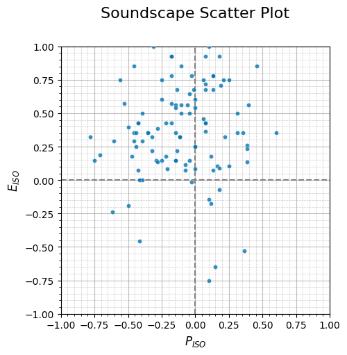
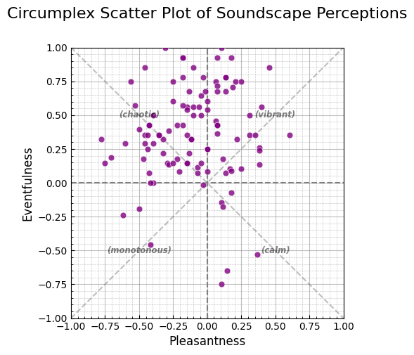
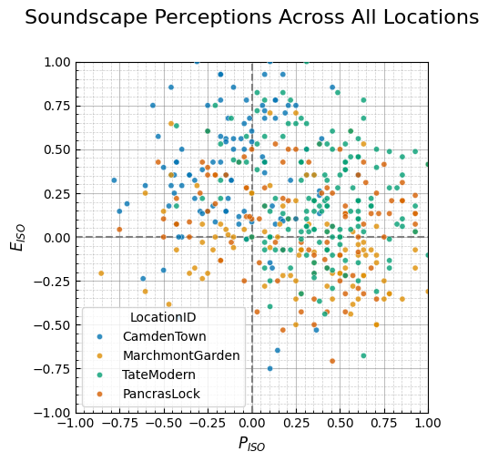
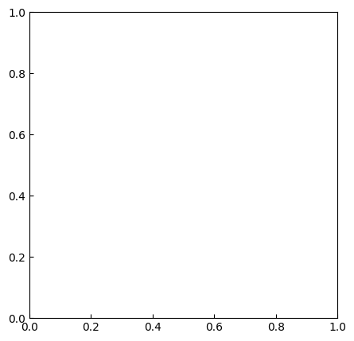
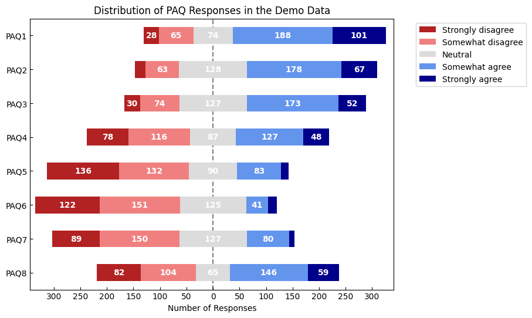

<a href="https://colab.research.google.com/github/MitchellAcoustics/Soundscapy/blob/dev/docs/tutorials/IoA_Soundscape_Assessment_Tutorial.ipynb" target="_parent"></a>

``` python
!Rscript -e "install.packages('sn')"
!pip install "soundscapy[spi] @ git+https://github.com/MitchellAcoustics/Soundscapy@dev"
```

    Installing package into ‘/usr/local/lib/R/site-library’
    (as ‘lib’ is unspecified)
    trying URL 'https://cran.rstudio.com/src/contrib/sn_2.1.1.tar.gz'
    Content type 'application/x-gzip' length 827061 bytes (807 KB)
    ==================================================
    downloaded 807 KB

    * installing *source* package ‘sn’ ...
    ** this is package ‘sn’ version ‘2.1.1’
    ** package ‘sn’ successfully unpacked and MD5 sums checked
    ** using staged installation
    ** R
    ** data
    ** inst
    ** byte-compile and prepare package for lazy loading
    ** help
    *** installing help indices
    ** building package indices
    ** installing vignettes
    ** testing if installed package can be loaded from temporary location
    ** testing if installed package can be loaded from final location
    ** testing if installed package keeps a record of temporary installation path
    * DONE (sn)

    The downloaded source packages are in
        ‘/tmp/Rtmprt6Poo/downloaded_packages’
    Collecting soundscapy@ git+https://github.com/MitchellAcoustics/Soundscapy@dev (from soundscapy[spi]@ git+https://github.com/MitchellAcoustics/Soundscapy@dev)
      Cloning https://github.com/MitchellAcoustics/Soundscapy (to revision dev) to /tmp/pip-install-bg23ixf2/soundscapy_edf33d8197e942f5a12ace9c8667e318
      Running command git clone --filter=blob:none --quiet https://github.com/MitchellAcoustics/Soundscapy /tmp/pip-install-bg23ixf2/soundscapy_edf33d8197e942f5a12ace9c8667e318
      Running command git checkout -b dev --track origin/dev
      Switched to a new branch 'dev'
      Branch 'dev' set up to track remote branch 'dev' from 'origin'.
      Resolved https://github.com/MitchellAcoustics/Soundscapy to commit fa6fb0e57a353f730cfae093fd7d57c55071f401
      Installing build dependencies ... done
      Getting requirements to build wheel ... done
      Preparing metadata (pyproject.toml) ... done
    Requirement already satisfied: loguru>=0.7.2 in /usr/local/lib/python3.11/dist-packages (from soundscapy@ git+https://github.com/MitchellAcoustics/Soundscapy@dev->soundscapy[spi]@ git+https://github.com/MitchellAcoustics/Soundscapy@dev) (0.7.3)
    Requirement already satisfied: numpy!=1.26 in /usr/local/lib/python3.11/dist-packages (from soundscapy@ git+https://github.com/MitchellAcoustics/Soundscapy@dev->soundscapy[spi]@ git+https://github.com/MitchellAcoustics/Soundscapy@dev) (2.0.2)
    Requirement already satisfied: pandas>=2.2.2 in /usr/local/lib/python3.11/dist-packages (from pandas[excel]>=2.2.2->soundscapy@ git+https://github.com/MitchellAcoustics/Soundscapy@dev->soundscapy[spi]@ git+https://github.com/MitchellAcoustics/Soundscapy@dev) (2.2.2)
    Requirement already satisfied: plot-likert>=0.5.0 in /usr/local/lib/python3.11/dist-packages (from soundscapy@ git+https://github.com/MitchellAcoustics/Soundscapy@dev->soundscapy[spi]@ git+https://github.com/MitchellAcoustics/Soundscapy@dev) (0.5.0)
    Requirement already satisfied: pydantic>=2.8.2 in /usr/local/lib/python3.11/dist-packages (from soundscapy@ git+https://github.com/MitchellAcoustics/Soundscapy@dev->soundscapy[spi]@ git+https://github.com/MitchellAcoustics/Soundscapy@dev) (2.11.4)
    Requirement already satisfied: pyyaml>=6.0.2 in /usr/local/lib/python3.11/dist-packages (from soundscapy@ git+https://github.com/MitchellAcoustics/Soundscapy@dev->soundscapy[spi]@ git+https://github.com/MitchellAcoustics/Soundscapy@dev) (6.0.2)
    Requirement already satisfied: scipy>=1.14.1 in /usr/local/lib/python3.11/dist-packages (from soundscapy@ git+https://github.com/MitchellAcoustics/Soundscapy@dev->soundscapy[spi]@ git+https://github.com/MitchellAcoustics/Soundscapy@dev) (1.15.3)
    Requirement already satisfied: seaborn>=0.13.2 in /usr/local/lib/python3.11/dist-packages (from soundscapy@ git+https://github.com/MitchellAcoustics/Soundscapy@dev->soundscapy[spi]@ git+https://github.com/MitchellAcoustics/Soundscapy@dev) (0.13.2)
    Requirement already satisfied: rpy2>=3.5.0 in /usr/local/lib/python3.11/dist-packages (from soundscapy@ git+https://github.com/MitchellAcoustics/Soundscapy@dev->soundscapy[spi]@ git+https://github.com/MitchellAcoustics/Soundscapy@dev) (3.5.17)
    Requirement already satisfied: python-dateutil>=2.8.2 in /usr/local/lib/python3.11/dist-packages (from pandas>=2.2.2->pandas[excel]>=2.2.2->soundscapy@ git+https://github.com/MitchellAcoustics/Soundscapy@dev->soundscapy[spi]@ git+https://github.com/MitchellAcoustics/Soundscapy@dev) (2.9.0.post0)
    Requirement already satisfied: pytz>=2020.1 in /usr/local/lib/python3.11/dist-packages (from pandas>=2.2.2->pandas[excel]>=2.2.2->soundscapy@ git+https://github.com/MitchellAcoustics/Soundscapy@dev->soundscapy[spi]@ git+https://github.com/MitchellAcoustics/Soundscapy@dev) (2025.2)
    Requirement already satisfied: tzdata>=2022.7 in /usr/local/lib/python3.11/dist-packages (from pandas>=2.2.2->pandas[excel]>=2.2.2->soundscapy@ git+https://github.com/MitchellAcoustics/Soundscapy@dev->soundscapy[spi]@ git+https://github.com/MitchellAcoustics/Soundscapy@dev) (2025.2)
    Requirement already satisfied: odfpy>=1.4.1 in /usr/local/lib/python3.11/dist-packages (from pandas[excel]>=2.2.2->soundscapy@ git+https://github.com/MitchellAcoustics/Soundscapy@dev->soundscapy[spi]@ git+https://github.com/MitchellAcoustics/Soundscapy@dev) (1.4.1)
    Requirement already satisfied: openpyxl>=3.1.0 in /usr/local/lib/python3.11/dist-packages (from pandas[excel]>=2.2.2->soundscapy@ git+https://github.com/MitchellAcoustics/Soundscapy@dev->soundscapy[spi]@ git+https://github.com/MitchellAcoustics/Soundscapy@dev) (3.1.5)
    Requirement already satisfied: python-calamine>=0.1.7 in /usr/local/lib/python3.11/dist-packages (from pandas[excel]>=2.2.2->soundscapy@ git+https://github.com/MitchellAcoustics/Soundscapy@dev->soundscapy[spi]@ git+https://github.com/MitchellAcoustics/Soundscapy@dev) (0.3.2)
    Requirement already satisfied: pyxlsb>=1.0.10 in /usr/local/lib/python3.11/dist-packages (from pandas[excel]>=2.2.2->soundscapy@ git+https://github.com/MitchellAcoustics/Soundscapy@dev->soundscapy[spi]@ git+https://github.com/MitchellAcoustics/Soundscapy@dev) (1.0.10)
    Requirement already satisfied: xlrd>=2.0.1 in /usr/local/lib/python3.11/dist-packages (from pandas[excel]>=2.2.2->soundscapy@ git+https://github.com/MitchellAcoustics/Soundscapy@dev->soundscapy[spi]@ git+https://github.com/MitchellAcoustics/Soundscapy@dev) (2.0.1)
    Requirement already satisfied: xlsxwriter>=3.0.5 in /usr/local/lib/python3.11/dist-packages (from pandas[excel]>=2.2.2->soundscapy@ git+https://github.com/MitchellAcoustics/Soundscapy@dev->soundscapy[spi]@ git+https://github.com/MitchellAcoustics/Soundscapy@dev) (3.2.3)
    Requirement already satisfied: matplotlib>=3.4.0 in /usr/local/lib/python3.11/dist-packages (from plot-likert>=0.5.0->soundscapy@ git+https://github.com/MitchellAcoustics/Soundscapy@dev->soundscapy[spi]@ git+https://github.com/MitchellAcoustics/Soundscapy@dev) (3.10.0)
    Requirement already satisfied: annotated-types>=0.6.0 in /usr/local/lib/python3.11/dist-packages (from pydantic>=2.8.2->soundscapy@ git+https://github.com/MitchellAcoustics/Soundscapy@dev->soundscapy[spi]@ git+https://github.com/MitchellAcoustics/Soundscapy@dev) (0.7.0)
    Requirement already satisfied: pydantic-core==2.33.2 in /usr/local/lib/python3.11/dist-packages (from pydantic>=2.8.2->soundscapy@ git+https://github.com/MitchellAcoustics/Soundscapy@dev->soundscapy[spi]@ git+https://github.com/MitchellAcoustics/Soundscapy@dev) (2.33.2)
    Requirement already satisfied: typing-extensions>=4.12.2 in /usr/local/lib/python3.11/dist-packages (from pydantic>=2.8.2->soundscapy@ git+https://github.com/MitchellAcoustics/Soundscapy@dev->soundscapy[spi]@ git+https://github.com/MitchellAcoustics/Soundscapy@dev) (4.13.2)
    Requirement already satisfied: typing-inspection>=0.4.0 in /usr/local/lib/python3.11/dist-packages (from pydantic>=2.8.2->soundscapy@ git+https://github.com/MitchellAcoustics/Soundscapy@dev->soundscapy[spi]@ git+https://github.com/MitchellAcoustics/Soundscapy@dev) (0.4.0)
    Requirement already satisfied: cffi>=1.15.1 in /usr/local/lib/python3.11/dist-packages (from rpy2>=3.5.0->soundscapy@ git+https://github.com/MitchellAcoustics/Soundscapy@dev->soundscapy[spi]@ git+https://github.com/MitchellAcoustics/Soundscapy@dev) (1.17.1)
    Requirement already satisfied: jinja2 in /usr/local/lib/python3.11/dist-packages (from rpy2>=3.5.0->soundscapy@ git+https://github.com/MitchellAcoustics/Soundscapy@dev->soundscapy[spi]@ git+https://github.com/MitchellAcoustics/Soundscapy@dev) (3.1.6)
    Requirement already satisfied: tzlocal in /usr/local/lib/python3.11/dist-packages (from rpy2>=3.5.0->soundscapy@ git+https://github.com/MitchellAcoustics/Soundscapy@dev->soundscapy[spi]@ git+https://github.com/MitchellAcoustics/Soundscapy@dev) (5.3.1)
    Requirement already satisfied: pycparser in /usr/local/lib/python3.11/dist-packages (from cffi>=1.15.1->rpy2>=3.5.0->soundscapy@ git+https://github.com/MitchellAcoustics/Soundscapy@dev->soundscapy[spi]@ git+https://github.com/MitchellAcoustics/Soundscapy@dev) (2.22)
    Requirement already satisfied: contourpy>=1.0.1 in /usr/local/lib/python3.11/dist-packages (from matplotlib>=3.4.0->plot-likert>=0.5.0->soundscapy@ git+https://github.com/MitchellAcoustics/Soundscapy@dev->soundscapy[spi]@ git+https://github.com/MitchellAcoustics/Soundscapy@dev) (1.3.2)
    Requirement already satisfied: cycler>=0.10 in /usr/local/lib/python3.11/dist-packages (from matplotlib>=3.4.0->plot-likert>=0.5.0->soundscapy@ git+https://github.com/MitchellAcoustics/Soundscapy@dev->soundscapy[spi]@ git+https://github.com/MitchellAcoustics/Soundscapy@dev) (0.12.1)
    Requirement already satisfied: fonttools>=4.22.0 in /usr/local/lib/python3.11/dist-packages (from matplotlib>=3.4.0->plot-likert>=0.5.0->soundscapy@ git+https://github.com/MitchellAcoustics/Soundscapy@dev->soundscapy[spi]@ git+https://github.com/MitchellAcoustics/Soundscapy@dev) (4.57.0)
    Requirement already satisfied: kiwisolver>=1.3.1 in /usr/local/lib/python3.11/dist-packages (from matplotlib>=3.4.0->plot-likert>=0.5.0->soundscapy@ git+https://github.com/MitchellAcoustics/Soundscapy@dev->soundscapy[spi]@ git+https://github.com/MitchellAcoustics/Soundscapy@dev) (1.4.8)
    Requirement already satisfied: packaging>=20.0 in /usr/local/lib/python3.11/dist-packages (from matplotlib>=3.4.0->plot-likert>=0.5.0->soundscapy@ git+https://github.com/MitchellAcoustics/Soundscapy@dev->soundscapy[spi]@ git+https://github.com/MitchellAcoustics/Soundscapy@dev) (24.2)
    Requirement already satisfied: pillow>=8 in /usr/local/lib/python3.11/dist-packages (from matplotlib>=3.4.0->plot-likert>=0.5.0->soundscapy@ git+https://github.com/MitchellAcoustics/Soundscapy@dev->soundscapy[spi]@ git+https://github.com/MitchellAcoustics/Soundscapy@dev) (11.2.1)
    Requirement already satisfied: pyparsing>=2.3.1 in /usr/local/lib/python3.11/dist-packages (from matplotlib>=3.4.0->plot-likert>=0.5.0->soundscapy@ git+https://github.com/MitchellAcoustics/Soundscapy@dev->soundscapy[spi]@ git+https://github.com/MitchellAcoustics/Soundscapy@dev) (3.2.3)
    Requirement already satisfied: defusedxml in /usr/local/lib/python3.11/dist-packages (from odfpy>=1.4.1->pandas[excel]>=2.2.2->soundscapy@ git+https://github.com/MitchellAcoustics/Soundscapy@dev->soundscapy[spi]@ git+https://github.com/MitchellAcoustics/Soundscapy@dev) (0.7.1)
    Requirement already satisfied: et-xmlfile in /usr/local/lib/python3.11/dist-packages (from openpyxl>=3.1.0->pandas[excel]>=2.2.2->soundscapy@ git+https://github.com/MitchellAcoustics/Soundscapy@dev->soundscapy[spi]@ git+https://github.com/MitchellAcoustics/Soundscapy@dev) (2.0.0)
    Requirement already satisfied: six>=1.5 in /usr/local/lib/python3.11/dist-packages (from python-dateutil>=2.8.2->pandas>=2.2.2->pandas[excel]>=2.2.2->soundscapy@ git+https://github.com/MitchellAcoustics/Soundscapy@dev->soundscapy[spi]@ git+https://github.com/MitchellAcoustics/Soundscapy@dev) (1.17.0)
    Requirement already satisfied: MarkupSafe>=2.0 in /usr/local/lib/python3.11/dist-packages (from jinja2->rpy2>=3.5.0->soundscapy@ git+https://github.com/MitchellAcoustics/Soundscapy@dev->soundscapy[spi]@ git+https://github.com/MitchellAcoustics/Soundscapy@dev) (3.0.2)

``` python
import warnings

import matplotlib.pyplot as plt
import numpy as np
import pandas as pd
import seaborn as sns

import soundscapy as sspy
from soundscapy import ISOPlot
from soundscapy.spi import DirectParams, MultiSkewNorm

# Set up plotting
warnings.filterwarnings("ignore")
```

# Soundscape Assessment Tutorial

## Introduction

This tutorial will guide you through the process of conducting a
comprehensive soundscape assessment using Soundscapy. You’ll learn how
to analyze survey data, create visualizations, and interpret the results
to understand how people perceive and experience soundscapes in
different locations.

By the end of this tutorial, you’ll be able to: - Load and validate
soundscape survey data - Calculate ISO coordinates from perceptual
attribute questions (PAQs) - Create basic and advanced visualizations of
soundscape data - Perform statistical analysis of soundscape
perceptions - Apply the Soundscape Perception Index (SPI) to evaluate
soundscapes against target distributions - Create professional reports
and presentations of your findings

Let’s begin by loading some sample data and exploring its structure.

## 1. Loading and Exploring the Data

The first step in any soundscape assessment is to load and explore your
data. For this tutorial, we’ll use a sample dataset containing
soundscape survey responses from multiple locations.

``` python
# Load the demo data
data = pd.read_excel("/content/DemoData.xlsx")

# Display the first few rows
data.head()
```

    FileNotFoundError: [Errno 2] No such file or directory: '/content/DemoData.xlsx'
    ---------------------------------------------------------------------------
    FileNotFoundError                         Traceback (most recent call last)
    Cell In[2], line 2
          1 # Load the demo data
    ----> 2 data = pd.read_excel("/content/DemoData.xlsx")
          4 # Display the first few rows
          5 data.head()

    File ~/Documents/GitHub/Soundscapy/.venv/lib/python3.12/site-packages/pandas/io/excel/_base.py:495, in read_excel(io, sheet_name, header, names, index_col, usecols, dtype, engine, converters, true_values, false_values, skiprows, nrows, na_values, keep_default_na, na_filter, verbose, parse_dates, date_parser, date_format, thousands, decimal, comment, skipfooter, storage_options, dtype_backend, engine_kwargs)
        493 if not isinstance(io, ExcelFile):
        494     should_close = True
    --> 495     io = ExcelFile(
        496         io,
        497         storage_options=storage_options,
        498         engine=engine,
        499         engine_kwargs=engine_kwargs,
        500     )
        501 elif engine and engine != io.engine:
        502     raise ValueError(
        503         "Engine should not be specified when passing "
        504         "an ExcelFile - ExcelFile already has the engine set"
        505     )

    File ~/Documents/GitHub/Soundscapy/.venv/lib/python3.12/site-packages/pandas/io/excel/_base.py:1550, in ExcelFile.__init__(self, path_or_buffer, engine, storage_options, engine_kwargs)
       1548     ext = "xls"
       1549 else:
    -> 1550     ext = inspect_excel_format(
       1551         content_or_path=path_or_buffer, storage_options=storage_options
       1552     )
       1553     if ext is None:
       1554         raise ValueError(
       1555             "Excel file format cannot be determined, you must specify "
       1556             "an engine manually."
       1557         )

    File ~/Documents/GitHub/Soundscapy/.venv/lib/python3.12/site-packages/pandas/io/excel/_base.py:1402, in inspect_excel_format(content_or_path, storage_options)
       1399 if isinstance(content_or_path, bytes):
       1400     content_or_path = BytesIO(content_or_path)
    -> 1402 with get_handle(
       1403     content_or_path, "rb", storage_options=storage_options, is_text=False
       1404 ) as handle:
       1405     stream = handle.handle
       1406     stream.seek(0)

    File ~/Documents/GitHub/Soundscapy/.venv/lib/python3.12/site-packages/pandas/io/common.py:882, in get_handle(path_or_buf, mode, encoding, compression, memory_map, is_text, errors, storage_options)
        873         handle = open(
        874             handle,
        875             ioargs.mode,
       (...)
        878             newline="",
        879         )
        880     else:
        881         # Binary mode
    --> 882         handle = open(handle, ioargs.mode)
        883     handles.append(handle)
        885 # Convert BytesIO or file objects passed with an encoding

    FileNotFoundError: [Errno 2] No such file or directory: '/content/DemoData.xlsx'

### Display basic information about the dataset

Dataset shape:

``` python
data.shape
```

    (456, 37)

Number of locations:

``` python
data["LocationID"].nunique()
```

    4

Locations:

``` python
data["LocationID"].unique()
```

    array(['CamdenTown', 'MarchmontGarden', 'TateModern', 'PancrasLock'],
          dtype=object)

### Understanding the Data Structure

Our dataset contains several types of columns:

1.  **Index Columns**: Identify the survey, location, and respondent
    - `LocationID`: Identifier for the location
    - `RecordID`: Identifier for the audio recording
    - `GroupID`: Identifier for the group of respondents
    - `SessionID`: Identifier for the survey session
2.  **Perceptual Attribute Questions (PAQs)**: Ratings on a 5-point
    Likert scale
    - `PAQ1` (pleasant): How pleasant is the soundscape?
    - `PAQ2` (vibrant): How vibrant is the soundscape?
    - `PAQ3` (eventful): How eventful is the soundscape?
    - `PAQ4` (chaotic): How chaotic is the soundscape?
    - `PAQ5` (annoying): How annoying is the soundscape?
    - `PAQ6` (monotonous): How monotonous is the soundscape?
    - `PAQ7` (uneventful): How uneventful is the soundscape?
    - `PAQ8` (calm): How calm is the soundscape?
3.  **Sound Source Dominance**: Ratings of how dominant different sound
    sources are
    - `traffic_noise`: Dominance of traffic noise
    - `other_noise`: Dominance of other mechanical noise
    - `human_sounds`: Dominance of human sounds
    - `natural_sounds`: Dominance of natural sounds
4.  **Acoustic Metrics**: Objective measurements of the sound
    environment
    - `LAeq`: A-weighted equivalent continuous sound level
    - Various other metrics like `N5`, `Sharpness`, etc.

## 2. Data Validation and ISO Coordinate Calculation

Before analyzing the data, it’s important to validate it to ensure
quality and consistency. Soundscapy provides functions for validating
soundscape data and calculating ISO coordinates.

``` python
# Validate the data
valid_data, invalid_indices = sspy.databases.isd.validate(data)

# Display validation results
print(f"Original dataset size: {len(data)}")
print(f"Valid dataset size: {len(valid_data)}")
print(f"Number of invalid records: {len(invalid_indices) if invalid_indices else 0}")

# If there are invalid records, display the first few
if invalid_indices:
    print("\nSample of invalid records:")
    print(data.loc[invalid_indices[:5]])
```

    Original dataset size: 456
    Valid dataset size: 456
    Number of invalid records: 0

### Calculating ISO Coordinates

The ISO 12913 standard defines a circumplex model for soundscape
perception, with two main dimensions: pleasantness and eventfulness.
Soundscapy can calculate these coordinates from the PAQ responses with a
single function call.

The ISO coordinates are calculated using a trigonometric projection of
the eight PAQ responses, where: - `ISOPleasant` represents the
horizontal axis (pleasant to unpleasant) - `ISOEventful` represents the
vertical axis (eventful to uneventful)

These coordinates allow us to position each response in the soundscape
circumplex model, which has four quadrants: - Pleasant and Eventful:
“Vibrant” - Unpleasant and Eventful: “Chaotic” - Unpleasant and
Uneventful: “Monotonous” - Pleasant and Uneventful: “Calm”

``` python
# Calculate ISO coordinates if not already present
valid_data = sspy.surveys.add_iso_coords(valid_data, overwrite=True)

# Display the first few rows with ISO coordinates
print("Data with ISO coordinates:")
valid_data[["LocationID", "ISOPleasant", "ISOEventful"]].head()
```

    Data with ISO coordinates:

<div id="df-0cbb9bab-5610-4cea-bc62-dcb7b79fb791" class="colab-df-container">
    <div>
<style scoped>
    .dataframe tbody tr th:only-of-type {
        vertical-align: middle;
    }

    .dataframe tbody tr th {
        vertical-align: top;
    }

    .dataframe thead th {
        text-align: right;
    }
</style>

<table class="dataframe" data-quarto-postprocess="true" data-border="1">
<thead>
<tr style="text-align: right;">
<th data-quarto-table-cell-role="th"></th>
<th data-quarto-table-cell-role="th">LocationID</th>
<th data-quarto-table-cell-role="th">ISOPleasant</th>
<th data-quarto-table-cell-role="th">ISOEventful</th>
</tr>
</thead>
<tbody>
<tr>
<td data-quarto-table-cell-role="th">0</td>
<td>CamdenTown</td>
<td>-2.196699e-01</td>
<td>0.426777</td>
</tr>
<tr>
<td data-quarto-table-cell-role="th">1</td>
<td>CamdenTown</td>
<td>5.748368e-17</td>
<td>0.250000</td>
</tr>
<tr>
<td data-quarto-table-cell-role="th">2</td>
<td>CamdenTown</td>
<td>-4.696699e-01</td>
<td>0.176777</td>
</tr>
<tr>
<td data-quarto-table-cell-role="th">3</td>
<td>CamdenTown</td>
<td>1.035534e-01</td>
<td>-0.750000</td>
</tr>
<tr>
<td data-quarto-table-cell-role="th">4</td>
<td>CamdenTown</td>
<td>2.500000e-01</td>
<td>0.750000</td>
</tr>
</tbody>
</table>

</div>
    <div class="colab-df-buttons">

  <div class="colab-df-container">
    <button class="colab-df-convert" onclick="convertToInteractive('df-0cbb9bab-5610-4cea-bc62-dcb7b79fb791')"
            title="Convert this dataframe to an interactive table."
            style="display:none;">

  <svg xmlns="http://www.w3.org/2000/svg" height="24px" viewBox="0 -960 960 960">
    <path d="M120-120v-720h720v720H120Zm60-500h600v-160H180v160Zm220 220h160v-160H400v160Zm0 220h160v-160H400v160ZM180-400h160v-160H180v160Zm440 0h160v-160H620v160ZM180-180h160v-160H180v160Zm440 0h160v-160H620v160Z"/>
  </svg>
    </button>

  <style>
    .colab-df-container {
      display:flex;
      gap: 12px;
    }

    .colab-df-convert {
      background-color: #E8F0FE;
      border: none;
      border-radius: 50%;
      cursor: pointer;
      display: none;
      fill: #1967D2;
      height: 32px;
      padding: 0 0 0 0;
      width: 32px;
    }

    .colab-df-convert:hover {
      background-color: #E2EBFA;
      box-shadow: 0px 1px 2px rgba(60, 64, 67, 0.3), 0px 1px 3px 1px rgba(60, 64, 67, 0.15);
      fill: #174EA6;
    }

    .colab-df-buttons div {
      margin-bottom: 4px;
    }

    [theme=dark] .colab-df-convert {
      background-color: #3B4455;
      fill: #D2E3FC;
    }

    [theme=dark] .colab-df-convert:hover {
      background-color: #434B5C;
      box-shadow: 0px 1px 3px 1px rgba(0, 0, 0, 0.15);
      filter: drop-shadow(0px 1px 2px rgba(0, 0, 0, 0.3));
      fill: #FFFFFF;
    }
  </style>

    <script>
      const buttonEl =
        document.querySelector('#df-0cbb9bab-5610-4cea-bc62-dcb7b79fb791 button.colab-df-convert');
      buttonEl.style.display =
        google.colab.kernel.accessAllowed ? 'block' : 'none';

      async function convertToInteractive(key) {
        const element = document.querySelector('#df-0cbb9bab-5610-4cea-bc62-dcb7b79fb791');
        const dataTable =
          await google.colab.kernel.invokeFunction('convertToInteractive',
                                                    [key], {});
        if (!dataTable) return;

        const docLinkHtml = 'Like what you see? Visit the ' +
          '<a target="_blank" href=https://colab.research.google.com/notebooks/data_table.ipynb>data table notebook</a>'
          + ' to learn more about interactive tables.';
        element.innerHTML = '';
        dataTable['output_type'] = 'display_data';
        await google.colab.output.renderOutput(dataTable, element);
        const docLink = document.createElement('div');
        docLink.innerHTML = docLinkHtml;
        element.appendChild(docLink);
      }
    </script>
  </div>


    <div id="df-1c321a98-3015-4fb5-a5ac-ee4a063e7c25">
      <button class="colab-df-quickchart" onclick="quickchart('df-1c321a98-3015-4fb5-a5ac-ee4a063e7c25')"
                title="Suggest charts"
                style="display:none;">

<svg xmlns="http://www.w3.org/2000/svg" height="24px"viewBox="0 0 24 24"
     width="24px">
    <g>
        <path d="M19 3H5c-1.1 0-2 .9-2 2v14c0 1.1.9 2 2 2h14c1.1 0 2-.9 2-2V5c0-1.1-.9-2-2-2zM9 17H7v-7h2v7zm4 0h-2V7h2v10zm4 0h-2v-4h2v4z"/>
    </g>
</svg>
      </button>

<style>
  .colab-df-quickchart {
      --bg-color: #E8F0FE;
      --fill-color: #1967D2;
      --hover-bg-color: #E2EBFA;
      --hover-fill-color: #174EA6;
      --disabled-fill-color: #AAA;
      --disabled-bg-color: #DDD;
  }

  [theme=dark] .colab-df-quickchart {
      --bg-color: #3B4455;
      --fill-color: #D2E3FC;
      --hover-bg-color: #434B5C;
      --hover-fill-color: #FFFFFF;
      --disabled-bg-color: #3B4455;
      --disabled-fill-color: #666;
  }

  .colab-df-quickchart {
    background-color: var(--bg-color);
    border: none;
    border-radius: 50%;
    cursor: pointer;
    display: none;
    fill: var(--fill-color);
    height: 32px;
    padding: 0;
    width: 32px;
  }

  .colab-df-quickchart:hover {
    background-color: var(--hover-bg-color);
    box-shadow: 0 1px 2px rgba(60, 64, 67, 0.3), 0 1px 3px 1px rgba(60, 64, 67, 0.15);
    fill: var(--button-hover-fill-color);
  }

  .colab-df-quickchart-complete:disabled,
  .colab-df-quickchart-complete:disabled:hover {
    background-color: var(--disabled-bg-color);
    fill: var(--disabled-fill-color);
    box-shadow: none;
  }

  .colab-df-spinner {
    border: 2px solid var(--fill-color);
    border-color: transparent;
    border-bottom-color: var(--fill-color);
    animation:
      spin 1s steps(1) infinite;
  }

  @keyframes spin {
    0% {
      border-color: transparent;
      border-bottom-color: var(--fill-color);
      border-left-color: var(--fill-color);
    }
    20% {
      border-color: transparent;
      border-left-color: var(--fill-color);
      border-top-color: var(--fill-color);
    }
    30% {
      border-color: transparent;
      border-left-color: var(--fill-color);
      border-top-color: var(--fill-color);
      border-right-color: var(--fill-color);
    }
    40% {
      border-color: transparent;
      border-right-color: var(--fill-color);
      border-top-color: var(--fill-color);
    }
    60% {
      border-color: transparent;
      border-right-color: var(--fill-color);
    }
    80% {
      border-color: transparent;
      border-right-color: var(--fill-color);
      border-bottom-color: var(--fill-color);
    }
    90% {
      border-color: transparent;
      border-bottom-color: var(--fill-color);
    }
  }
</style>

      <script>
        async function quickchart(key) {
          const quickchartButtonEl =
            document.querySelector('#' + key + ' button');
          quickchartButtonEl.disabled = true;  // To prevent multiple clicks.
          quickchartButtonEl.classList.add('colab-df-spinner');
          try {
            const charts = await google.colab.kernel.invokeFunction(
                'suggestCharts', [key], {});
          } catch (error) {
            console.error('Error during call to suggestCharts:', error);
          }
          quickchartButtonEl.classList.remove('colab-df-spinner');
          quickchartButtonEl.classList.add('colab-df-quickchart-complete');
        }
        (() => {
          let quickchartButtonEl =
            document.querySelector('#df-1c321a98-3015-4fb5-a5ac-ee4a063e7c25 button');
          quickchartButtonEl.style.display =
            google.colab.kernel.accessAllowed ? 'block' : 'none';
        })();
      </script>
    </div>

    </div>
  </div>

### Save the data

After using Soundscapy to calculate the ISOCoordinates, we can easily
save our resulting DataFrame out to a file. We can easily save to an
Excel file, allowing you to use the tools you’re more comfortable with
for additional analysis:

``` python
data.to_excel("SoundscapyResults.xlsx", index=False)
```

## 3. Basic Visualization and Summary Statistics

Now that we have our validated data with ISO coordinates, we can create
basic visualizations and calculate summary statistics to understand the
soundscape perceptions at different locations.

``` python
# Get summary statistics for ISO coordinates by location
iso_stats = valid_data.groupby("LocationID")[["ISOPleasant", "ISOEventful"]].agg(
    ["mean", "std", "min", "max"]
)

# Display the summary statistics
print("Summary statistics for ISO coordinates by location:")
iso_stats
```

    Summary statistics for ISO coordinates by location:

<div id="df-19e584f7-00c5-4a04-93f8-738ad6e085fd" class="colab-df-container">
    <div>
<style scoped>
    .dataframe tbody tr th:only-of-type {
        vertical-align: middle;
    }

    .dataframe tbody tr th {
        vertical-align: top;
    }

    .dataframe thead tr th {
        text-align: left;
    }

    .dataframe thead tr:last-of-type th {
        text-align: right;
    }
</style>

<table class="dataframe" data-quarto-postprocess="true" data-border="1">
<thead>
<tr>
<th data-quarto-table-cell-role="th"></th>
<th colspan="4" data-quarto-table-cell-role="th"
data-halign="left">ISOPleasant</th>
<th colspan="4" data-quarto-table-cell-role="th"
data-halign="left">ISOEventful</th>
</tr>
<tr>
<th data-quarto-table-cell-role="th"></th>
<th data-quarto-table-cell-role="th">mean</th>
<th data-quarto-table-cell-role="th">std</th>
<th data-quarto-table-cell-role="th">min</th>
<th data-quarto-table-cell-role="th">max</th>
<th data-quarto-table-cell-role="th">mean</th>
<th data-quarto-table-cell-role="th">std</th>
<th data-quarto-table-cell-role="th">min</th>
<th data-quarto-table-cell-role="th">max</th>
</tr>
<tr>
<th data-quarto-table-cell-role="th">LocationID</th>
<th data-quarto-table-cell-role="th"></th>
<th data-quarto-table-cell-role="th"></th>
<th data-quarto-table-cell-role="th"></th>
<th data-quarto-table-cell-role="th"></th>
<th data-quarto-table-cell-role="th"></th>
<th data-quarto-table-cell-role="th"></th>
<th data-quarto-table-cell-role="th"></th>
<th data-quarto-table-cell-role="th"></th>
</tr>
</thead>
<tbody>
<tr>
<td data-quarto-table-cell-role="th">CamdenTown</td>
<td>-0.102571</td>
<td>0.289155</td>
<td>-0.780330</td>
<td>0.603553</td>
<td>0.364096</td>
<td>0.344868</td>
<td>-0.750000</td>
<td>1.000000</td>
</tr>
<tr>
<td data-quarto-table-cell-role="th">MarchmontGarden</td>
<td>0.276438</td>
<td>0.424521</td>
<td>-0.853553</td>
<td>1.000000</td>
<td>-0.036172</td>
<td>0.258432</td>
<td>-0.500000</td>
<td>0.707107</td>
</tr>
<tr>
<td data-quarto-table-cell-role="th">PancrasLock</td>
<td>0.254416</td>
<td>0.390951</td>
<td>-0.750000</td>
<td>0.926777</td>
<td>0.078584</td>
<td>0.284963</td>
<td>-0.707107</td>
<td>0.603553</td>
</tr>
<tr>
<td data-quarto-table-cell-role="th">TateModern</td>
<td>0.380585</td>
<td>0.288983</td>
<td>-0.426777</td>
<td>1.000000</td>
<td>0.210786</td>
<td>0.308650</td>
<td>-0.676777</td>
<td>1.000000</td>
</tr>
</tbody>
</table>

</div>
    <div class="colab-df-buttons">

  <div class="colab-df-container">
    <button class="colab-df-convert" onclick="convertToInteractive('df-19e584f7-00c5-4a04-93f8-738ad6e085fd')"
            title="Convert this dataframe to an interactive table."
            style="display:none;">

  <svg xmlns="http://www.w3.org/2000/svg" height="24px" viewBox="0 -960 960 960">
    <path d="M120-120v-720h720v720H120Zm60-500h600v-160H180v160Zm220 220h160v-160H400v160Zm0 220h160v-160H400v160ZM180-400h160v-160H180v160Zm440 0h160v-160H620v160ZM180-180h160v-160H180v160Zm440 0h160v-160H620v160Z"/>
  </svg>
    </button>

  <style>
    .colab-df-container {
      display:flex;
      gap: 12px;
    }

    .colab-df-convert {
      background-color: #E8F0FE;
      border: none;
      border-radius: 50%;
      cursor: pointer;
      display: none;
      fill: #1967D2;
      height: 32px;
      padding: 0 0 0 0;
      width: 32px;
    }

    .colab-df-convert:hover {
      background-color: #E2EBFA;
      box-shadow: 0px 1px 2px rgba(60, 64, 67, 0.3), 0px 1px 3px 1px rgba(60, 64, 67, 0.15);
      fill: #174EA6;
    }

    .colab-df-buttons div {
      margin-bottom: 4px;
    }

    [theme=dark] .colab-df-convert {
      background-color: #3B4455;
      fill: #D2E3FC;
    }

    [theme=dark] .colab-df-convert:hover {
      background-color: #434B5C;
      box-shadow: 0px 1px 3px 1px rgba(0, 0, 0, 0.15);
      filter: drop-shadow(0px 1px 2px rgba(0, 0, 0, 0.3));
      fill: #FFFFFF;
    }
  </style>

    <script>
      const buttonEl =
        document.querySelector('#df-19e584f7-00c5-4a04-93f8-738ad6e085fd button.colab-df-convert');
      buttonEl.style.display =
        google.colab.kernel.accessAllowed ? 'block' : 'none';

      async function convertToInteractive(key) {
        const element = document.querySelector('#df-19e584f7-00c5-4a04-93f8-738ad6e085fd');
        const dataTable =
          await google.colab.kernel.invokeFunction('convertToInteractive',
                                                    [key], {});
        if (!dataTable) return;

        const docLinkHtml = 'Like what you see? Visit the ' +
          '<a target="_blank" href=https://colab.research.google.com/notebooks/data_table.ipynb>data table notebook</a>'
          + ' to learn more about interactive tables.';
        element.innerHTML = '';
        dataTable['output_type'] = 'display_data';
        await google.colab.output.renderOutput(dataTable, element);
        const docLink = document.createElement('div');
        docLink.innerHTML = docLinkHtml;
        element.appendChild(docLink);
      }
    </script>
  </div>


    <div id="df-d06a9fc6-eb98-490f-8c36-09494a01c3ab">
      <button class="colab-df-quickchart" onclick="quickchart('df-d06a9fc6-eb98-490f-8c36-09494a01c3ab')"
                title="Suggest charts"
                style="display:none;">

<svg xmlns="http://www.w3.org/2000/svg" height="24px"viewBox="0 0 24 24"
     width="24px">
    <g>
        <path d="M19 3H5c-1.1 0-2 .9-2 2v14c0 1.1.9 2 2 2h14c1.1 0 2-.9 2-2V5c0-1.1-.9-2-2-2zM9 17H7v-7h2v7zm4 0h-2V7h2v10zm4 0h-2v-4h2v4z"/>
    </g>
</svg>
      </button>

<style>
  .colab-df-quickchart {
      --bg-color: #E8F0FE;
      --fill-color: #1967D2;
      --hover-bg-color: #E2EBFA;
      --hover-fill-color: #174EA6;
      --disabled-fill-color: #AAA;
      --disabled-bg-color: #DDD;
  }

  [theme=dark] .colab-df-quickchart {
      --bg-color: #3B4455;
      --fill-color: #D2E3FC;
      --hover-bg-color: #434B5C;
      --hover-fill-color: #FFFFFF;
      --disabled-bg-color: #3B4455;
      --disabled-fill-color: #666;
  }

  .colab-df-quickchart {
    background-color: var(--bg-color);
    border: none;
    border-radius: 50%;
    cursor: pointer;
    display: none;
    fill: var(--fill-color);
    height: 32px;
    padding: 0;
    width: 32px;
  }

  .colab-df-quickchart:hover {
    background-color: var(--hover-bg-color);
    box-shadow: 0 1px 2px rgba(60, 64, 67, 0.3), 0 1px 3px 1px rgba(60, 64, 67, 0.15);
    fill: var(--button-hover-fill-color);
  }

  .colab-df-quickchart-complete:disabled,
  .colab-df-quickchart-complete:disabled:hover {
    background-color: var(--disabled-bg-color);
    fill: var(--disabled-fill-color);
    box-shadow: none;
  }

  .colab-df-spinner {
    border: 2px solid var(--fill-color);
    border-color: transparent;
    border-bottom-color: var(--fill-color);
    animation:
      spin 1s steps(1) infinite;
  }

  @keyframes spin {
    0% {
      border-color: transparent;
      border-bottom-color: var(--fill-color);
      border-left-color: var(--fill-color);
    }
    20% {
      border-color: transparent;
      border-left-color: var(--fill-color);
      border-top-color: var(--fill-color);
    }
    30% {
      border-color: transparent;
      border-left-color: var(--fill-color);
      border-top-color: var(--fill-color);
      border-right-color: var(--fill-color);
    }
    40% {
      border-color: transparent;
      border-right-color: var(--fill-color);
      border-top-color: var(--fill-color);
    }
    60% {
      border-color: transparent;
      border-right-color: var(--fill-color);
    }
    80% {
      border-color: transparent;
      border-right-color: var(--fill-color);
      border-bottom-color: var(--fill-color);
    }
    90% {
      border-color: transparent;
      border-bottom-color: var(--fill-color);
    }
  }
</style>

      <script>
        async function quickchart(key) {
          const quickchartButtonEl =
            document.querySelector('#' + key + ' button');
          quickchartButtonEl.disabled = true;  // To prevent multiple clicks.
          quickchartButtonEl.classList.add('colab-df-spinner');
          try {
            const charts = await google.colab.kernel.invokeFunction(
                'suggestCharts', [key], {});
          } catch (error) {
            console.error('Error during call to suggestCharts:', error);
          }
          quickchartButtonEl.classList.remove('colab-df-spinner');
          quickchartButtonEl.classList.add('colab-df-quickchart-complete');
        }
        (() => {
          let quickchartButtonEl =
            document.querySelector('#df-d06a9fc6-eb98-490f-8c36-09494a01c3ab button');
          quickchartButtonEl.style.display =
            google.colab.kernel.accessAllowed ? 'block' : 'none';
        })();
      </script>
    </div>

  <div id="id_f4834c46-79e1-440a-8b87-7ee85e38bf77">
    <style>
      .colab-df-generate {
        background-color: #E8F0FE;
        border: none;
        border-radius: 50%;
        cursor: pointer;
        display: none;
        fill: #1967D2;
        height: 32px;
        padding: 0 0 0 0;
        width: 32px;
      }

      .colab-df-generate:hover {
        background-color: #E2EBFA;
        box-shadow: 0px 1px 2px rgba(60, 64, 67, 0.3), 0px 1px 3px 1px rgba(60, 64, 67, 0.15);
        fill: #174EA6;
      }

      [theme=dark] .colab-df-generate {
        background-color: #3B4455;
        fill: #D2E3FC;
      }

      [theme=dark] .colab-df-generate:hover {
        background-color: #434B5C;
        box-shadow: 0px 1px 3px 1px rgba(0, 0, 0, 0.15);
        filter: drop-shadow(0px 1px 2px rgba(0, 0, 0, 0.3));
        fill: #FFFFFF;
      }
    </style>
    <button class="colab-df-generate" onclick="generateWithVariable('iso_stats')"
            title="Generate code using this dataframe."
            style="display:none;">

  <svg xmlns="http://www.w3.org/2000/svg" height="24px"viewBox="0 0 24 24"
       width="24px">
    <path d="M7,19H8.4L18.45,9,17,7.55,7,17.6ZM5,21V16.75L18.45,3.32a2,2,0,0,1,2.83,0l1.4,1.43a1.91,1.91,0,0,1,.58,1.4,1.91,1.91,0,0,1-.58,1.4L9.25,21ZM18.45,9,17,7.55Zm-12,3A5.31,5.31,0,0,0,4.9,8.1,5.31,5.31,0,0,0,1,6.5,5.31,5.31,0,0,0,4.9,4.9,5.31,5.31,0,0,0,6.5,1,5.31,5.31,0,0,0,8.1,4.9,5.31,5.31,0,0,0,12,6.5,5.46,5.46,0,0,0,6.5,12Z"/>
  </svg>
    </button>
    <script>
      (() => {
      const buttonEl =
        document.querySelector('#id_f4834c46-79e1-440a-8b87-7ee85e38bf77 button.colab-df-generate');
      buttonEl.style.display =
        google.colab.kernel.accessAllowed ? 'block' : 'none';

      buttonEl.onclick = () => {
        google.colab.notebook.generateWithVariable('iso_stats');
      }
      })();
    </script>
  </div>

    </div>
  </div>

### Create a circumplex scatter plot

Creating a scatter plot of the Soundscape data is extremely easy in
Soundscapy. Let’s start by plotting a single location. Again, we use
`sspy.isd.select_location_ids()` to select a single location:

``` python
sspy.scatter(sspy.isd.select_location_ids(valid_data, "CamdenTown"))
```



#### Customizing the plot

The Soundscapy plotting functions contain several customization options,
such as changing the color, palette, point size, and title:

``` python
sspy.scatter(
    sspy.isd.select_location_ids(valid_data, "CamdenTown"),
    color="purple",
    s=40,
    title="Circumplex Scatter Plot of Soundscape Perceptions",
    xlabel="Pleasantness",
    ylabel="Eventfulness",
    diagonal_lines=True,
)
```



#### Color by location

One of the most useful settings is the ability to split the plot by some
grouping variable. In Soundscape data, this will often be the location,
but we can easily select any other categorical variable in the dataset.
Simply set the `hue` option to get a different color for each group:

``` python
# Create a basic scatter plot of ISO coordinates
sspy.scatter(
    valid_data,
    title="Soundscape Perceptions Across All Locations",
    hue="LocationID",
)
plt.show()
```



``` python
# Split by a different variable:

sspy.scatter(...)
```

    TypeError: Data source must be a DataFrame or Mapping, not <class 'ellipsis'>.
    ---------------------------------------------------------------------------
    TypeError                                 Traceback (most recent call last)
    <ipython-input-14-020523ce5eec> in <cell line: 0>()
          1 # Split by a different variable:
          2 
    ----> 3 sspy.scatter(...)
    
    /usr/local/lib/python3.11/dist-packages/soundscapy/plotting/plot_functions.py in scatter(data, title, ax, x, y, hue, palette, legend, prim_labels, **kwargs)
        748         _, ax = plt.subplots(1, 1, figsize=subplots_args.figsize)
        749 
    --> 750     p = sns.scatterplot(ax=ax, **scatter_args.as_dict())
        751 
        752     _set_style()

    /usr/local/lib/python3.11/dist-packages/seaborn/relational.py in scatterplot(data, x, y, hue, size, style, palette, hue_order, hue_norm, sizes, size_order, size_norm, markers, style_order, legend, ax, **kwargs)
        613 ):
        614 
    --> 615     p = _ScatterPlotter(
        616         data=data,
        617         variables=dict(x=x, y=y, hue=hue, size=size, style=style),

    /usr/local/lib/python3.11/dist-packages/seaborn/relational.py in __init__(self, data, variables, legend)
        394         )
        395 
    --> 396         super().__init__(data=data, variables=variables)
        397 
        398         self.legend = legend

    /usr/local/lib/python3.11/dist-packages/seaborn/_base.py in __init__(self, data, variables)
        632         # information for numeric axes would be information about log scales.
        633         self._var_ordered = {"x": False, "y": False}  # alt., used DefaultDict
    --> 634         self.assign_variables(data, variables)
        635 
        636         # TODO Lots of tests assume that these are called to initialize the

    /usr/local/lib/python3.11/dist-packages/seaborn/_base.py in assign_variables(self, data, variables)
        677             # to centralize / standardize data consumption logic.
        678             self.input_format = "long"
    --> 679             plot_data = PlotData(data, variables)
        680             frame = plot_data.frame
        681             names = plot_data.names

    /usr/local/lib/python3.11/dist-packages/seaborn/_core/data.py in __init__(self, data, variables)
         55     ):
         56 
    ---> 57         data = handle_data_source(data)
         58         frame, names, ids = self._assign_variables(data, variables)
         59 

    /usr/local/lib/python3.11/dist-packages/seaborn/_core/data.py in handle_data_source(data)
        276     elif data is not None and not isinstance(data, Mapping):
        277         err = f"Data source must be a DataFrame or Mapping, not {type(data)!r}."
    --> 278         raise TypeError(err)
        279 
        280     return data

    TypeError: Data source must be a DataFrame or Mapping, not <class 'ellipsis'>.



## Density Plots

Of course, the most notable plot type in Soundscapy is the Density plot.
Just like scatter, this has its own simple function. Try it out:

``` python
# Create a basic density plot
sspy.density(...)
plt.show()
```

## 4. Creating Likert Style Plots

Likert plots are a useful way to visualize the distribution of responses
to Likert scale questions, such as the PAQs in our survey. Soundscapy
integrates with the `plot_likert` package to create these
visualizations.

We can use Soundscapy’s `paq_likert` plot to examine the distribution of
PAQ responses:

``` python
from soundscapy import PAQ_IDS

sspy.paq_likert(data[PAQ_IDS], title="Distribution of PAQ Responses in the Demo Data")
```



To get a better view of the data, we can also split it across the
Locations. To do this, we use the `select_location_ids()` function from
Soundscapy, and use a `for` loop to create a separate plot for each
location.

``` python
for location in data["LocationID"].unique():
    sspy.paq_likert(
        sspy.databases.isd.select_location_ids(data, location)[PAQ_IDS],
        title=f"Distribution of PAQ Responses in {location}",
    )
    plt.show()
```

### Analyzing Sound Source Dominance

Let’s examine the dominance of different sound sources at each location.

``` python
sspy.stacked_likert(valid_data, "traffic_noise", title="Traffic Noise Dominance")
```

Try this out with some of the other Likert scaled data:

``` python
sspy.stacked_likert(...)
```

In addition to the more specialised Likert plots provided by Soundscapy,
we can of course apply more common analyses. For this, we need to do
some data processing and plotting in Pandas and Seaborn:

``` python
# Calculate mean sound source dominance by location
sound_sources = (
    valid_data.groupby("LocationID")[
        ["traffic_noise", "other_noise", "human_sounds", "natural_sounds"]
    ]
    .mean()
    .round(2)
)
```

#### Mean sound source dominance by location:

``` python
sound_sources
```

Since Soundscapy doesn’t implement its own functionality for the more
common plots, we fall back to the very nice Seaborn plotting library,
which we imported as `sns` to create a barplot of the mean sound source
responses (or you can of course do this in something like Excel):

``` python
# Create a bar chart
sound_sources_plot = sound_sources.reset_index().melt(
    id_vars=["LocationID"], var_name="Source", value_name="Dominance"
)

sns.barplot(
    data=sound_sources_plot,
    x="Source",
    y="Dominance",
    hue="LocationID",
    palette="colorblind",
)
plt.title("Sound Source Dominance by Location")
plt.xlabel("Sound Source")
plt.ylabel("Mean Dominance Rating")
plt.xticks(rotation=45)
plt.tight_layout()
plt.show()
```

## 5. Creating Complex Plots with Hue and Subplots

Soundscapy makes it easy to create more complex visualizations that show
relationships between different variables. Let’s explore how sound
source dominance affects soundscape perception:

``` python
# Create subplots showing the impact of natural sounds on soundscape perception
sspy.create_iso_subplots(
    data=valid_data,
    subplot_by="LocationID",
    hue="natural_sounds",
    plot_layers=["scatter", "simple_density"],
    title="Impact of Natural Sounds on Soundscape Perception",
)
plt.tight_layout()
plt.show()
```

``` python
# Create subplots showing the impact of traffic noise on soundscape perception
sspy.create_iso_subplots(
    data=valid_data,
    subplot_by="LocationID",
    hue="traffic_noise",
    plot_layers=["scatter", "simple_density"],
    title="Impact of Traffic Noise on Soundscape Perception",
)
plt.tight_layout()
plt.show()
```

We can also examine the relationship between acoustic metrics and
soundscape perception:

``` python
# Create a scatter plot with regression line showing the relationship between
# LAeq and ISOPleasant
sns.lmplot(
    data=valid_data,
    x="LAeq",
    y="ISOPleasant",
    hue="LocationID",
    palette="colorblind",
    height=6,
    aspect=1.5,
)
plt.title("Relationship between Sound Level (LAeq) and Pleasantness")
plt.tight_layout()
plt.show()
```

``` python
# Create a scatter plot with regression line showing the relationship between
# N5 and ISOEventful
sns.lmplot(
    data=valid_data,
    x="N5",
    y="ISOEventful",
    hue="LocationID",
    palette="colorblind",
    height=6,
    aspect=1.5,
)
plt.title("Relationship between Loudness (N5) and Eventfulness")
plt.tight_layout()
plt.show()
```

## 6. Applying SPI Analysis

The Soundscape Perception Index (SPI) is a powerful tool for comparing
soundscapes to target distributions. It quantifies the similarity
between two soundscape distributions on a scale from 0 to 100, where 100
indicates perfect similarity.

Let’s define some target distributions and calculate SPI scores for our
locations:

``` python
# Define a "tranquil" target distribution
tranquil_target = DirectParams(
    xi=np.array([[0.8, -0.5]]),  # Pleasant and uneventful
    omega=np.array([[0.17, -0.04], [-0.04, 0.09]]),
    alpha=np.array([-8, 1]),
)

# Create a MultiSkewNorm instance from the parameters
tranquil_msn = MultiSkewNorm.from_params(tranquil_target)

# Generate sample data
tranquil_msn.sample(1000)

# Convert to DataFrame for visualization
tranquil_df = pd.DataFrame(
    tranquil_msn.sample_data, columns=["ISOPleasant", "ISOEventful"]
)

# Visualize the target distribution
plt.figure(figsize=(8, 8))
sspy.density(tranquil_df, title="Tranquil Target Distribution", color="red")
plt.show()
```

``` python
# Define a "vibrant" target distribution
vibrant_target = DirectParams(
    xi=np.array([[0.7, 0.6]]),  # Pleasant and eventful
    omega=np.array([[0.15, 0.03], [0.03, 0.15]]),
    alpha=np.array([0, 0]),
)

# Create a MultiSkewNorm instance from the parameters
vibrant_msn = MultiSkewNorm.from_params(vibrant_target)

# Generate sample data
vibrant_msn.sample(1000)

# Convert to DataFrame for visualization
vibrant_df = pd.DataFrame(
    vibrant_msn.sample_data, columns=["ISOPleasant", "ISOEventful"]
)

# Visualize the target distribution
sspy.density(
    vibrant_df,
    title="Vibrant Target Distribution",
    color="purple",
)
plt.show()
```

Now let’s calculate SPI scores for each location against both target
distributions:

``` python
# Calculate SPI scores for each location against the tranquil target
locations = valid_data["LocationID"].unique()
tranquil_spi_scores = {}
vibrant_spi_scores = {}

for location in locations:
    # Get data for this location
    location_data = sspy.databases.isd.select_location_ids(valid_data, location)

    # Calculate SPI against tranquil target
    tranquil_spi_scores[location] = tranquil_msn.spi_score(
        location_data[["ISOPleasant", "ISOEventful"]]
    )

    # Calculate SPI against vibrant target
    vibrant_spi_scores[location] = vibrant_msn.spi_score(
        location_data[["ISOPleasant", "ISOEventful"]]
    )

# Display the results
spi_results = pd.DataFrame(
    {
        "Tranquil SPI": tranquil_spi_scores,
        "Vibrant SPI": vibrant_spi_scores,
    }
).T

print("SPI Scores by Location:")
print(spi_results)

# Create a bar chart of SPI scores
plt.figure(figsize=(12, 6))
spi_results.plot(kind="bar", colormap="viridis")
plt.title("SPI Scores by Location")
plt.xlabel("Target Distribution")
plt.ylabel("SPI Score")
plt.ylim(0, 100)
plt.xticks(rotation=0)
plt.legend(title="Location")
plt.tight_layout()
plt.show()
```

## 7. Using the ISOPlot Interface for SPI Analysis

Soundscapy’s `ISOPlot` class provides a more sophisticated interface for
creating SPI visualizations. Let’s use it to create a comprehensive SPI
analysis:

``` python
# Create an SPI plot comparing locations against the tranquil target
tranquil_plot = (
    ISOPlot(
        data=valid_data,
        title="Comparing Locations Against Tranquil Target",
    )
    .create_subplots(
        subplot_by="LocationID",
        figsize=(4, 4),
        auto_allocate_axes=True,
    )
    .add_scatter()
    .add_simple_density(fill=True)
    .add_spi(spi_target_data=tranquil_df, show_score="on axis")
    .style(legend_loc=False)
)
```

``` python
# Create an SPI plot comparing locations against the vibrant target
vibrant_plot = (
    ISOPlot(
        data=valid_data,
        title="Comparing Locations Against Vibrant Target",
    )
    .create_subplots(
        subplot_by="LocationID",
        figsize=(4, 4),
        auto_allocate_axes=True,
    )
    .add_scatter()
    .add_simple_density(fill=True)
    .add_spi(spi_target_data=vibrant_df, show_score="on axis")
    .style(legend_loc=False)
)
```

## 8. Interpreting the Results

Now that we’ve analyzed our data and created various visualizations,
let’s interpret the results:

1.  **Location Characteristics**:
    - Each location has a distinct soundscape character, as shown by its
      position in the circumplex model.
    - Some locations are more pleasant (higher ISOPleasant values),
      while others are more eventful (higher ISOEventful values).
2.  **Sound Source Influence**:
    - Natural sounds tend to increase pleasantness, as shown by the
      relationship between natural sound dominance and ISOPleasant
      values.
    - Traffic noise tends to decrease pleasantness, as shown by the
      relationship between traffic noise dominance and ISOPleasant
      values.
3.  **Acoustic Metrics**:
    - Higher sound levels (LAeq) are generally associated with lower
      pleasantness.
    - Higher loudness (N5) is generally associated with higher
      eventfulness.
4.  **SPI Analysis**:
    - Some locations match better with the tranquil target, while others
      match better with the vibrant target.
    - This information can be used to identify which locations provide
      the desired soundscape experience.

These insights can inform soundscape design and management decisions,
such as: - Which locations to preserve or enhance for specific
soundscape experiences - Which sound sources to promote or mitigate at
different locations - How to design new spaces to achieve desired
soundscape characteristics

## 9. Gallery of Soundscapy Visualizations

Soundscapy offers a wide range of visualization options. Here’s a
gallery of additional plots you can create:

``` python
# Basic scatter plot
sspy.scatter(
    valid_data,
    title="Basic Scatter Plot",
    diagonal_lines=True,
)
plt.show()
```

``` python
# Density plot
sspy.density(
    valid_data,
    title="Density Plot",
    diagonal_lines=True,
    fill=True,
)
plt.show()
```

``` python
# Combined scatter and density plot
sspy.iso_plot(
    valid_data,
    title="Combined Scatter and Density Plot",
    plot_layers=["scatter", "density"],
    diagonal_lines=True,
)
plt.show()
```

``` python
# Simple density plot with hue
sspy.density(
    valid_data,
    title="Simple Density Plot with Hue",
    density_type="simple",
    hue="LocationID",
)
plt.show()
```

``` python
# Joint plot
sspy.jointplot(
    valid_data,
    title="Joint Plot",
)
plt.show()
```

``` python
# Joint plot with histogram marginals
plt.figure(figsize=(10, 10))
sspy.jointplot(
    valid_data, title="Joint Plot with Histogram Marginals", marginal_kind="hist"
)
plt.show()
```

``` python
# Joint plot with grouping
plt.figure(figsize=(10, 10))
sspy.jointplot(
    valid_data,
    title="Joint Plot with Grouping",
    hue="LocationID",
    density_type="simple",
)
plt.show()
```

``` python
# Custom multi-panel visualization
fig = plt.figure(figsize=(15, 14))

# Create a 2x2 grid
gs = fig.add_gridspec(2, 2, height_ratios=[1, 1.2])

# Create a scatter plot of all locations in the first subplot
ax1 = fig.add_subplot(gs[0, 0])
sspy.scatter(
    valid_data,
    title="All Locations - Scatter",
    hue="LocationID",
    ax=ax1,
)

# Create a density plot of all locations in the second subplot
ax2 = fig.add_subplot(gs[0, 1])
sspy.density(
    valid_data,
    title="All Locations - Density",
    hue="LocationID",
    density_type="simple",
    incl_scatter=False,
    fill=False,
    ax=ax2,
)

# Create a scatter plot colored by LAeq in the third subplot
ax3 = fig.add_subplot(gs[1, 0])
sspy.scatter(
    valid_data,
    title="Sound Level (LAeq)",
    hue="LAeq",
    palette="viridis",
    ax=ax3,
)

# Create a density plot colored by natural sounds in the fourth subplot
ax4 = fig.add_subplot(gs[1, 1])
sspy.density(
    valid_data,
    title="Natural Sounds Dominance",
    hue="natural_sounds",
    density_type="simple",
    ax=ax4,
)

plt.tight_layout()
plt.show()
```

## 10. Summary

In this tutorial, you’ve learned how to:

1.  **Load and validate soundscape survey data**
    - Import data from Excel files
    - Validate data quality
    - Calculate ISO coordinates
2.  **Create basic visualizations and summary statistics**
    - Scatter plots and density plots
    - Summary statistics by location
    - Sound source dominance analysis
3.  **Create Likert style plots**
    - Convert numeric responses to categorical
    - Create side-by-side Likert plots for comparison
4.  **Create complex plots with hue and subplots**
    - Visualize relationships between variables
    - Create multi-panel visualizations
    - Analyze the impact of sound sources on perception
5.  **Apply SPI analysis**
    - Define target distributions
    - Calculate SPI scores
    - Compare locations against different targets
6.  **Use the ISOPlot interface**
    - Create sophisticated SPI visualizations
    - Combine multiple layers in a single plot
    - Customize plot appearance

These skills will enable you to conduct comprehensive soundscape
assessments and communicate your findings effectively. By understanding
how people perceive and experience soundscapes, you can contribute to
the design and management of more pleasant and appropriate acoustic
environments.

## References

1.  ISO 12913-1:2014. Acoustics — Soundscape — Part 1: Definition and
    conceptual framework.
2.  ISO 12913-2:2018. Acoustics — Soundscape — Part 2: Data collection
    and reporting requirements.
3.  ISO 12913-3:2019. Acoustics — Soundscape — Part 3: Data analysis.
4.  Mitchell, A., Aletta, F., & Kang, J. (2022). How to analyse and
    represent quantitative soundscape data. JASA Express Letters,
    2, 37201. https://doi.org/10.1121/10.0009794
