# `Soundscapy` - Quick Start Guide


By Andrew Mitchell, Lecturer, University College London

## Background

`Soundscapy` is a python toolbox for analysing quantitative soundscape
data. Urban soundscapes are typically assessed through surveys which ask
respondents how they perceive the given soundscape. Particularly when
collected following the technical specification ISO 12913, these surveys
can constitute quantitative data about the soundscape perception. As
proposed in *How to analyse and represent quantitative soundscape data*
[(Mitchell, Aletta, & Kang,
2022)](https://asa.scitation.org/doi/full/10.1121/10.0009794), in order
to describe the soundscape perception of a group or of a location, we
should consider the distribution of responses. `Soundscapy`’s approach
to soundscape analysis follows this approach and makes it simple to
process soundscape data and visualise the distribution of responses.

For more information on the theory underlying the assessments and forms
of data collection, please see ISO 12913-Part 2, *The SSID Protocol*
[(Mitchell, *et al.*, 2020)](https://www.mdpi.com/2076-3417/10/7/2397),
and *How to analyse and represent quantitative soundscape data*.

## This Notebook

The purpose of this notebook is to give a brief overview of how
`Soundscapy` works and how to quickly get started using it to analyse
your own soundscape data. The example dataset used is *The International
Soundscape Database (ISD)* (Mitchell, *et al.*, 2021), which is publicly
available at [Zenodo](https://zenodo.org/record/6331810) and is free to
use. `Soundscapy` expects data to follow the format used in the ISD, but
can be adapted for similar datasets.

------------------------------------------------------------------------

## Installation

To install Soundscapy with `pip`:

    pip install soundscapy

------------------------------------------------------------------------

## Working with Data

### Loading and Validating Data

Let’s start by importing Soundscapy and loading the International
Soundscape Database (ISD):

``` python
# Import Soundscapy
import soundscapy as sspy
from soundscapy.databases import isd

# Load the ISD dataset
data = isd.load()
print(data.shape)

# Validate the dataset with ISD-custom checks
df, excl = isd.validate(data)
print(f"Valid samples: {data.shape[0]}, Excluded samples: {excl.shape[0]}")
```

    (3589, 142)
    Valid samples: 3589, Excluded samples: 56

### Calculating ISOPleasant and ISOEventful Coordinates

Next, we’ll calculate the ISOCoordinate values:

``` python
data = sspy.surveys.add_iso_coords(data)
data[["ISOPleasant", "ISOEventful"]].round(2).head()
```

<div>
<style scoped>
    .dataframe tbody tr th:only-of-type {
        vertical-align: middle;
    }

    .dataframe tbody tr th {
        vertical-align: top;
    }

    .dataframe thead th {
        text-align: right;
    }
</style>

<table class="dataframe" data-quarto-postprocess="true" data-border="1">
<thead>
<tr style="text-align: right;">
<th data-quarto-table-cell-role="th"></th>
<th data-quarto-table-cell-role="th">ISOPleasant</th>
<th data-quarto-table-cell-role="th">ISOEventful</th>
</tr>
</thead>
<tbody>
<tr>
<td data-quarto-table-cell-role="th">0</td>
<td>0.22</td>
<td>-0.13</td>
</tr>
<tr>
<td data-quarto-table-cell-role="th">1</td>
<td>-0.43</td>
<td>0.53</td>
</tr>
<tr>
<td data-quarto-table-cell-role="th">2</td>
<td>0.68</td>
<td>-0.07</td>
</tr>
<tr>
<td data-quarto-table-cell-role="th">3</td>
<td>0.60</td>
<td>-0.15</td>
</tr>
<tr>
<td data-quarto-table-cell-role="th">4</td>
<td>0.46</td>
<td>-0.15</td>
</tr>
</tbody>
</table>

</div>

`Soundscapy` expects the PAQ values to be Likert scale values ranging
from 1 to 5 by default, as specified in ISO 12913 and the SSID Protocol.
However, it is possible to use data which, although structured the same
way, has a different range of values. For instance this could be a
7-point Likert scale, or a 0 to 100 scale. By passing these numbers both
to `validate_dataset()` and `add_paq_coords()` as the `val_range`,
`Soundscapy` will check that the data conforms to what is expected and
will automatically scale the ISOCoordinates from -1 to +1 depending on
the original value range.

For example:

``` python
import pandas as pd

val_range = (0, 100)
sample_transform = {
    "RecordID": ["EX1", "EX2"],
    "pleasant": [40, 25],
    "vibrant": [45, 31],
    "eventful": [41, 54],
    "chaotic": [24, 56],
    "annoying": [8, 52],
    "monotonous": [31, 55],
    "uneventful": [37, 31],
    "calm": [40, 10],
}
sample_transform = pd.DataFrame().from_dict(sample_transform)
sample_transform = sspy.rename_paqs(sample_transform)
sample_transform = sspy.add_iso_coords(sample_transform, val_range=val_range)
sample_transform
```

<div>
<style scoped>
    .dataframe tbody tr th:only-of-type {
        vertical-align: middle;
    }

    .dataframe tbody tr th {
        vertical-align: top;
    }

    .dataframe thead th {
        text-align: right;
    }
</style>

<table class="dataframe" data-quarto-postprocess="true" data-border="1">
<thead>
<tr style="text-align: right;">
<th data-quarto-table-cell-role="th"></th>
<th data-quarto-table-cell-role="th">RecordID</th>
<th data-quarto-table-cell-role="th">PAQ1</th>
<th data-quarto-table-cell-role="th">PAQ2</th>
<th data-quarto-table-cell-role="th">PAQ3</th>
<th data-quarto-table-cell-role="th">PAQ4</th>
<th data-quarto-table-cell-role="th">PAQ5</th>
<th data-quarto-table-cell-role="th">PAQ6</th>
<th data-quarto-table-cell-role="th">PAQ7</th>
<th data-quarto-table-cell-role="th">PAQ8</th>
<th data-quarto-table-cell-role="th">ISOPleasant</th>
<th data-quarto-table-cell-role="th">ISOEventful</th>
</tr>
</thead>
<tbody>
<tr>
<td data-quarto-table-cell-role="th">0</td>
<td>EX1</td>
<td>40</td>
<td>45</td>
<td>41</td>
<td>24</td>
<td>8</td>
<td>31</td>
<td>37</td>
<td>40</td>
<td>0.220416</td>
<td>0.010711</td>
</tr>
<tr>
<td data-quarto-table-cell-role="th">1</td>
<td>EX2</td>
<td>25</td>
<td>31</td>
<td>54</td>
<td>56</td>
<td>52</td>
<td>55</td>
<td>31</td>
<td>10</td>
<td>-0.316863</td>
<td>0.159706</td>
</tr>
</tbody>
</table>

</div>

### Filtering Data

`Soundscapy` includes methods for several filters that are normally
needed within the ISD, such as filtering by `LocationID` or `SessionID`.

``` python
# Filter by location
camden_data = isd.select_location_ids(data, ["CamdenTown"])
print(f"Camden Town samples: {camden_data.shape[0]}")

# Filter by session
regent_data = isd.select_session_ids(data, ["RegentsParkJapan1"])
print(f"Regent's Park Japan session 1 samples: {regent_data.shape[0]}")

# Complex filtering using pandas query
women_over_50 = df.query("gen00 == 'Female' and age00 > 50")
print(f"Women over 50: {women_over_50.shape[0]}")
```

    Camden Town samples: 105
    Regent's Park Japan session 1 samples: 46
    Women over 50: 133

All of these filters can also be chained together. So, for instance, to
return surveys from women over 50 taken in Camden Town, we would do:

``` python
isd.select_location_ids(data, "CamdenTown").query("gen00 == 'Female' and age00 > 50")
```

<div>
<style scoped>
    .dataframe tbody tr th:only-of-type {
        vertical-align: middle;
    }

    .dataframe tbody tr th {
        vertical-align: top;
    }

    .dataframe thead th {
        text-align: right;
    }
</style>

<table class="dataframe" data-quarto-postprocess="true" data-border="1">
<thead>
<tr style="text-align: right;">
<th data-quarto-table-cell-role="th"></th>
<th data-quarto-table-cell-role="th">LocationID</th>
<th data-quarto-table-cell-role="th">SessionID</th>
<th data-quarto-table-cell-role="th">GroupID</th>
<th data-quarto-table-cell-role="th">RecordID</th>
<th data-quarto-table-cell-role="th">start_time</th>
<th data-quarto-table-cell-role="th">end_time</th>
<th data-quarto-table-cell-role="th">latitude</th>
<th data-quarto-table-cell-role="th">longitude</th>
<th data-quarto-table-cell-role="th">Language</th>
<th data-quarto-table-cell-role="th">Survey_Version</th>
<th data-quarto-table-cell-role="th">...</th>
<th data-quarto-table-cell-role="th">THD_THD_Max</th>
<th data-quarto-table-cell-role="th">THD_Min_Max</th>
<th data-quarto-table-cell-role="th">THD_Max_Max</th>
<th data-quarto-table-cell-role="th">THD_L5_Max</th>
<th data-quarto-table-cell-role="th">THD_L10_Max</th>
<th data-quarto-table-cell-role="th">THD_L50_Max</th>
<th data-quarto-table-cell-role="th">THD_L90_Max</th>
<th data-quarto-table-cell-role="th">THD_L95_Max</th>
<th data-quarto-table-cell-role="th">ISOPleasant</th>
<th data-quarto-table-cell-role="th">ISOEventful</th>
</tr>
</thead>
<tbody>
<tr>
<td data-quarto-table-cell-role="th">58</td>
<td>CamdenTown</td>
<td>CamdenTown1</td>
<td>CT108</td>
<td>531</td>
<td>2019-05-02 12:10:52</td>
<td>2019-05-02 12:26:45</td>
<td>51.539124</td>
<td>-0.142624</td>
<td>eng</td>
<td>engISO2018</td>
<td>...</td>
<td>-2.12</td>
<td>-4.44</td>
<td>72.28</td>
<td>45.05</td>
<td>37.19</td>
<td>13.40</td>
<td>-1.88</td>
<td>-2.45</td>
<td>-1.464466e-01</td>
<td>0.146447</td>
</tr>
<tr>
<td data-quarto-table-cell-role="th">63</td>
<td>CamdenTown</td>
<td>CamdenTown1</td>
<td>CT111</td>
<td>533</td>
<td>2019-05-02 12:29:42</td>
<td>2019-05-02 12:58:56</td>
<td>51.539124</td>
<td>-0.142624</td>
<td>eng</td>
<td>engISO2018</td>
<td>...</td>
<td>NaN</td>
<td>NaN</td>
<td>NaN</td>
<td>NaN</td>
<td>NaN</td>
<td>NaN</td>
<td>NaN</td>
<td>NaN</td>
<td>-4.142136e-01</td>
<td>-0.457107</td>
</tr>
<tr>
<td data-quarto-table-cell-role="th">104</td>
<td>CamdenTown</td>
<td>CamdenTown3</td>
<td>CT311</td>
<td>593</td>
<td>2019-05-20 12:24:14</td>
<td>2019-05-20 12:28:27</td>
<td>51.539124</td>
<td>-0.142624</td>
<td>eng</td>
<td>engISO2018</td>
<td>...</td>
<td>-4.73</td>
<td>-8.48</td>
<td>76.20</td>
<td>44.21</td>
<td>34.12</td>
<td>11.04</td>
<td>-4.83</td>
<td>-5.99</td>
<td>-1.464466e-01</td>
<td>0.146447</td>
</tr>
<tr>
<td data-quarto-table-cell-role="th">105</td>
<td>CamdenTown</td>
<td>CamdenTown3</td>
<td>CT311</td>
<td>623</td>
<td>2019-05-20 12:25:00</td>
<td>2019-05-20 12:30:00</td>
<td>51.539124</td>
<td>-0.142624</td>
<td>eng</td>
<td>engISO2018</td>
<td>...</td>
<td>-4.73</td>
<td>-8.48</td>
<td>76.20</td>
<td>44.21</td>
<td>34.12</td>
<td>11.04</td>
<td>-4.83</td>
<td>-5.99</td>
<td>1.338835e-01</td>
<td>0.073223</td>
</tr>
<tr>
<td data-quarto-table-cell-role="th">122</td>
<td>CamdenTown</td>
<td>CamdenTown3</td>
<td>CT324</td>
<td>609</td>
<td>2019-05-20 13:51:00</td>
<td>2019-05-20 13:57:00</td>
<td>51.539124</td>
<td>-0.142624</td>
<td>eng</td>
<td>engISO2018</td>
<td>...</td>
<td>-1.53</td>
<td>-9.57</td>
<td>75.83</td>
<td>43.30</td>
<td>33.73</td>
<td>11.88</td>
<td>-5.59</td>
<td>-7.44</td>
<td>1.767767e-01</td>
<td>0.926777</td>
</tr>
<tr>
<td data-quarto-table-cell-role="th">128</td>
<td>CamdenTown</td>
<td>CamdenTown3</td>
<td>CT328</td>
<td>617</td>
<td>2019-05-20 14:13:00</td>
<td>2019-05-20 14:16:00</td>
<td>51.539124</td>
<td>-0.142624</td>
<td>eng</td>
<td>engISO2018</td>
<td>...</td>
<td>-5.89</td>
<td>-1.76</td>
<td>71.56</td>
<td>45.97</td>
<td>38.80</td>
<td>17.59</td>
<td>2.64</td>
<td>1.16</td>
<td>-4.393398e-01</td>
<td>0.250000</td>
</tr>
<tr>
<td data-quarto-table-cell-role="th">132</td>
<td>CamdenTown</td>
<td>CamdenTown4</td>
<td>CT403</td>
<td>1220</td>
<td>2019-07-13 12:31:40</td>
<td>2019-07-13 12:35:30</td>
<td>51.539140</td>
<td>-0.142648</td>
<td>eng</td>
<td>engISO2018</td>
<td>...</td>
<td>-1.32</td>
<td>-3.24</td>
<td>71.78</td>
<td>49.81</td>
<td>42.16</td>
<td>16.53</td>
<td>0.54</td>
<td>-0.65</td>
<td>6.898042e-17</td>
<td>0.603553</td>
</tr>
</tbody>
</table>

<p>7 rows × 144 columns</p>
</div>

## Plotting

Soundscapy offers various plotting functions to visualize soundscape
data. Let’s explore some of them:

### Scatter plots

``` python
from soundscapy.plotting import ISOPlot

# Basic scatter plot
p1 = (
    ISOPlot(data=isd.select_location_ids(data, ["RussellSq"]), title="Russell Square")
    .create_subplots()
    .add_scatter()
    .style()
)

# Customized scatter plot with multiple locations
p2 = (
    ISOPlot(
        data=isd.select_location_ids(data, ["RussellSq", "EustonTap"]),
        title="Russell Square vs. Euston Tap",
        hue="LocationID",
    )
    .create_subplots()
    .add_scatter()
    .style(diagonal_lines=True, legend_loc="lower left")
)
```

    /var/folders/6t/7h8wn9n92w5f24ml_bkwck9m0000gn/T/ipykernel_7477/3481299990.py:5: ExperimentalWarning: `ISOPlot` is currently under development and should be considered experimental. `ISOPlot` implements an experimental API for creating layered soundscape circumplex plots. Use with caution.
      ISOPlot(data=isd.select_location_ids(data, ["RussellSq"]), title="Russell Square")
    /var/folders/6t/7h8wn9n92w5f24ml_bkwck9m0000gn/T/ipykernel_7477/3481299990.py:13: ExperimentalWarning: `ISOPlot` is currently under development and should be considered experimental. `ISOPlot` implements an experimental API for creating layered soundscape circumplex plots. Use with caution.
      ISOPlot(

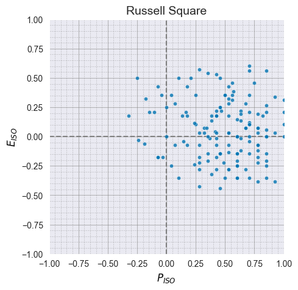

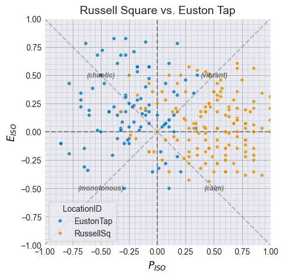

The CircumplexPlot also allows us to make this set of plots in one go,
as a single figure. To do this, we need to set up the subplots slightly
differently, then pass the subplot data to each .add_scatter() call
separately, rather than passing the whold dataframe to the
CircumplexPlot object.

``` python
p3 = (
    ISOPlot(title=None)
    .create_subplots(
        2, 1, subplot_titles=["Russell Square", "Russell Square vs. Euston Tap"]
    )
    .add_scatter(data=isd.select_location_ids(data, ["RussellSq"]), on_axis=0)
    .add_scatter(
        data=isd.select_location_ids(data, ["RussellSq", "EustonTap"]),
        on_axis=1,
        hue="LocationID",
    )
    .style()
)
p3.show()
```

    /var/folders/6t/7h8wn9n92w5f24ml_bkwck9m0000gn/T/ipykernel_7477/1865619274.py:2: ExperimentalWarning: `ISOPlot` is currently under development and should be considered experimental. `ISOPlot` implements an experimental API for creating layered soundscape circumplex plots. Use with caution.
      ISOPlot(title=None)

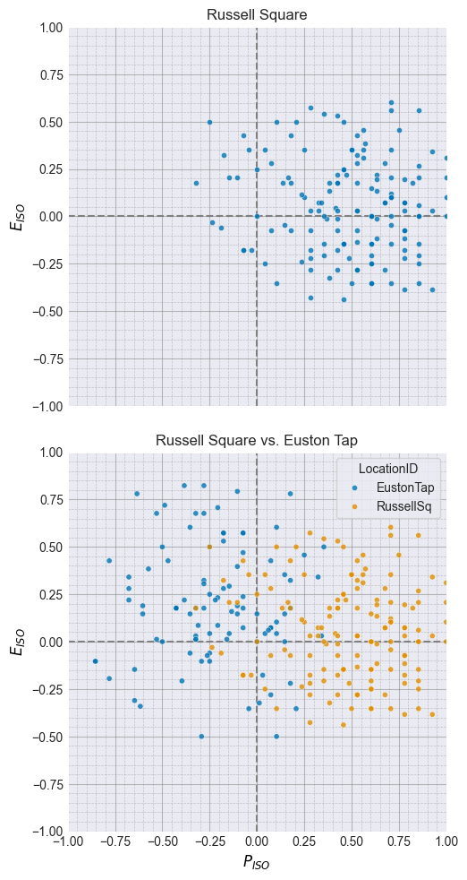

### Density plots

``` python
d1 = (
    ISOPlot(
        data=isd.select_location_ids(data, ["CamdenTown"]),
        title="Camden Town Density Plot",
    )
    .create_subplots()
    .add_scatter()
    .add_density()
    .style()
)

d2 = (
    ISOPlot(
        data=isd.select_location_ids(data, ["CamdenTown", "RussellSq", "PancrasLock"]),
        title="Comparison of the soundscapes of three urban spaces",
        hue="LocationID",
        palette="husl",
    )
    .create_subplots(figsize=(8, 8))
    .add_scatter()
    .add_simple_density(hue="LocationID")
    .style(title_fontsize=14)
)
```

    /var/folders/6t/7h8wn9n92w5f24ml_bkwck9m0000gn/T/ipykernel_7477/3496086766.py:2: ExperimentalWarning: `ISOPlot` is currently under development and should be considered experimental. `ISOPlot` implements an experimental API for creating layered soundscape circumplex plots. Use with caution.
      ISOPlot(
    /var/folders/6t/7h8wn9n92w5f24ml_bkwck9m0000gn/T/ipykernel_7477/3496086766.py:13: ExperimentalWarning: `ISOPlot` is currently under development and should be considered experimental. `ISOPlot` implements an experimental API for creating layered soundscape circumplex plots. Use with caution.
      ISOPlot(

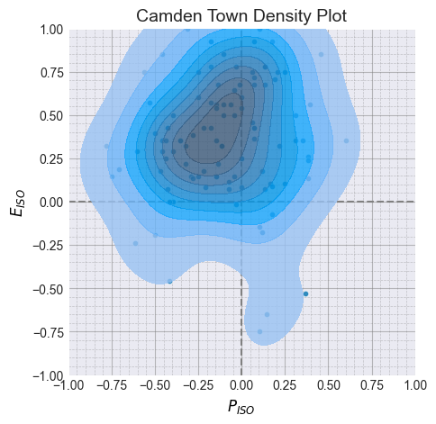

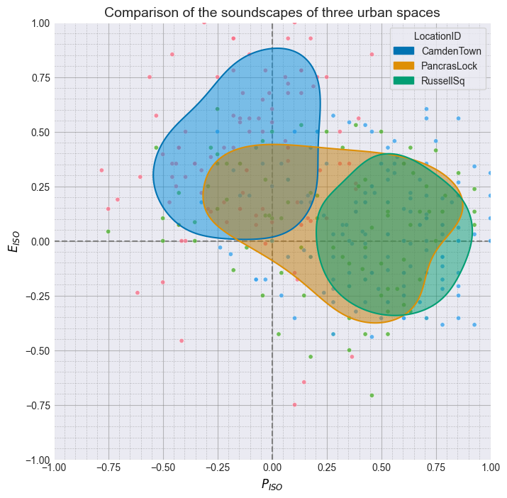

### Jointplots

``` python
sspy.jointplot(
    data=isd.select_location_ids(data, ["CamdenTown"]),
    x="ISOEventful",
    y="ISOPleasant",
    title="Camden Town",
    palette="husl",
    kind="kde",
)
```

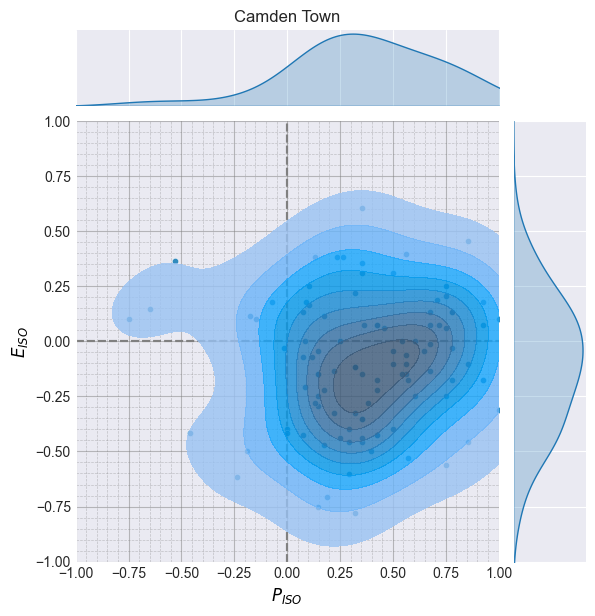

### Creating subplots

`Soundscapy` also provides a method for creating subplots of the
circumplex. This is particularly useful when comparing multiple
locations.

``` python
df["LocationID"].unique()
```

    array(['CarloV', 'SanMarco', 'PlazaBibRambla', 'CamdenTown', 'EustonTap',
           'Noorderplantsoen', 'MarchmontGarden', 'MonumentoGaribaldi',
           'TateModern', 'PancrasLock', 'TorringtonSq', 'RegentsParkFields',
           'RegentsParkJapan', 'RussellSq', 'StPaulsCross', 'StPaulsRow',
           'CampoPrincipe', 'MiradorSanNicolas', 'LianhuashanParkEntrance',
           'LianhuashanParkForest', 'PingshanPark', 'PingshanStreet',
           'ZhongshanPark', 'OlympicSquare', 'ZhongshanSquare',
           'DadongSquare'], dtype=object)

``` python
sub_data = sspy.isd.select_location_ids(
    data, ["PancrasLock", "TorringtonSq", "RegentsParkFields", "RegentsParkJapan"]
)

mp1 = (
    ISOPlot(
        data=sub_data,
        title="Density plots of the first four locations",
    )
    .create_subplots(subplot_by="LocationID", auto_allocate_axes=True)
    .add_scatter()
    .add_density()
    .style()
)
```

    /var/folders/6t/7h8wn9n92w5f24ml_bkwck9m0000gn/T/ipykernel_7477/695190007.py:6: ExperimentalWarning: `ISOPlot` is currently under development and should be considered experimental. `ISOPlot` implements an experimental API for creating layered soundscape circumplex plots. Use with caution.
      ISOPlot(
    /Users/mitch/Documents/GitHub/Soundscapy/src/soundscapy/plotting/iso_plot.py:503: UserWarning: This is an experimental feature. The number of rows and columns may not be optimal.
      self._allocate_subplot_axes(subplot_titles)

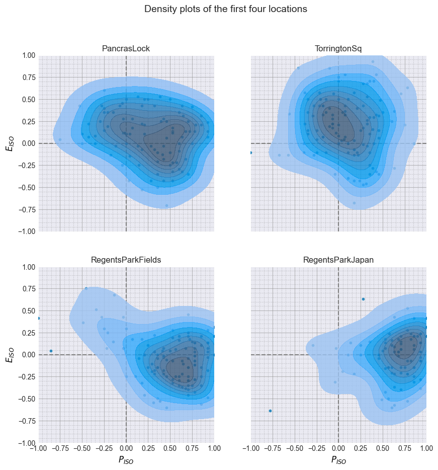

You can also do this manually if you need more control, by creating a
figure and axes and then plotting the density plots on the axes.

``` python
sub_data2 = sspy.isd.select_location_ids(
    data, ["CarloV", "SanMarco", "PlazaBibRambla", "CamdenTown"]
)

mp2 = (
    ISOPlot(
        data=sub_data2,
        title=None,
        hue="SessionID",
    )
    .create_subplots(
        2,
        2,
        subplot_by="LocationID",
        figsize=(12, 12),
        adjust_figsize=False,
    )
    .add_scatter()
    .add_simple_density(fill=False)
    .style()
)
mp2.show()
```

    /var/folders/6t/7h8wn9n92w5f24ml_bkwck9m0000gn/T/ipykernel_7477/1815054888.py:6: ExperimentalWarning: `ISOPlot` is currently under development and should be considered experimental. `ISOPlot` implements an experimental API for creating layered soundscape circumplex plots. Use with caution.
      ISOPlot(
    /Users/mitch/Documents/GitHub/Soundscapy/src/soundscapy/plotting/layers.py:218: UserWarning: Density plots are not recommended for small datasets (<30 samples).
      self._valid_density_size(data)

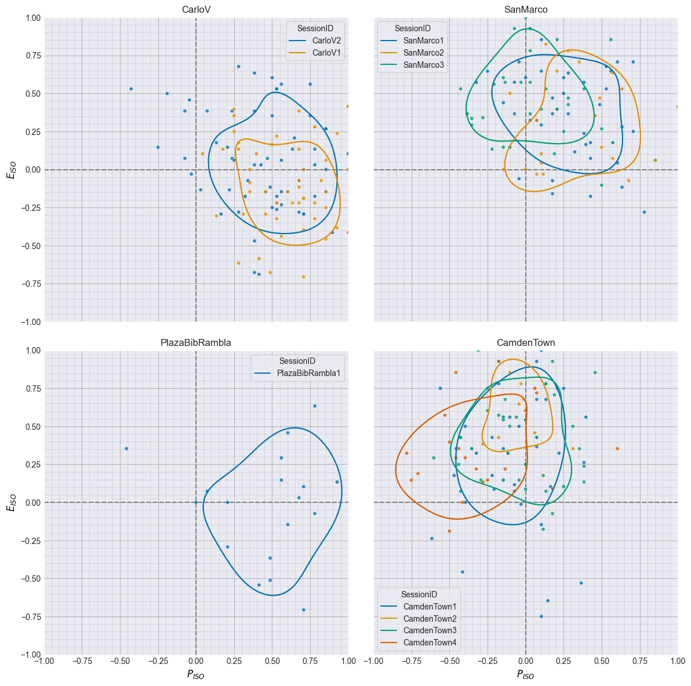

### Using Adjusted Angles

In Aletta et. al. (2024), we propose a method for adjusting the angles
of the circumplex to better represent the perceptual space. These
adjusted angles are derived for each language separately, meaning that,
once projected, the circumplex coordinates will be comparable across all
languages. This ability and the derived angles have been incorporated
into `Soundscapy`.

``` python
from soundscapy.surveys import LANGUAGE_ANGLES

adj_data = sspy.surveys.add_iso_coords(
    data,
    names=("AdjustedPleasant", "AdjustedEventful"),
    angles=LANGUAGE_ANGLES["eng"],
    overwrite=True,
)

adj_p = (
    ISOPlot(
        data=isd.select_location_ids(adj_data, ["CamdenTown", "RussellSq"]),
        x="AdjustedPleasant",
        y="AdjustedEventful",
        hue="LocationID",
        title="Adjusted Pleasant vs. Adjusted Eventful",
    )
    .create_subplots()
    .add_scatter()
    .add_simple_density()
    .style()
)
adj_p.show()
```

    /var/folders/6t/7h8wn9n92w5f24ml_bkwck9m0000gn/T/ipykernel_7477/1321125023.py:11: ExperimentalWarning: `ISOPlot` is currently under development and should be considered experimental. `ISOPlot` implements an experimental API for creating layered soundscape circumplex plots. Use with caution.
      ISOPlot(

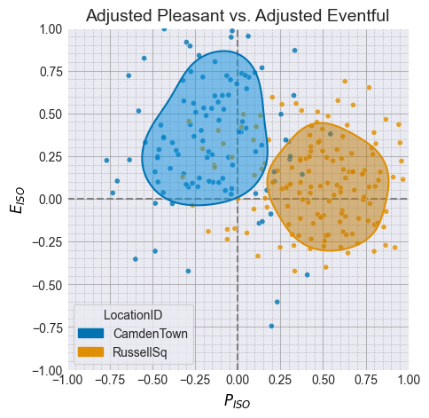

``` python
def apply_iso_coords(row):
    angles = LANGUAGE_ANGLES.get(row["Language"], None)
    if angles:
        return sspy.surveys.add_iso_coords(
            pd.DataFrame([row]),
            angles=angles,
            names=("AdjPleasant", "AdjEventful"),
            overwrite=True,
        ).iloc[0]
    return row


data = data.apply(apply_iso_coords, axis=1)
```

``` python
data[["AdjPleasant", "AdjEventful"]].describe()
```

<div>
<style scoped>
    .dataframe tbody tr th:only-of-type {
        vertical-align: middle;
    }

    .dataframe tbody tr th {
        vertical-align: top;
    }

    .dataframe thead th {
        text-align: right;
    }
</style>

<table class="dataframe" data-quarto-postprocess="true" data-border="1">
<thead>
<tr style="text-align: right;">
<th data-quarto-table-cell-role="th"></th>
<th data-quarto-table-cell-role="th">AdjPleasant</th>
<th data-quarto-table-cell-role="th">AdjEventful</th>
</tr>
</thead>
<tbody>
<tr>
<td data-quarto-table-cell-role="th">count</td>
<td>3552.000000</td>
<td>3552.000000</td>
</tr>
<tr>
<td data-quarto-table-cell-role="th">mean</td>
<td>0.216068</td>
<td>0.051510</td>
</tr>
<tr>
<td data-quarto-table-cell-role="th">std</td>
<td>0.330794</td>
<td>0.281739</td>
</tr>
<tr>
<td data-quarto-table-cell-role="th">min</td>
<td>-1.000000</td>
<td>-0.820740</td>
</tr>
<tr>
<td data-quarto-table-cell-role="th">25%</td>
<td>0.000000</td>
<td>-0.138494</td>
</tr>
<tr>
<td data-quarto-table-cell-role="th">50%</td>
<td>0.226012</td>
<td>0.022161</td>
</tr>
<tr>
<td data-quarto-table-cell-role="th">75%</td>
<td>0.440837</td>
<td>0.222739</td>
</tr>
<tr>
<td data-quarto-table-cell-role="th">max</td>
<td>1.000000</td>
<td>0.994374</td>
</tr>
</tbody>
</table>

</div>

``` python
import matplotlib.pyplot as plt

mp3 = (
    ISOPlot(
        data=data,
        title="Soundscape Density Plots with corrected ISO coordinates",
        x="AdjPleasant",
        y="AdjEventful",
        hue="SessionID",
    )
    .create_subplots(
        subplot_by="LocationID",
        figsize=(4, 4),
        auto_allocate_axes=True,
    )
    .add_scatter()
    .add_simple_density(fill=False)
    .style(title_fontsize=25)
)
plt.show()
```

    /var/folders/6t/7h8wn9n92w5f24ml_bkwck9m0000gn/T/ipykernel_7477/1925802003.py:4: ExperimentalWarning: `ISOPlot` is currently under development and should be considered experimental. `ISOPlot` implements an experimental API for creating layered soundscape circumplex plots. Use with caution.
      ISOPlot(
    /Users/mitch/Documents/GitHub/Soundscapy/src/soundscapy/plotting/iso_plot.py:503: UserWarning: This is an experimental feature. The number of rows and columns may not be optimal.
      self._allocate_subplot_axes(subplot_titles)
    /Users/mitch/Documents/GitHub/Soundscapy/src/soundscapy/plotting/layers.py:218: UserWarning: Density plots are not recommended for small datasets (<30 samples).
      self._valid_density_size(data)

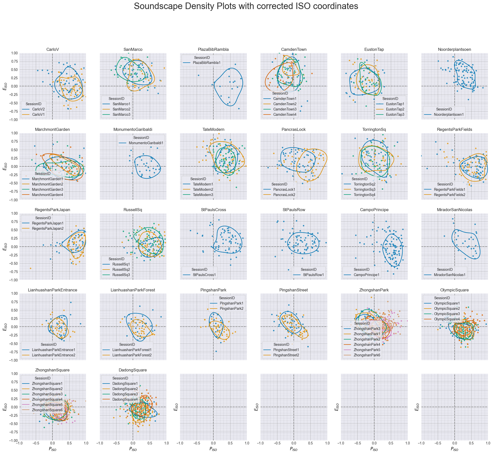

``` python
import matplotlib.pyplot as plt
import numpy as np

from soundscapy.spi import DirectParams, MultiSkewNorm

spi = DirectParams(
    xi=np.array([0.5, 0.7]),
    omega=np.array([[0.1, 0.05], [0.05, 0.1]]),
    alpha=np.array([0, -5]),
)
# Create a custom distribution
spi_msn = MultiSkewNorm.from_params(spi)
# Generate random samples
spi_msn.sample(1000)

mp3 = (
    ISOPlot(
        data=data,
        title="Soundscape Density Plots with corrected ISO coordinates",
        x="AdjPleasant",
        y="AdjEventful",
    )
    .create_subplots(
        subplot_by="LocationID",
        figsize=(4, 4),
        auto_allocate_axes=True,
    )
    .add_scatter()
    .add_simple_density(fill=False)
    .add_spi(spi_target_data=spi_msn.sample_data, show_score="on axis")
    .style(legend_loc=False, title_fontsize=30)
)
```

    /var/folders/6t/7h8wn9n92w5f24ml_bkwck9m0000gn/T/ipykernel_7477/1823870167.py:17: ExperimentalWarning: `ISOPlot` is currently under development and should be considered experimental. `ISOPlot` implements an experimental API for creating layered soundscape circumplex plots. Use with caution.
      ISOPlot(
    /Users/mitch/Documents/GitHub/Soundscapy/src/soundscapy/plotting/iso_plot.py:503: UserWarning: This is an experimental feature. The number of rows and columns may not be optimal.
      self._allocate_subplot_axes(subplot_titles)
    /Users/mitch/Documents/GitHub/Soundscapy/src/soundscapy/plotting/layers.py:218: UserWarning: Density plots are not recommended for small datasets (<30 samples).
      self._valid_density_size(data)

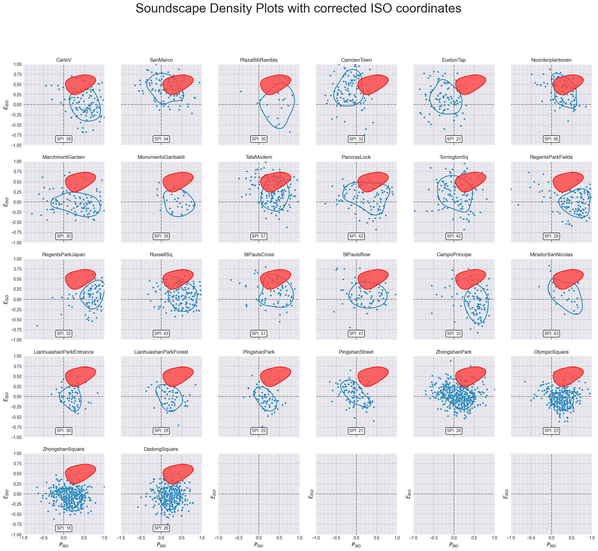
