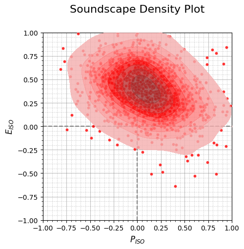
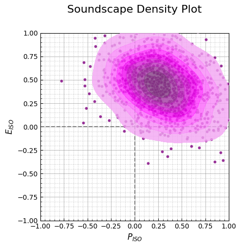

``` python
import numpy as np
import pandas as pd

import soundscapy as sspy
from soundscapy.spi import MultiSkewNorm
from soundscapy.surveys.survey_utils import LANGUAGE_ANGLES, PAQ_IDS

data = sspy.isd.load()
data, excl_data = sspy.isd.validate(data)
data = data.query("Language != 'cmn'")

excl_id = [652, 706, 548, 550, 551, 553, 569, 580, 609, 618, 623, 636, 643]
data = data.drop(excl_id)
```

``` python
for lang in data.Language.unique():
    angles = LANGUAGE_ANGLES[lang]

    lang_idx = data.query(f"Language == '{lang}'").index
    iso_pl, iso_ev = sspy.surveys.processing.calculate_iso_coords(
        data.loc[lang_idx, PAQ_IDS], (1, 5), angles
    )
    data.loc[lang_idx, "ISOPleasant"] = round(iso_pl, 3)
    data.loc[lang_idx, "ISOEventful"] = round(iso_ev, 3)

data.head()
```

<div>
<style scoped>
    .dataframe tbody tr th:only-of-type {
        vertical-align: middle;
    }

    .dataframe tbody tr th {
        vertical-align: top;
    }

    .dataframe thead th {
        text-align: right;
    }
</style>

<table class="dataframe" data-quarto-postprocess="true" data-border="1">
<thead>
<tr style="text-align: right;">
<th data-quarto-table-cell-role="th"></th>
<th data-quarto-table-cell-role="th">LocationID</th>
<th data-quarto-table-cell-role="th">SessionID</th>
<th data-quarto-table-cell-role="th">GroupID</th>
<th data-quarto-table-cell-role="th">RecordID</th>
<th data-quarto-table-cell-role="th">start_time</th>
<th data-quarto-table-cell-role="th">end_time</th>
<th data-quarto-table-cell-role="th">latitude</th>
<th data-quarto-table-cell-role="th">longitude</th>
<th data-quarto-table-cell-role="th">Language</th>
<th data-quarto-table-cell-role="th">Survey_Version</th>
<th data-quarto-table-cell-role="th">...</th>
<th data-quarto-table-cell-role="th">THD_THD_Max</th>
<th data-quarto-table-cell-role="th">THD_Min_Max</th>
<th data-quarto-table-cell-role="th">THD_Max_Max</th>
<th data-quarto-table-cell-role="th">THD_L5_Max</th>
<th data-quarto-table-cell-role="th">THD_L10_Max</th>
<th data-quarto-table-cell-role="th">THD_L50_Max</th>
<th data-quarto-table-cell-role="th">THD_L90_Max</th>
<th data-quarto-table-cell-role="th">THD_L95_Max</th>
<th data-quarto-table-cell-role="th">ISOPleasant</th>
<th data-quarto-table-cell-role="th">ISOEventful</th>
</tr>
</thead>
<tbody>
<tr>
<td data-quarto-table-cell-role="th">0</td>
<td>CarloV</td>
<td>CarloV2</td>
<td>2CV12</td>
<td>1434</td>
<td>2019-05-16 18:46:00</td>
<td>2019-05-16 18:56:00</td>
<td>37.17685</td>
<td>-3.590392</td>
<td>eng</td>
<td>engISO2018</td>
<td>...</td>
<td>-0.09</td>
<td>-11.76</td>
<td>54.18</td>
<td>34.82</td>
<td>26.53</td>
<td>5.57</td>
<td>-9.0</td>
<td>-10.29</td>
<td>0.209</td>
<td>-0.144</td>
</tr>
<tr>
<td data-quarto-table-cell-role="th">1</td>
<td>CarloV</td>
<td>CarloV2</td>
<td>2CV12</td>
<td>1435</td>
<td>2019-05-16 18:46:00</td>
<td>2019-05-16 18:56:00</td>
<td>37.17685</td>
<td>-3.590392</td>
<td>eng</td>
<td>engISO2018</td>
<td>...</td>
<td>-0.09</td>
<td>-11.76</td>
<td>54.18</td>
<td>34.82</td>
<td>26.53</td>
<td>5.57</td>
<td>-9.0</td>
<td>-10.29</td>
<td>-0.443</td>
<td>0.468</td>
</tr>
<tr>
<td data-quarto-table-cell-role="th">2</td>
<td>CarloV</td>
<td>CarloV2</td>
<td>2CV13</td>
<td>1430</td>
<td>2019-05-16 19:02:00</td>
<td>2019-05-16 19:12:00</td>
<td>37.17685</td>
<td>-3.590392</td>
<td>eng</td>
<td>engISO2018</td>
<td>...</td>
<td>-2.10</td>
<td>-19.32</td>
<td>72.52</td>
<td>32.33</td>
<td>24.52</td>
<td>0.25</td>
<td>-16.3</td>
<td>-17.33</td>
<td>0.637</td>
<td>0.002</td>
</tr>
<tr>
<td data-quarto-table-cell-role="th">3</td>
<td>CarloV</td>
<td>CarloV2</td>
<td>2CV13</td>
<td>1431</td>
<td>2019-05-16 19:02:00</td>
<td>2019-05-16 19:12:00</td>
<td>37.17685</td>
<td>-3.590392</td>
<td>eng</td>
<td>engISO2018</td>
<td>...</td>
<td>-2.10</td>
<td>-19.32</td>
<td>72.52</td>
<td>32.33</td>
<td>24.52</td>
<td>0.25</td>
<td>-16.3</td>
<td>-17.33</td>
<td>0.589</td>
<td>-0.092</td>
</tr>
<tr>
<td data-quarto-table-cell-role="th">4</td>
<td>CarloV</td>
<td>CarloV2</td>
<td>2CV13</td>
<td>1432</td>
<td>2019-05-16 19:02:00</td>
<td>2019-05-16 19:12:00</td>
<td>37.17685</td>
<td>-3.590392</td>
<td>eng</td>
<td>engISO2018</td>
<td>...</td>
<td>-2.10</td>
<td>-19.32</td>
<td>72.52</td>
<td>32.33</td>
<td>24.52</td>
<td>0.25</td>
<td>-16.3</td>
<td>-17.33</td>
<td>0.445</td>
<td>-0.126</td>
</tr>
</tbody>
</table>

<p>5 rows × 144 columns</p>
</div>

``` python
ct = data.query("LocationID == 'SanMarco'")
x = ct["ISOPleasant"].to_numpy()
y = ct["ISOEventful"].to_numpy()

msn = MultiSkewNorm()
msn.fit(data=ct[["ISOPleasant", "ISOEventful"]])
msn.summary()
tgt_df = pd.DataFrame(
    msn.sample(n=1000, return_sample=True), columns=["ISOPleasant", "ISOEventful"]
)
sspy.density(tgt_df, color="red")
```



``` python
msn2 = MultiSkewNorm()
msn2.define_dp(
    xi=np.array([0.06534, 0.628637]),
    omega=np.array([[0.14890315, -0.06423752], [-0.06423752, 0.10139612]]),
    alpha=np.array([0.79105, -0.767217]),
)
msn2.sample(n=1000, return_sample=True)
msn2.summary()
tgt2_df = pd.DataFrame(
    msn2.sample(n=1000, return_sample=True), columns=["ISOPleasant", "ISOEventful"]
)
sspy.density(tgt2_df, color="purple")
```



``` python
```
